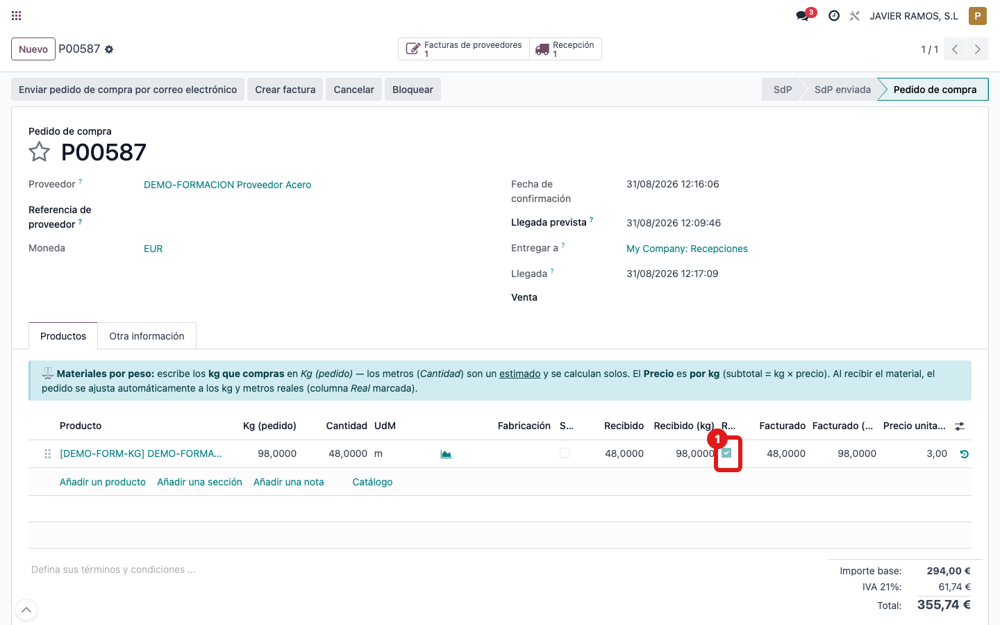

## Cuándo se usa
Cuando una línea del pedido ya se recibió (está marcada como **Real**) y necesitas
**corregir a mano** los kg o los metros, sabiendo que el sistema **respetará** tu
corrección y no la deshará recalculando.

## Antes de empezar
- La línea tiene que estar ya recibida y con la columna **Real** marcada.
- Ten claro el valor correcto (kg o metros) que quieres dejar.

## Pasos
1. Abre el **pedido de compra** y localiza la línea con la columna **Real** marcada. 
2. Edita el valor que haga falta: **Kg (pedido)** o **Cantidad** (metros). Al estar marcada como **Real**, cambiar uno **ya NO recalcula** el otro.
3. Guarda. La corrección queda tal cual la has escrito.

## Si algo va mal
- Cambias los kg y esperabas que los metros se recalcularan: en las líneas marcadas **Real** eso ya no pasa a propósito; si necesitas los dos valores, corrígelos los dos a mano.
- La línea **no** está marcada como **Real**: entonces sí se recalculan entre sí. Esto es normal en líneas aún no recibidas.
- No te deja editar: puede que el pedido esté en un estado que bloquea la edición; consulta con administración.

## Escalar
Si necesitas rehacer los datos reales de una línea (no solo un retoque), es mejor
revisar la recepción. Avisa a administración con el número de pedido y la línea.
