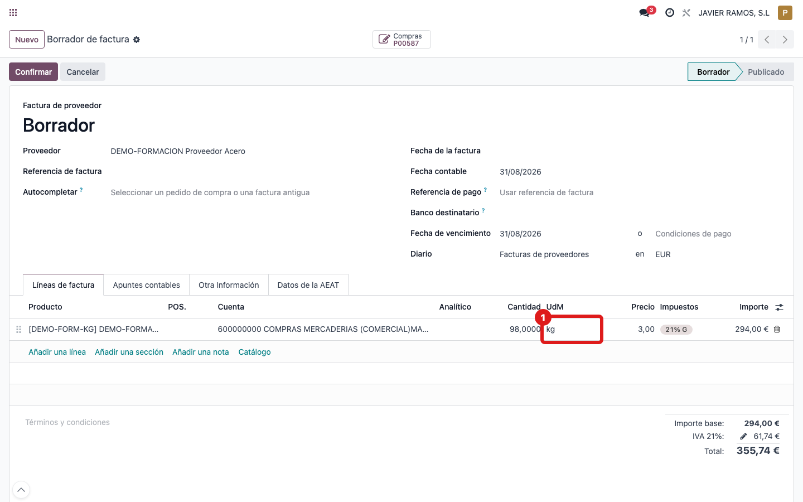
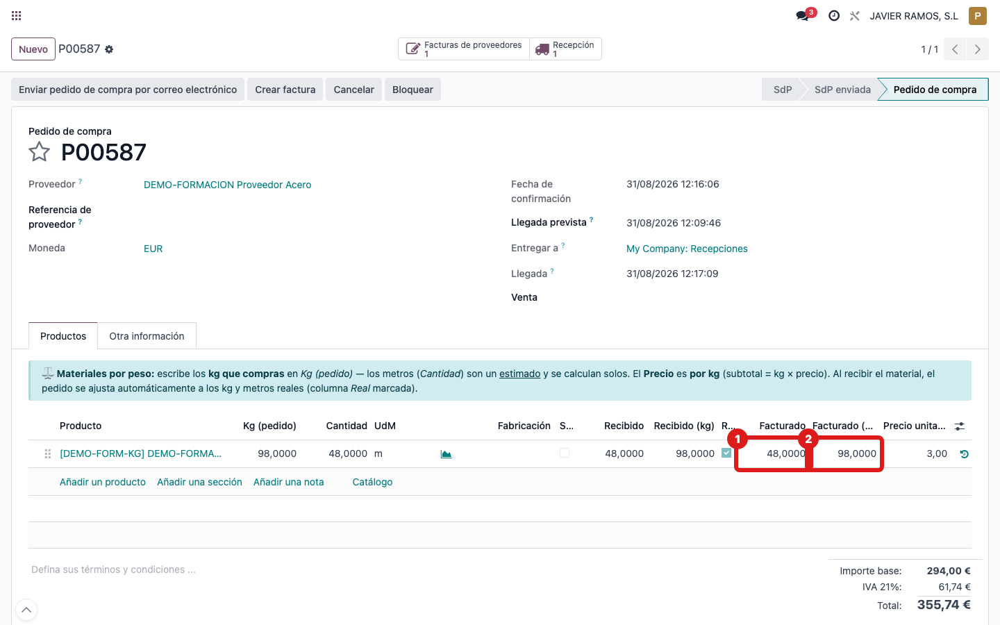

## Cuándo se usa
Cuando llega la **factura del proveedor** de un material por peso. El proveedor
factura en **kg**, así que la factura tiene que reflejar los kg (no los metros).

## Antes de empezar
- La **recepción** debe estar validada con los kg y metros reales (ver la guía *Validar la recepción con kg y metros reales*).
- Ten delante la factura en papel/PDF del proveedor para cuadrar importe y kg.

## Pasos
1. Desde el **pedido de compra**, pulsa **Crear factura**.
2. En la factura en borrador, mira la columna **UdM** de la línea: muestra **kg** (no metros). 
3. Comprueba que la **cantidad** de la línea son los **kg reales pendientes de facturar** (los que se pesaron al recibir).
4. Cuadra el importe con la factura del proveedor y **confirma** la factura.
5. En el **pedido de compra** puedes ver el avance en dos columnas: **Facturado** (en metros) y **Facturado (kg)** (los kg ya facturados). 

## Si algo va mal
- La columna **UdM** muestra **metros** en vez de kg: la línea no arrastró la unidad secundaria; no confirmes y avisa a administración.
- La **cantidad** no coincide con los kg de la báscula: revisa que la recepción se validó con los kg reales antes de crear la factura.
- **DUDA (verificar en pantalla):** en el pedido el subtotal puede ir por metros y en la factura por kg. Si el importe de la factura no cuadra con el del pedido, comprueba primero sobre qué cantidad calcula cada uno el subtotal.

## Escalar
Si el importe de la factura no cuadra con el pedido, avisa a administración con el
número de pedido, el de factura y una captura de ambas líneas (UdM y subtotal).
