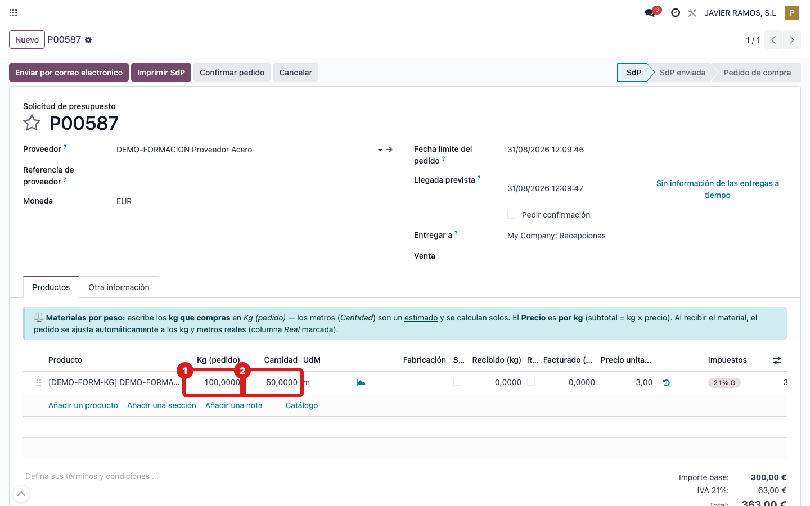
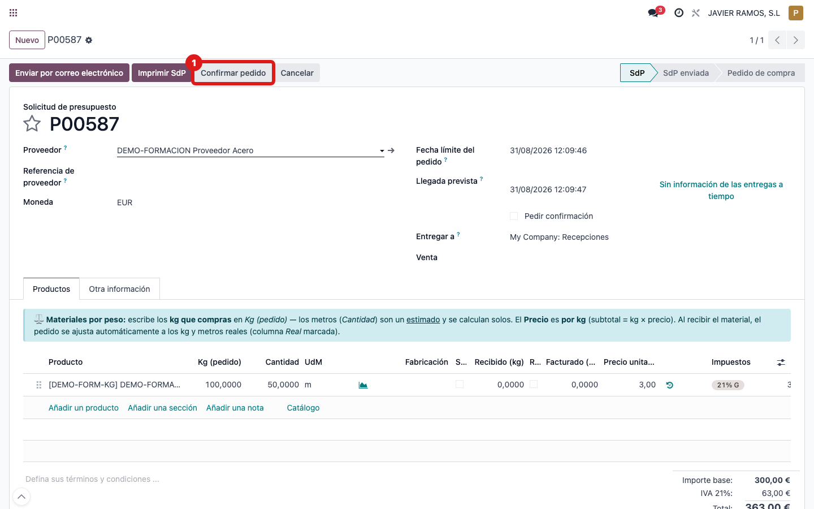

## Cuándo se usa
Cuando haces un pedido de un material **por peso**: le dices al proveedor los
**kg** que quieres, el precio va **por kg** y los metros son solo un estimado.

## Antes de empezar
- El producto tiene que estar configurado para comprarse en kg (ver la guía *Configurar un producto que se compra por peso*).
- Ten claros los **kg** que vas a pedir y el **precio por kg**.

## Pasos
1. Ve a **Compras → Pedidos** y pulsa **Nuevo**.
2. Elige el **proveedor**.
3. En las líneas, pulsa **Añadir una línea** y elige el producto. La línea nace con la unidad **kg** y una **Cantidad** (metros) estimada; arriba aparece el aviso azul de **Materiales por peso**.
4. Escribe los **kg que compras** en la columna **Kg (pedido)**. 
5. **No toques la columna Cantidad**: son los metros estimados y se calculan solos a partir de los kg.
6. Pon el **Precio** (recuerda: es el precio **por kg**).
7. Pulsa **Confirmar pedido**. 

## Si algo va mal
- No aparece el aviso azul ni la columna **Kg (pedido)**: el producto no está configurado por peso. Revisa su ficha antes de seguir.
- Escribes en **Cantidad** (metros) por error: no pasa nada grave, pero el dato bueno es **Kg (pedido)**; corrige los kg y deja que los metros se recalculen.
- **DUDA (verificar en pantalla):** el aviso dice que el precio es por kg y el *subtotal = kg × precio*, pero en el pedido el subtotal puede estar calculándose sobre los **metros (Cantidad)**, no sobre los kg. Confírmalo mirando si el subtotal coincide con `kg × precio` o con `metros × precio`.

## Escalar
Si el subtotal no cuadra con los kg × precio, avisa a administración con el
número de pedido, la línea y una captura del subtotal antes de confirmar.
