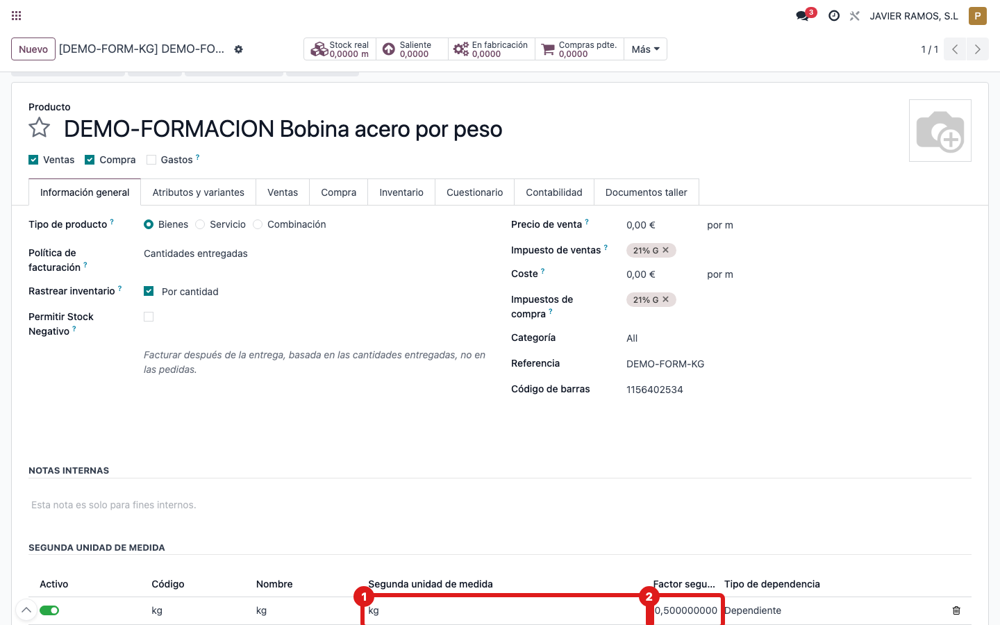
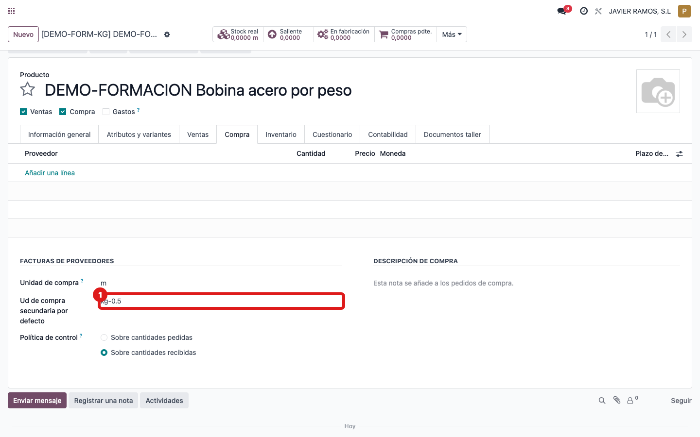

## Cuándo se usa
Cuando das de alta (o preparas) un material que se **compra en kg** pero que
internamente se maneja en **metros** (bobinas, rollos, film...). Con esto los
pedidos de ese producto nacen ya en kg y los metros se calculan solos.

## Antes de empezar
- Necesitas permiso para editar la ficha del producto.
- La unidad **kg** tiene que existir en el sistema.
- Ten a mano el **factor aproximado**: cuántos **metros sale cada kilo** de ese material.

## Pasos
1. Ve a **Compras → Productos → Productos** y abre el producto.
2. Entra en la pestaña **Información general**.
3. Baja hasta el grupo **Segunda unidad de medida** y pulsa **Añadir una línea**. 
4. Rellena la fila: **Código** (una referencia corta), **Nombre** (por ejemplo `kg`), **Segunda unidad de medida** = `kg`, **Factor segunda unidad** = los **metros que salen de un kilo**, y **Tipo de dependencia** = **Dependiente**.
5. Ve a la pestaña **Compra** y, junto a la **Unidad de compra**, pon el campo **Ud de compra secundaria por defecto** en **kg** (aparece como el código de la unidad, p. ej. "kg-0.5"). 
6. Guarda. A partir de ahora, cada línea de pedido de este producto nace en **kg** y calcula los metros sola.

## Si algo va mal
- No ves el grupo **Segunda unidad de medida**: falta activar las unidades de medida en Ajustes; pide que te lo activen.
- Pones **Tipo de dependencia = Independiente**: entonces los metros NO se calculan desde los kg. Para material por peso tiene que ser **Dependiente**.
- El campo **Ud de compra secundaria por defecto** vacío: el producto funciona igual, pero cada pedido nacerá en metros y tendrás que elegir kg a mano. Mejor déjalo en **kg**.

## Escalar
Si el grupo no aparece o no puedes elegir **kg**, avisa a administración indicando
el producto, qué pantalla estás viendo y el mensaje exacto que salga.
