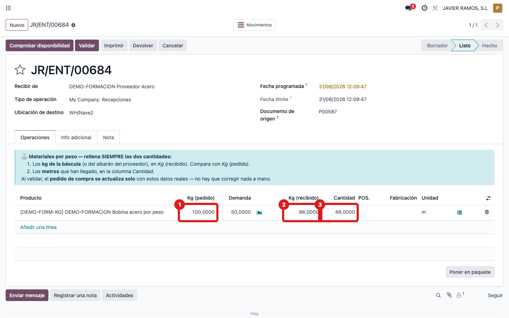
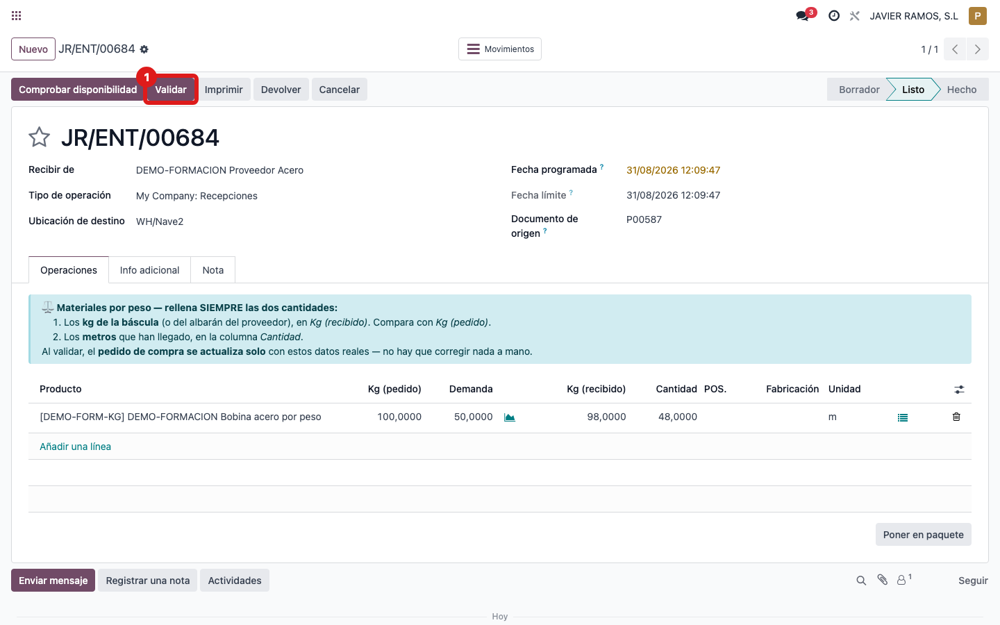

## Cuándo se usa
Cuando llega el material por peso y hay que dar entrada a lo que **de verdad** ha
venido: los **kg de la báscula** y los **metros medidos**. Al validar, el pedido
se ajusta solo a esos datos reales.

## Antes de empezar
- Ten el **peso real** (báscula o albarán del proveedor) y los **metros** que han llegado.
- Parte del pedido de compra ya confirmado y su recepción pendiente.

## Pasos
1. Abre la **recepción** del pedido (desde el pedido, botón **Recepción**, o en **Inventario → Recepciones**).
2. Abre la pestaña **Operaciones**: arriba está el aviso azul que recuerda rellenar **las dos cantidades**.
3. Compara la columna **Kg (pedido)** con lo que marca la **báscula**.
4. Escribe los **kg reales** en la columna **Kg (recibido)**. 
5. Escribe los **metros reales** en la columna **Cantidad**.
6. Pulsa **Validar**. 
7. Listo: el sistema calibra el factor metros/kg y **el pedido se ajusta solo** a lo real; la línea del pedido queda marcada como **Real** y deja un mensaje en el historial (chatter).

## Si algo va mal
- Solo rellenas los kg y dejas la **Cantidad** (metros) en cero: hay que poner **las dos**. Sin metros, el pedido no se ajusta bien.
- No ves la columna **Kg (recibido)**: la recepción no es de material por peso, o falta configuración en el producto.
- Es una recepción **parcial** (llega solo una parte): el pedido se ajusta cuando ya no queda nada pendiente de recibir en esa línea; en entregas parciales espera al último albarán.

## Escalar
Si tras validar el pedido no se ajusta o la línea no queda marcada como **Real**,
avisa a administración con el número de recepción, el producto y una captura del
historial (chatter) del pedido.
