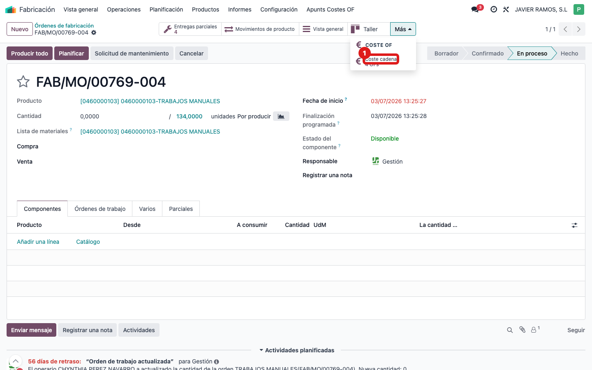
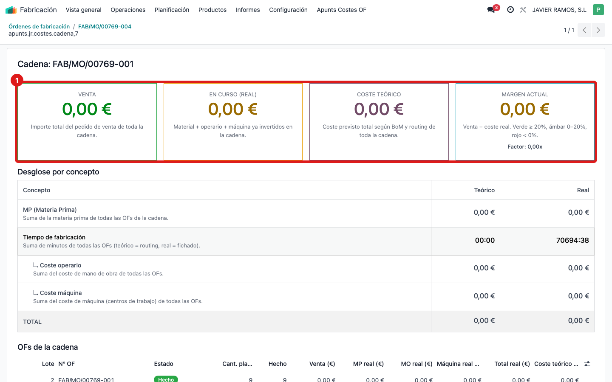
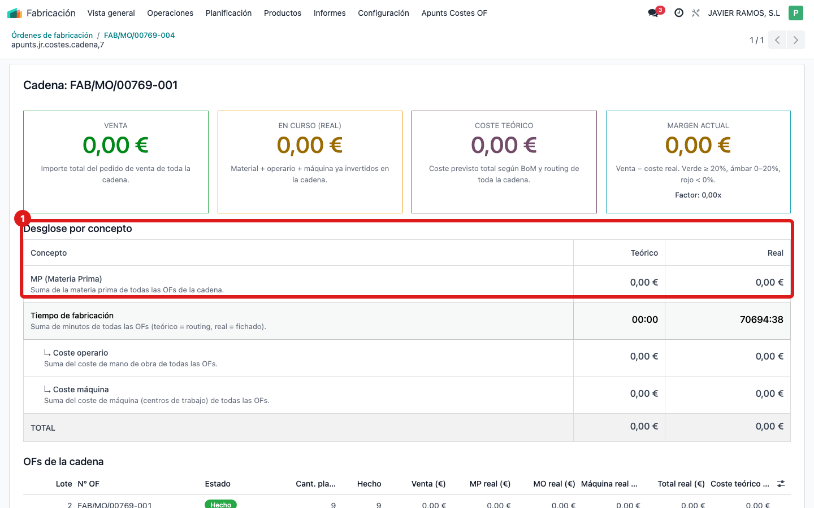
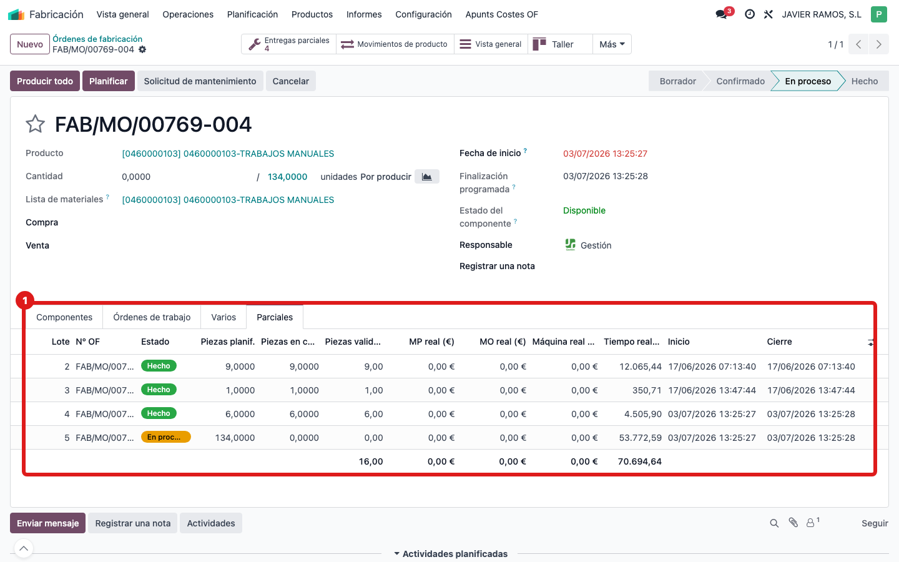

## Cuándo se usa
Una OF se fabricó por partes (parciales / back-orders) y quieres el coste y el margen de toda la cadena junta, no de cada trozo por separado.

## Antes de empezar
Abre una de las OF de la cadena (la madre o cualquier parcial). El botón solo aparece si la OF es parcial.

## Pasos
1. En la OF, pulsa el smart button **Coste cadena** (arriba a la derecha; muestra el número de OFs, p. ej. "3 OFs"). Si no lo ves, despliega el botón **Más** de esa fila de botones.
   
2. Se abre la pantalla de la cadena con las cuatro tarjetas consolidadas (Venta, En curso, Coste teórico, Margen actual) y el Factor de toda la cadena.
   
3. Baja al **Desglose por concepto** (MP, tiempo de fabricación, operario, máquina) y a la lista **OFs de la cadena**, que suma madre y back-orders.
   
4. Para ver los lotes uno a uno, vuelve a la OF y abre la pestaña **Parciales**: cada fila es un lote con sus piezas y su coste real.
   

## Si algo va mal
- No aparece el botón **Coste cadena**: míralo bajo **Más**; si tampoco está, la OF no es parcial (no tiene back-orders). El coste se ve en su propia pantalla COSTE OF.
- La cadena no incluye alguna parcial que esperabas: comprueba que ese back-order pertenece a la misma cadena (nace de la misma madre).
- Los totales de la cadena no cuadran con la suma manual: pulsa refrescar en la OF o revisa que todas las parciales tengan su coste imputado.

## Escalar
Si la cadena consolida OFs que no son de ese trabajo, o falta alguna parcial, avisa a la oficina técnica con el número de la OF madre y de las parciales implicadas.
