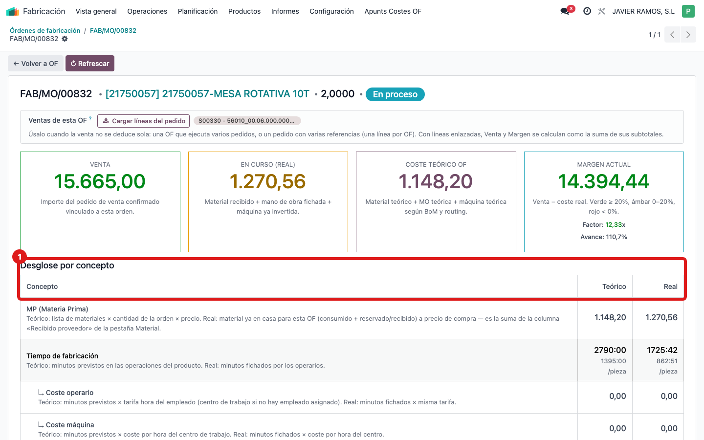
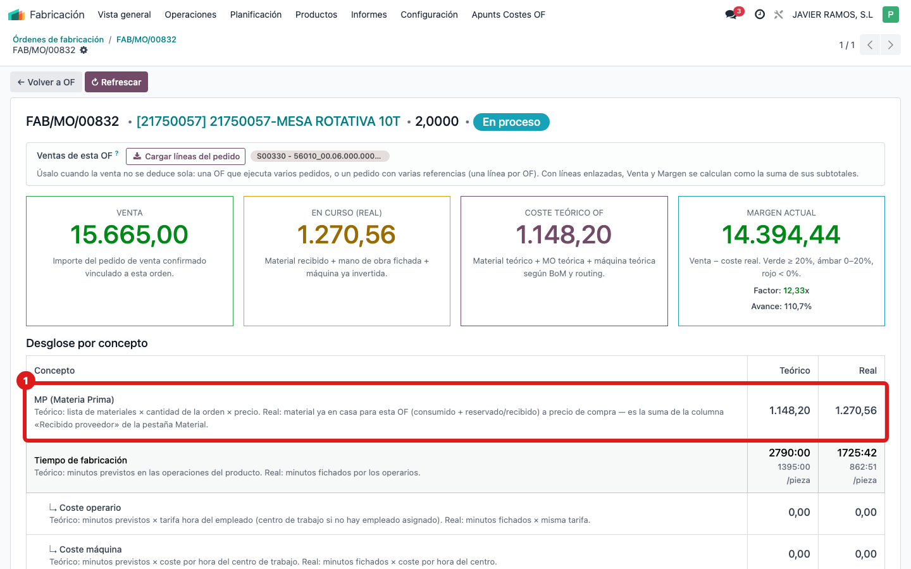
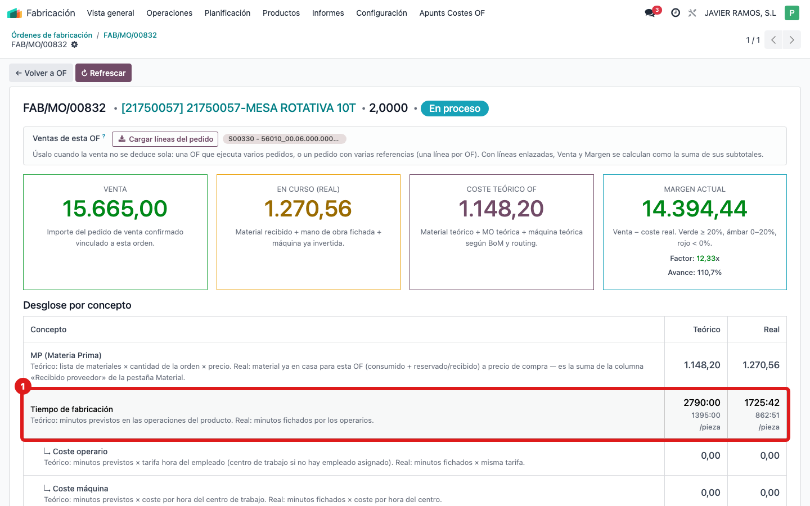
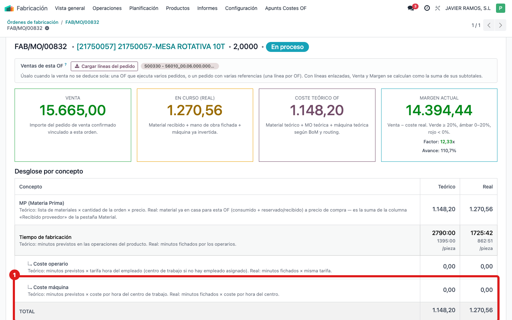

## Cuándo se usa
Quieres saber en qué se va el dinero de la OF: cuánto es material, cuánto tiempo de fabricación (operario y máquina) y si hay servicios externos, comparando lo teórico con lo real.

## Antes de empezar
Abre la pantalla **COSTE OF** de la orden. La tabla está justo debajo de las cuatro tarjetas.

## Pasos
1. Baja hasta la sección **Desglose por concepto**. La tabla tiene tres columnas: **Concepto**, **Teórico** y **Real**.
   
2. Lee la fila **MP (Materia Prima)**: teórico es la lista de materiales × cantidad × precio; real es el material ya en casa para esta OF (coincide con la columna "Recibido proveedor" de la pestaña Material).
   
3. Lee la fila **Tiempo de fabricación**: minutos previstos frente a minutos fichados por los operarios (verás también el detalle por pieza debajo del total).
   
4. Debajo, las dos filas con la flecha: **↳ Coste operario** (minutos × tarifa del empleado) y **↳ Coste máquina** (minutos × coste por hora del centro de trabajo). Si la OF lleva galvanizado, pintura o tratamientos, aparece **Servicios externos**. La última fila es el **TOTAL** teórico y real.
   
5. Si aparece un aviso amarillo **"Esta orden está gastando mucho más material del previsto"**, apúntalo: casi siempre es que a la lista de materiales del producto le faltan piezas o cantidades.

## Si algo va mal
- El **Real** de MP está muy por encima del **Teórico** y salta el aviso amarillo: revisa la lista de materiales (BoM) del producto; suele faltar alguna pieza o servicio externo.
- El **Real** del tiempo está a 0 con la OF avanzada: los operarios no han fichado en las órdenes de trabajo; ese coste no se puede calcular hasta que fichen.
- **Servicios externos** no aparece pero sabes que hubo galvanizado: comprueba que el pedido de compra de ese servicio está marcado como "Servicio externo" y vinculado a la OF.

## Escalar
Si el desglose no cuadra (por ejemplo material real disparado sin explicación), avisa a la oficina técnica con el número de OF y captura de la tabla, indicando qué concepto ves raro.
