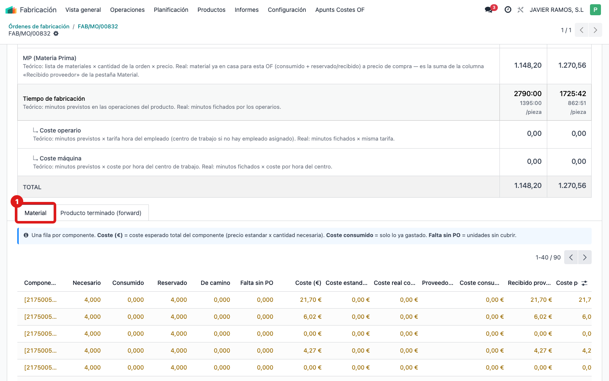
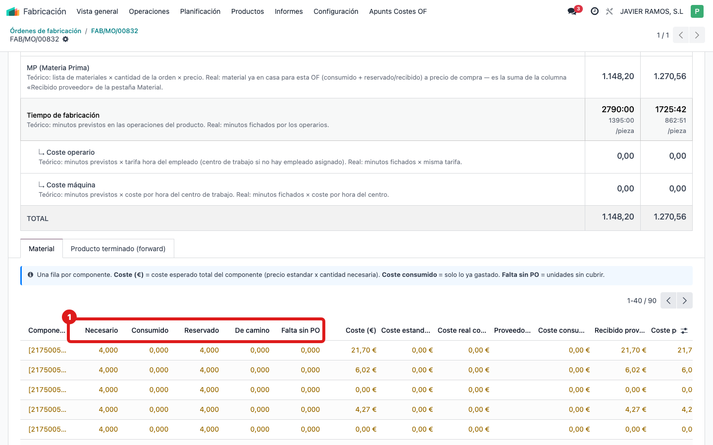
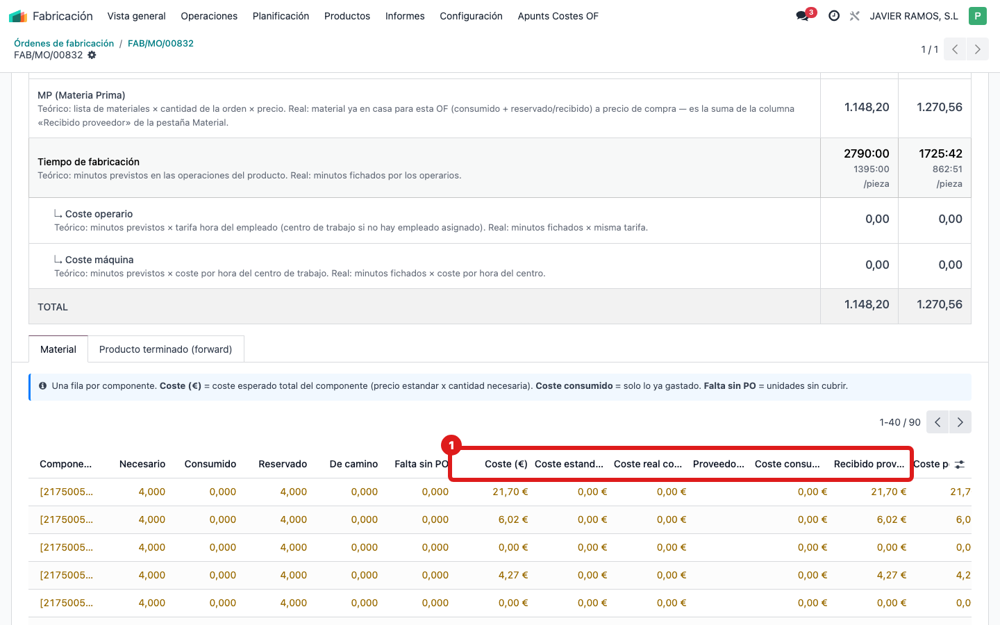
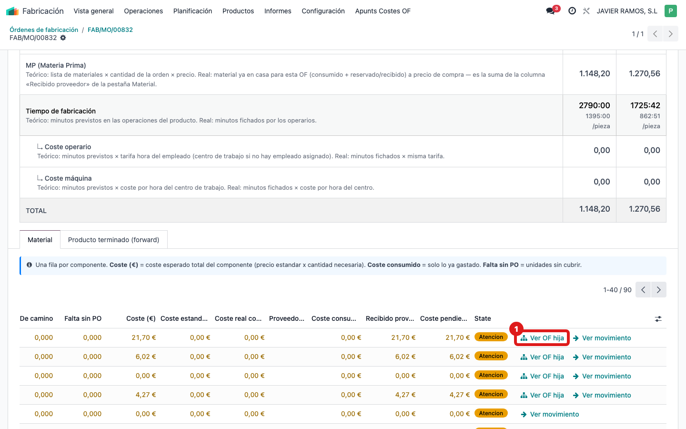

## Cuándo se usa
Necesitas ver componente a componente qué hace falta para la OF, qué está consumido, reservado o de camino, qué falta por comprar y de qué proveedor viene cada material.

## Antes de empezar
Abre la pantalla **COSTE OF** de la orden. La pestaña **Material** está debajo del desglose por concepto.

## Pasos
1. Pulsa la pestaña **Material**.
   
2. Lee cada fila (un componente): **Componente**, **Necesario**, **Consumido**, **Reservado**, **De camino** y **Falta sin PO** (unidades aún sin pedido de compra).
   
3. Mira las columnas de dinero: **Coste (€)** (coste esperado del componente), **Recibido proveedor (€)** (lo ya recibido) y la columna **Proveedor preferido**. El color de cada fila es un semáforo del estado de ese material.
   
4. Si un componente se fabrica en otra orden, verás el vínculo **Ver OF hija**: púlsalo para saltar al coste de esa OF que fabrica el subconjunto.
   
5. Si a un componente le falta material sin pedido, tienes el botón **Crear PO faltante** para lanzar la compra desde aquí.

## Si algo va mal
- **Falta sin PO** con unidades pendientes: aún no hay pedido de compra que cubra ese material; usa **Crear PO faltante** o avisa a compras.
- Un componente no muestra **Proveedor preferido**: falta configurar el proveedor en la ficha del producto.
- Ves **Ver OF hija** pero la hija está a 0 de coste: esa OF hija todavía no tiene coste real imputado.

## Escalar
Si el material que ves no coincide con lo que realmente lleva la pieza, avisa a la oficina técnica: probablemente la lista de materiales (BoM) del producto esté incompleta. Indica el número de OF y captura de la pestaña Material.
