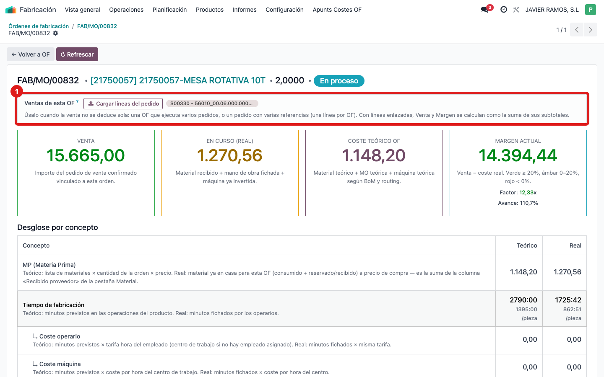
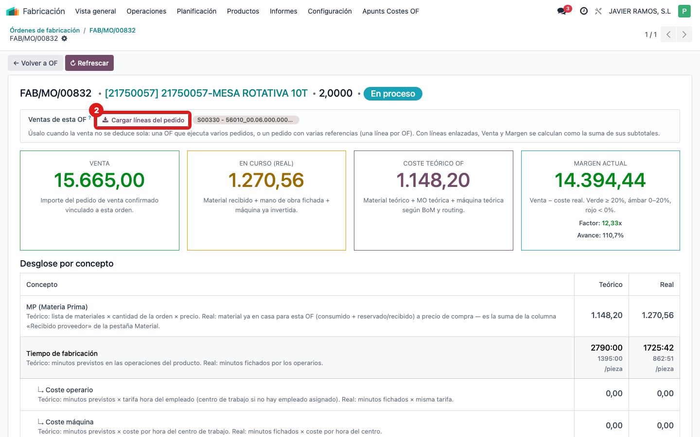
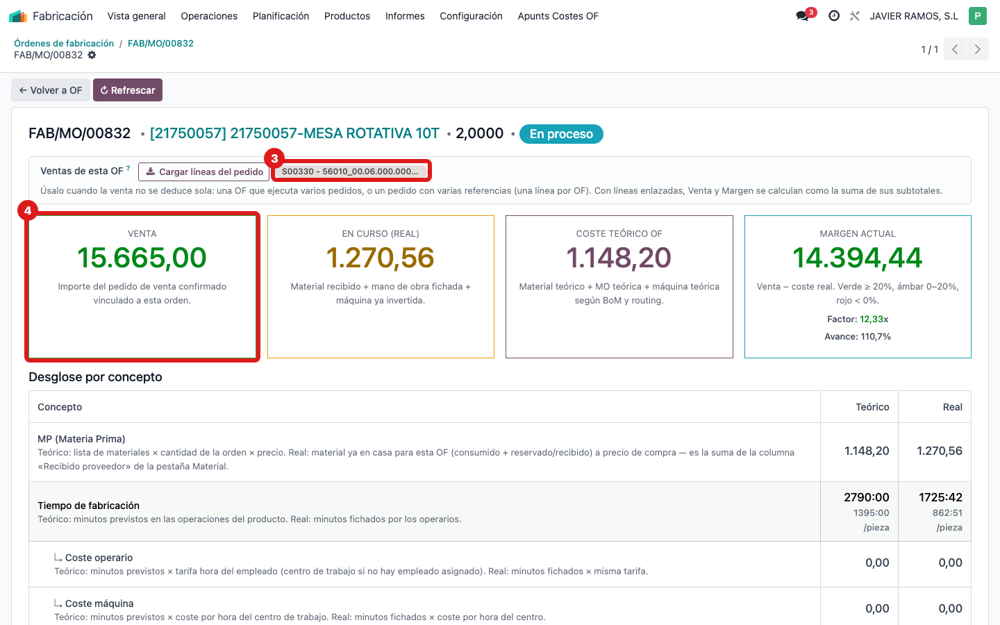

## Cuándo se usa
El margen de la OF sale mal o a 0 porque el sistema no sabe qué venta corresponde a esta orden. Le indicas a mano la línea (o líneas) del pedido que valoran esta OF.

## Antes de empezar
Ten claro qué pedido de venta y qué línea corresponden a esta OF. Puedes hacerlo desde la pantalla **COSTE OF** (recuadro superior) o desde la OF normal, pestaña **Varios**.

## Pasos
1. En la pantalla **COSTE OF**, localiza arriba el recuadro **Ventas de esta OF (para el margen)**.
   
2. Pulsa el botón **Cargar líneas del pedido**. Es inteligente: si el producto fabricado está como línea del pedido, carga solo esa línea; si no lo encuentra, carga todas las líneas del pedido.
   
3. Revisa las líneas que han quedado enlazadas en el campo. Puedes quitar las que sobren o añadir a mano otra línea de otro pedido si esta OF ejecuta varios.
   
4. Comprueba que las tarjetas **Venta** y **Margen actual** ahora reflejan la suma de los subtotales de las líneas enlazadas. Si dejas el campo vacío, el sistema vuelve al cálculo automático.

## Si algo va mal
- El pedido tiene **varias referencias** (una línea por OF): enlaza solo la línea que corresponde a esta OF, no todas.
- Una **misma OF ejecuta varios pedidos**: añade a mano las líneas de cada pedido en el campo.
- El **producto fabricado no está en el pedido** (se vende como conjunto): usa **Cargar líneas del pedido** para traer todas y quédate con la que aporta el importe correcto.
- No aparece el pedido al escribir: comprueba que el pedido de venta está confirmado.

## Escalar
Si tras enlazar las líneas la Venta sigue sin cuadrar, avisa a la oficina técnica con el número de OF, el pedido de venta y las líneas que esperabas ver.
