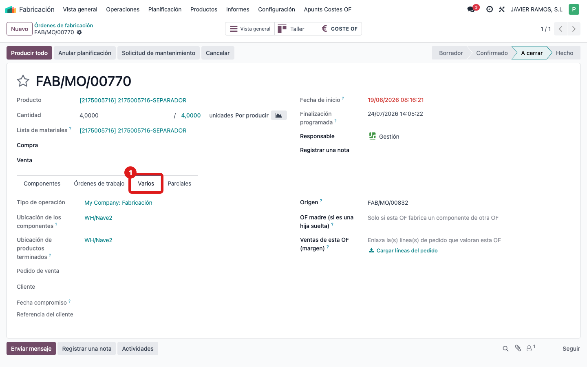
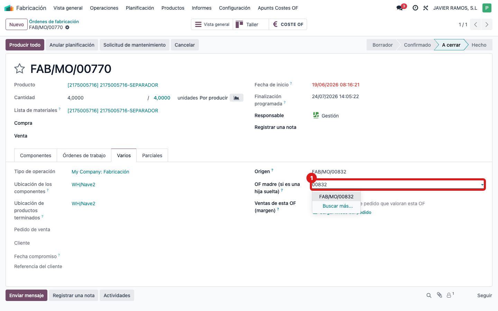
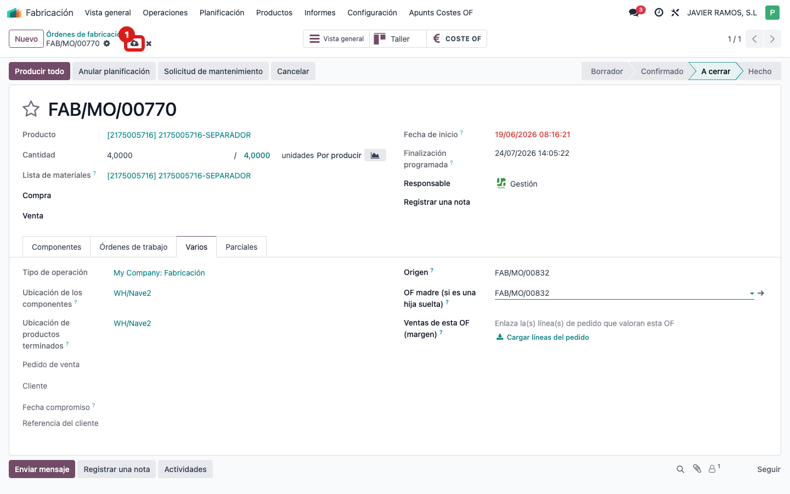

## Cuándo se usa
Un subconjunto se fabricó en una OF que se lanzó por separado (no salió del conjunto) y por eso su coste no sube a la OF madre. Le indicas a mano cuál es su madre.

## Antes de empezar
Abre la **OF hija** (la que fabrica el componente) y ten a mano el número de la **OF madre**.

## Pasos
1. En la OF hija, abre la pestaña **Varios**.
   
2. Busca el campo **OF madre (si es una hija suelta)** y selecciona la orden madre.
   
3. Guarda los cambios.
   
4. Abre la OF madre: el coste de la hija ya sube al componente correspondiente (pestaña Material de su COSTE OF) y la hija aparece en el smart button **Orden de fabricación hija**.

## Si algo va mal
- No encuentras el campo: asegúrate de estar en la pestaña **Varios** de la OF hija (no en la madre).
- No aparece la madre al buscar: escribe su número de OF; el campo solo deja elegir órdenes existentes.
- Enlazaste la hija equivocada: vacía el campo **OF madre (si es una hija suelta)** y vuelve a seleccionar la correcta.

## Escalar
Si tras enlazar la hija su coste no aparece en la madre, avisa a la oficina técnica con los números de la OF madre y la hija.
