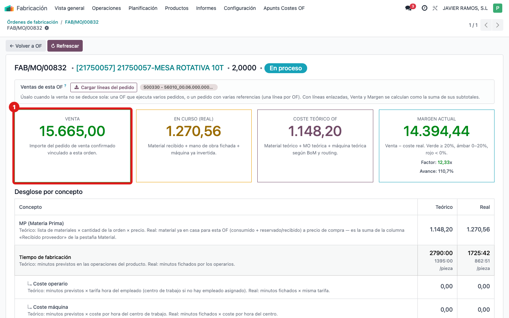
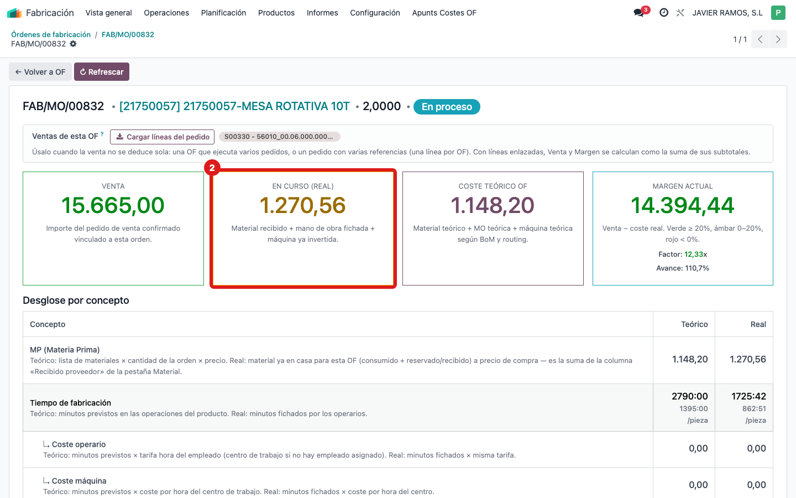
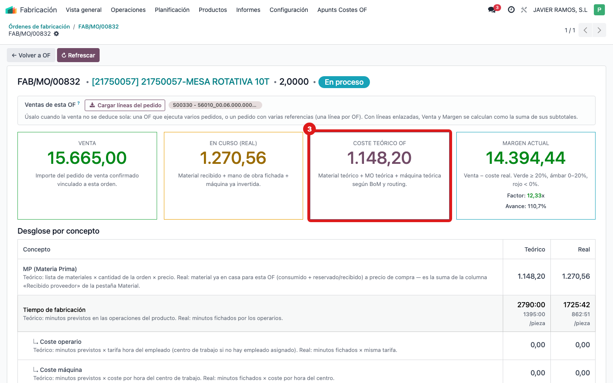
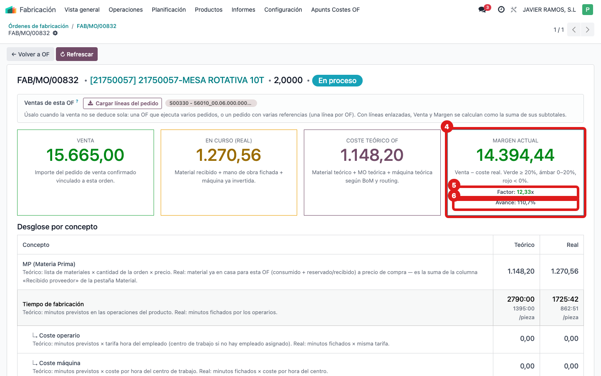

## Cuándo se usa
Ya estás en la pantalla **COSTE OF** y necesitas entender de un vistazo si la orden va bien o mal de dinero. Las cuatro tarjetas de arriba son el resumen.

## Antes de empezar
Abre la pantalla **COSTE OF** de la orden (ver la guía "Ver el coste de una orden de fabricación").

## Pasos
1. Mira la primera tarjeta, **Venta** (borde verde): es el importe del pedido de venta confirmado que está vinculado a esta OF, o sea lo que vamos a cobrar por lo fabricado.
   
2. Mira la segunda, **En curso (real)** (borde ámbar): lo que llevamos gastado de verdad hasta ahora: material recibido + mano de obra fichada + máquina invertida.
   
3. Mira la tercera, **Coste teórico OF** (borde azul): lo que debería costar según la lista de materiales (MP) y las operaciones (routing). Es la referencia contra la que comparar.
   
4. Mira la cuarta, **Margen actual**: es la **Venta − En curso (real)**. El color es un semáforo: verde si el margen es ≥ 20%, ámbar entre 0% y 20%, rojo si es negativo (perdemos).
   
5. Dentro de esa misma tarjeta, lee el **Factor**: es Venta ÷ coste real, y el objetivo es ≥ **1,35×**. Verde ≥ 1,35, ámbar entre 1 y 1,35, rojo por debajo de 1. Y el **Avance**: coste real ÷ coste teórico × 100, o sea cuánto del coste previsto se ha consumido ya.

## Si algo va mal
- La tarjeta **Venta** aparece a 0: la OF no tiene una venta vinculada. Puedes indicársela a mano (ver la guía "Indicar la venta de una OF para el margen").
- El **Margen** sale en rojo pero el trabajo va a medias: recuerda que "En curso (real)" solo cuenta lo ya gastado; el Factor y el Avance ayudan a leerlo (si el avance es bajo, aún queda coste por imputar).
- El **Factor** aparece muy alto o vacío: suele indicar que falta imputar coste real o que la venta no está bien vinculada.

## Escalar
Si los números de las tarjetas no cuadran con lo que sabes de la orden, avisa a la oficina técnica con el número de OF y una captura de las cuatro tarjetas.
