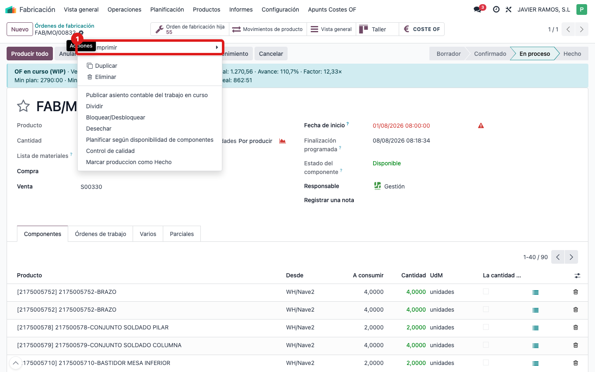
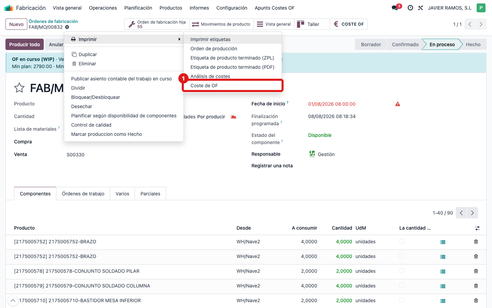
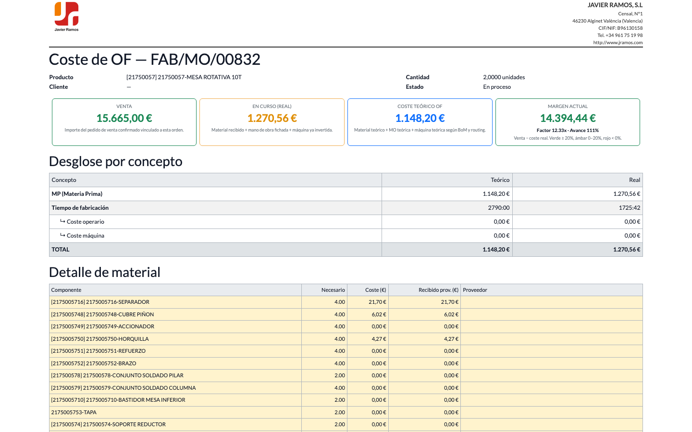

## Cuándo se usa
Necesitas el coste de la OF en un documento para archivar, compartir o comentar en una reunión: mismo contenido que la pantalla pero en PDF con el logo de la empresa.

## Antes de empezar
Abre la **orden de fabricación** (la OF normal, no hace falta estar en la pantalla de coste).

## Pasos
1. Con la OF abierta, abre el menú de engranaje **⚙ Acciones** (arriba, junto al nombre de la OF) y entra en **Imprimir**.
   
2. Elige la opción **Coste de OF**.
   
3. Se genera el PDF con la cabecera (logo y datos de la empresa), las cuatro tarjetas (Venta, En curso, Coste teórico, Margen), el desglose por concepto y el detalle de material y mano de obra. Los números son los mismos que ves en pantalla.
   

## Si algo va mal
- No aparece **Coste de OF** en Acciones → Imprimir: comprueba que estás sobre una orden de fabricación; el informe solo sale ahí.
- Los números del PDF no coinciden con la pantalla: abre primero la pantalla **COSTE OF** y pulsa **↻ Refrescar**, luego vuelve a imprimir.
- El PDF tarda o no descarga: revisa el bloqueador de ventanas del navegador.

## Escalar
Si el PDF sale con datos vacíos o el logo mal, avisa a la oficina técnica indicando el número de OF y adjuntando el PDF generado.
