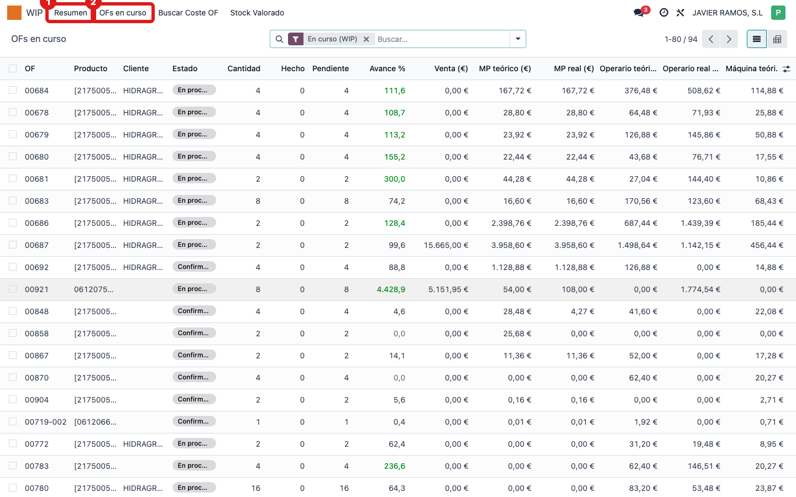
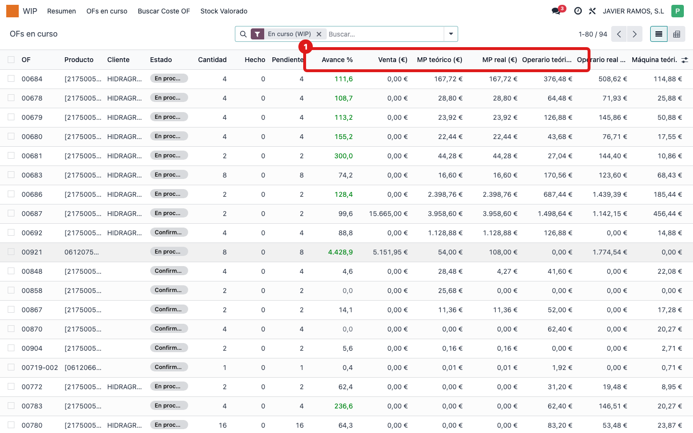
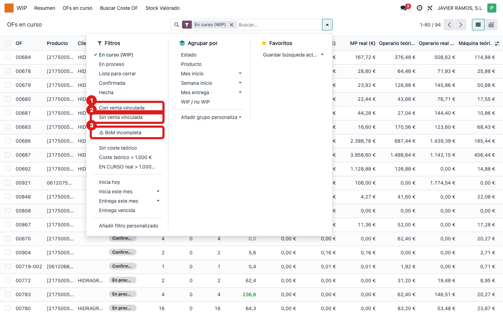

## Cuándo se usa
Quieres la foto global de todo lo que está en fabricación ahora mismo: venta, coste teórico, coste real (en curso), margen y factor de cada OF, y poder filtrar (por ejemplo, las que tienen la lista de materiales incompleta).

## Antes de empezar
Nada especial. Es una pantalla de consulta (no se edita desde aquí).

## Pasos
1. Abre el menú **WIP** y pulsa **Resumen** para ver la foto global de trabajo en curso; o pulsa **OFs en curso** para ir directo a la lista detallada.
   
2. En **OFs en curso** verás una fila por orden con sus columnas: **Venta (€)**, **MP teórico/real**, **Operario teórico/real**, **Máquina teórico/real**, **Coste teórico OF (€)**, **EN CURSO real (€)**, **Margen teórico y real (€)**, **Factor (×)** y **Avance %**.
   
3. Usa los filtros de la barra de búsqueda: **Con venta vinculada**, **Sin venta vinculada**, **⚠ BoM incompleta**, **Sin coste teórico**, entre otros. También puedes agrupar por estado, producto o mes.
   
4. Para el coste de una OF concreta, entra en su fila o usa **WIP → Buscar Coste OF**.

## Si algo va mal
- La lista sale vacía: puede que el filtro **En curso (WIP)** haya dejado fuera todo; revisa los filtros activos en la barra de búsqueda.
- Una OF aparece con **⚠ BoM incompleta**: su lista de materiales está incompleta y el coste de material real puede estar disparado; conviene revisar esa OF.
- Los datos parecen desactualizados (acabas de recibir una compra): en **WIP → Resumen** pulsa **↻ Forzar recompute**.

## Escalar
Si una OF que está en marcha no aparece en la lista, o sus columnas de coste están vacías sin motivo, avisa a la oficina técnica indicando el número de OF.
