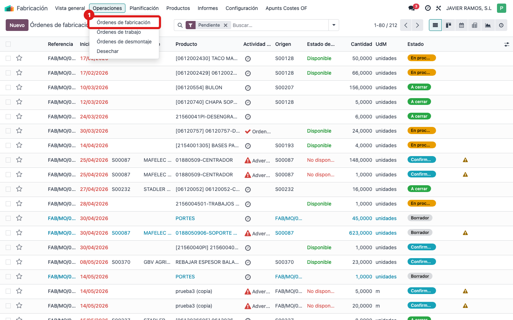
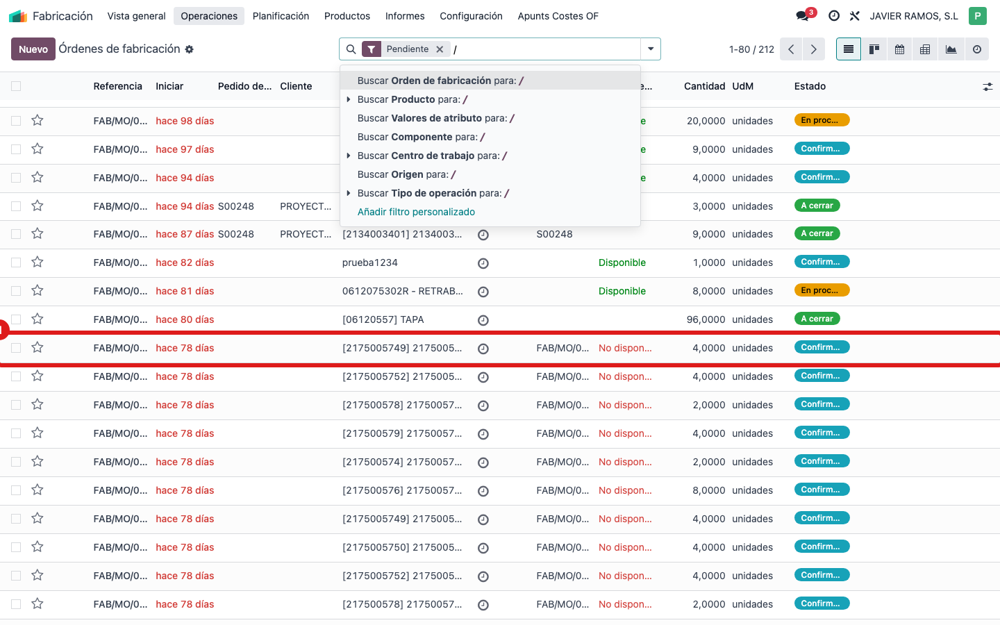
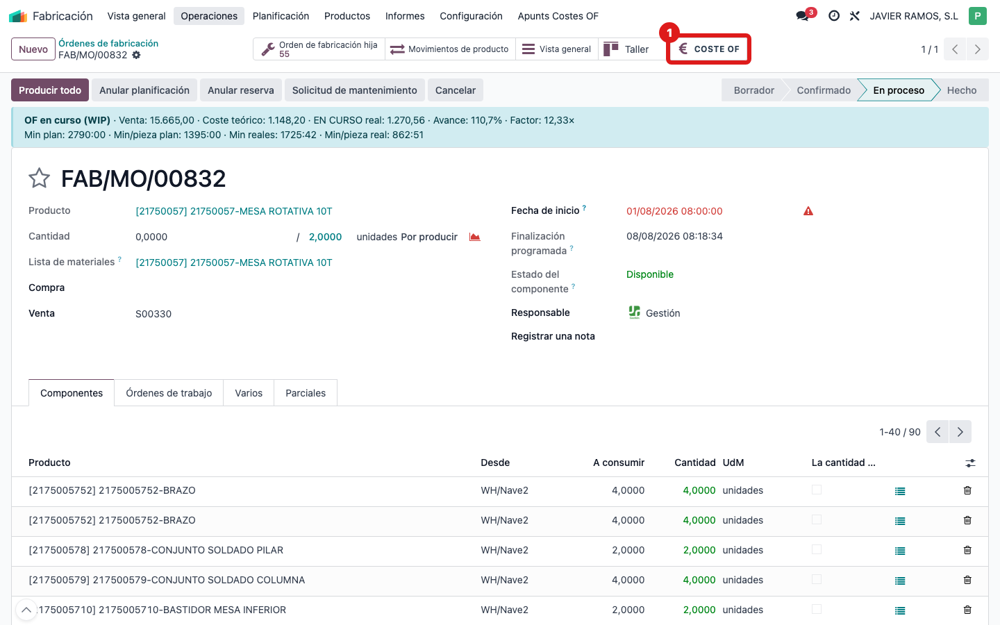
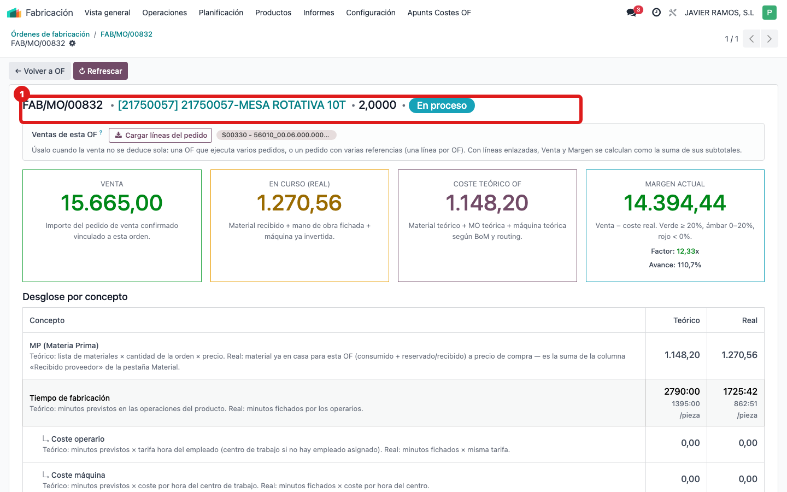

## Cuándo se usa
Quieres saber cuánto está costando (y cuánto debería costar) una orden de fabricación concreta: material, mano de obra, máquina y margen. Es la pantalla de partida de todo el control de costes.

## Antes de empezar
Ten a mano el número de la OF (por ejemplo `WH/MO/00832`) o el producto que se fabrica.

## Pasos
1. Entra en **Fabricación** y abre **Órdenes de fabricación**.
   
2. Abre la OF que quieres revisar pulsando sobre su fila.
   
3. Arriba a la derecha, pulsa el botón **COSTE OF** (el del icono del euro €).
   
4. Se abre la pantalla de coste consolidado: cabecera con el nº de OF, producto y estado, las cuatro tarjetas y el desglose por concepto.
   
5. Para volver a la OF normal, pulsa **← Volver a OF** arriba a la izquierda. Si acabas de recibir material o fichar horas y no ves los números al día, pulsa **↻ Refrescar**.

## Si algo va mal
- No encuentras el botón **COSTE OF**: comprueba que estás en la OF y no en un pedido. El botón está en la fila de botones de la esquina superior derecha.
- Prefieres buscar la OF por número: usa el menú **WIP → Buscar Coste OF**, escribe la OF en el campo y pulsa **Ver Coste OF**.
- Los números parecen antiguos: pulsa **↻ Refrescar** dentro de la pantalla de coste.

## Escalar
Si la pantalla no abre o da error, avisa a la oficina técnica indicando el número de OF, qué botón pulsaste y el mensaje exacto que aparece.
