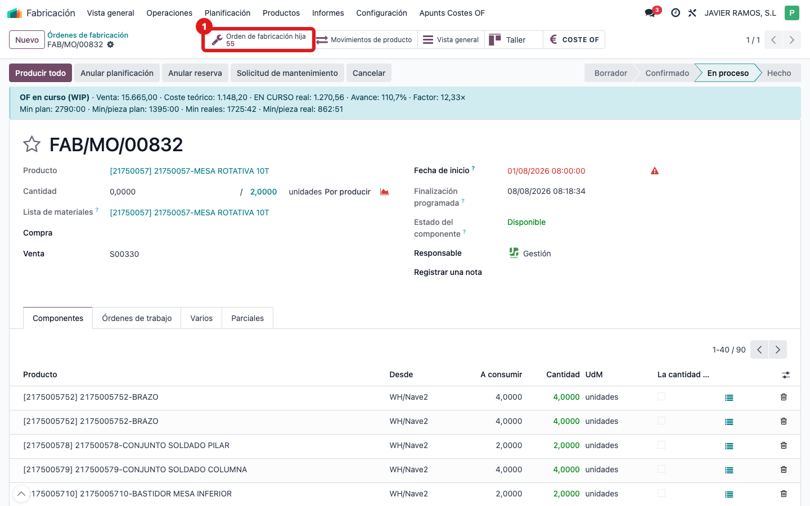
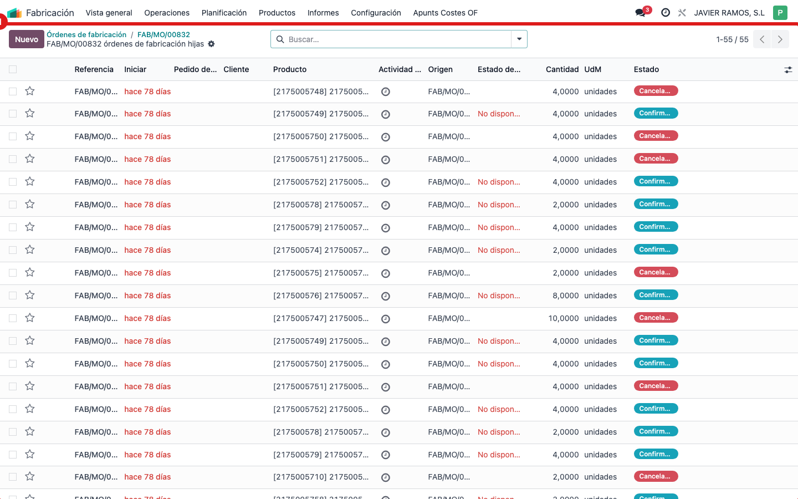
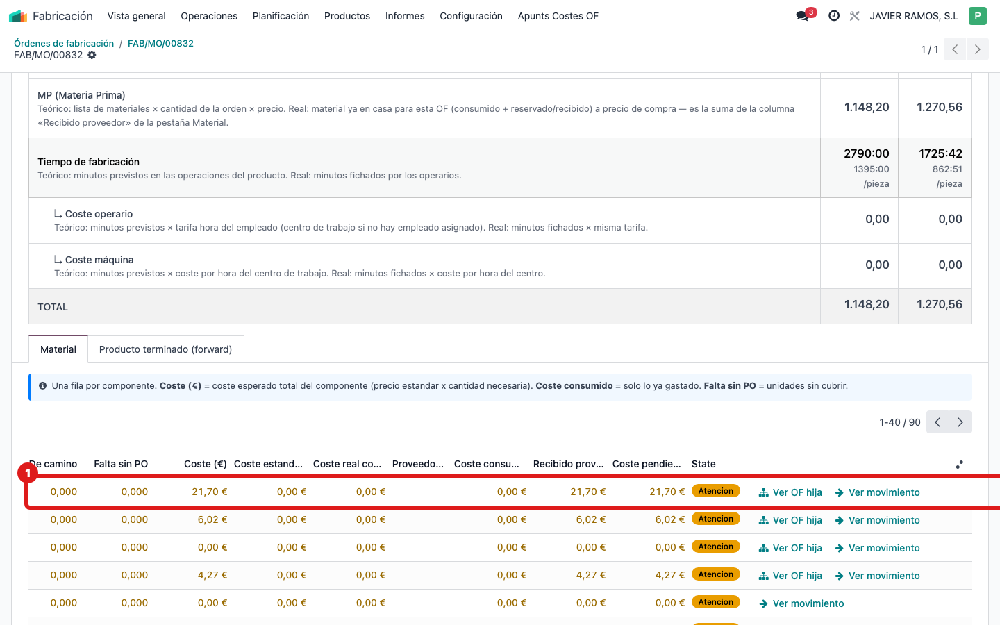

## Cuándo se usa
La OF fabrica un conjunto cuyos componentes se hacen en otras órdenes (las OF hijas). Quieres verlas todas y saber cuánto costó cada subconjunto para que sume al coste de la madre.

## Antes de empezar
Abre la **OF madre** (la del conjunto). El botón de hijas está en la fila de botones de la esquina superior derecha.

## Pasos
1. En la OF madre, pulsa el smart button **Orden de fabricación hija** (arriba a la derecha). Incluye las hijas detectadas por Origen y también las que enlazaste a mano.
   
2. Se abre la lista de las OF hijas; entra en cualquiera para ver su propio coste.
   
3. Vuelve a la OF madre y abre su pantalla **COSTE OF**, pestaña **Material**: cada componente que se fabrica como subconjunto muestra su coste real (roll-up) con el vínculo **Ver OF hija** para saltar a esa orden.
   

## Si algo va mal
- El botón **Orden de fabricación hija** no aparece o marca 0: no hay hijas detectadas. Si sabes que una hija se lanzó suelta, enlázala a mano (ver la guía "Enlazar una OF hija que se lanzó suelta").
- Una hija no aparece en la lista: normalmente porque su Origen no apunta a esta OF; enlázala manualmente.
- El subconjunto en la pestaña Material sale a coste 0: la OF hija aún no tiene coste real imputado.

## Escalar
Si faltan hijas que deberían estar o el coste del subconjunto no sube a la madre, avisa a la oficina técnica con el número de la OF madre y de la hija afectada.
