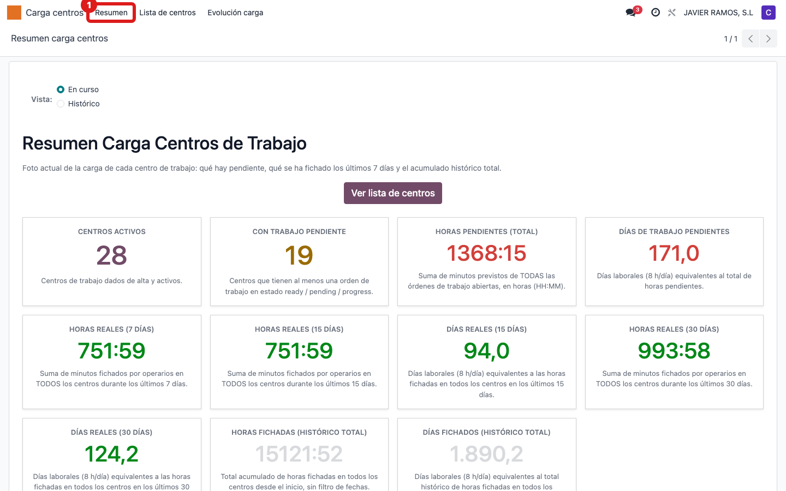
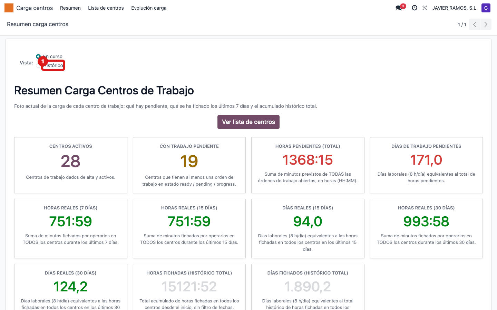
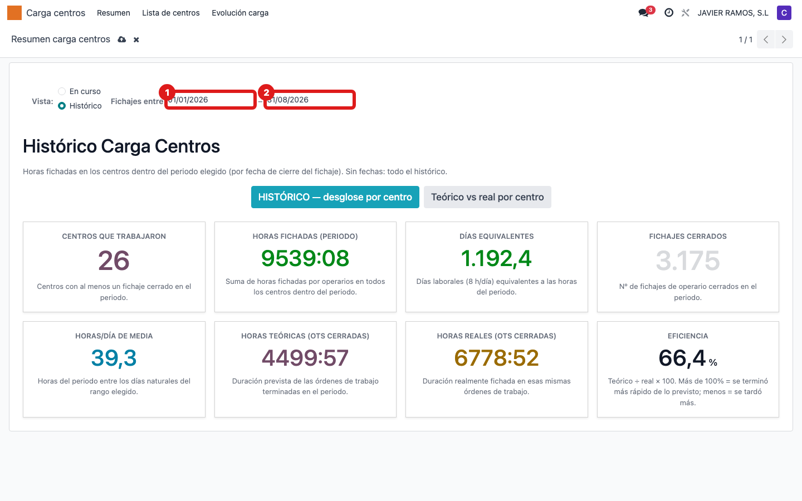
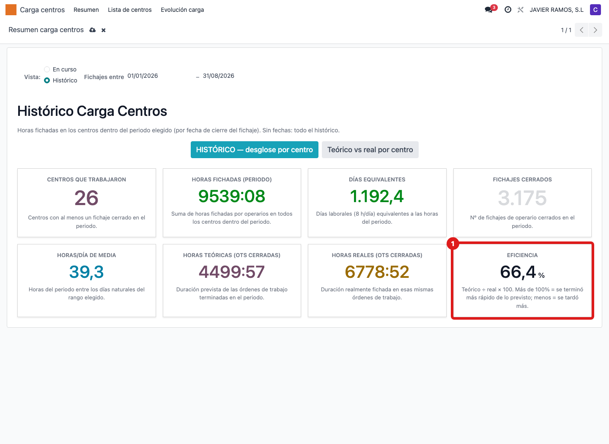
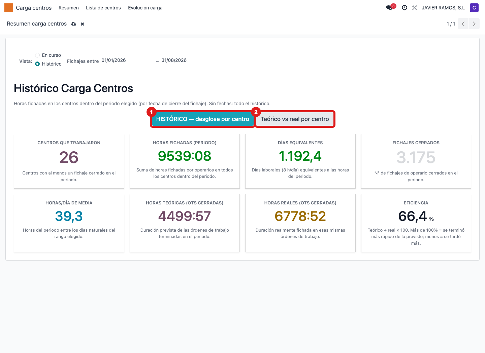

## Cuándo se usa
Cuando quieres saber cuántas horas se han fichado en los centros en un periodo y comparar lo
previsto (teórico) con lo que de verdad costó (real): la **eficiencia** del taller.

## Antes de empezar
- Necesitas el permiso de contabilidad de **solo lectura** para ver el menú (igual que en Dirección).
- Ten claro el periodo que quieres analizar (mes, trimestre, año). Si lo dejas en blanco, verás todo el histórico.

## Pasos
1. En el menú superior entra en **Carga centros** y pulsa **Resumen**.
   
2. Arriba, en **Vista:**, marca la opción **Histórico** (por defecto está en "En curso").
   
3. Aparece la fila **Fichajes entre** con dos casillas: escribe la fecha en **Desde** y en
   **Hasta**. Si las dejas vacías, se cuenta todo el histórico.
   
4. Lee las tarjetas del periodo: **Centros que trabajaron**, **Horas fichadas**,
   **Días equivalentes**, **Fichajes cerrados**, **Horas/día de media** (solo aparece si
   pusiste Desde y Hasta), **Horas teóricas (OTs cerradas)**, **Horas reales (OTs cerradas)**
   y **Eficiencia (%)**. En Eficiencia, más de 100% significa que se terminó más rápido de lo
   previsto; menos, que se tardó más.
   
5. Para el desglose por centro pulsa **HISTÓRICO — desglose por centro**; para comparar lo
   previsto con lo real centro a centro, pulsa **Teórico vs real por centro**.
   

## Si algo va mal
- No ves la fila **Fichajes entre**: sigues en la vista "En curso". Marca **Histórico** en "Vista:".
- La tarjeta **Horas/día de media** no aparece: es normal, solo se muestra cuando rellenas Desde y Hasta.
- La eficiencia sale rara: recuerda que solo cuenta las órdenes de trabajo **cerradas** en el periodo; un rango con pocas OTs cerradas da cifras poco representativas.

## Escalar
Si las horas teóricas o reales no cuadran con lo que sabes del taller, avisa a Apunts
indicando el periodo (Desde–Hasta) y qué centro descuadra.
