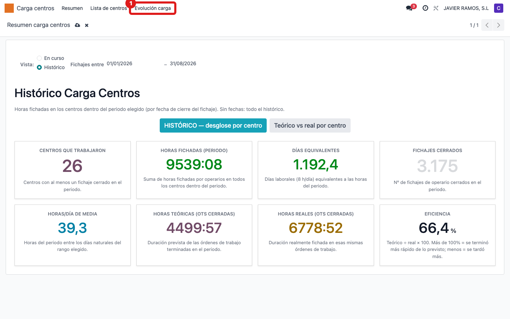
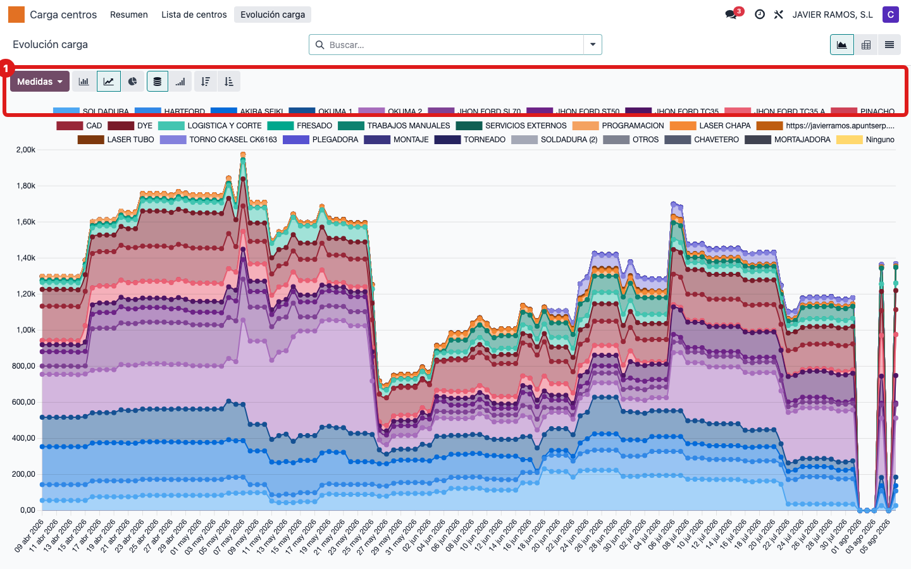
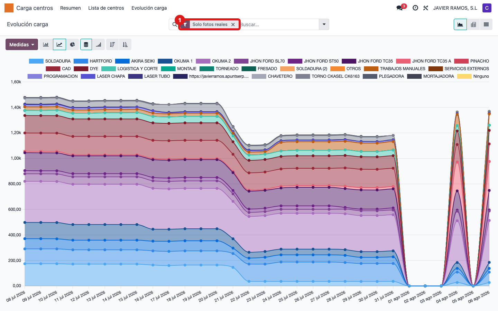
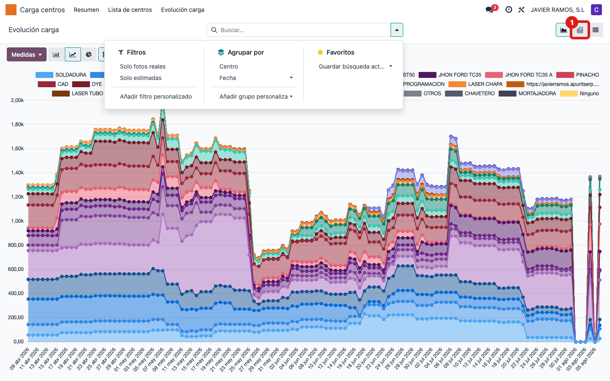

## Cuándo se usa
Cuando quieres ver si la carga pendiente de los centros crece (acumulamos retraso) o baja,
día a día y centro a centro. Es la foto de la tendencia de la carga de trabajo.

## Antes de empezar
- Necesitas el permiso de contabilidad de **solo lectura** para ver el menú.
- Cada día a las 04:30 se guarda sola una foto de las horas pendientes por centro. Las
  primeras filas marcadas como "Estimado" (en gris) son la reconstrucción retroactiva
  inicial; las demás son fotos reales.

## Pasos
1. En el menú superior entra en **Carga centros** y pulsa **Evolución carga**.
   
2. Se abre el gráfico de líneas con las **horas pendientes** de cada centro por día. La
   leyenda de la derecha (o arriba) indica qué color es cada centro.
   
3. Para quedarte solo con los datos de verdad, pulsa **Filtros** y marca **Solo fotos reales**
   (deja fuera las estimadas iniciales, que salen en gris).
   
4. Para ver el detalle en tabla, cambia a la vista de **pivote**: cruza cada centro (filas)
   con la semana (columnas) y suma las horas pendientes.
   

## Si algo va mal
- Ves filas en gris que descuadran la tendencia: son las estimadas iniciales. Aplica **Solo fotos reales**.
- El gráfico no tiene puntos de hoy: la foto del día se toma a las 04:30; si acabas de instalar o algo falló, puede faltar.
- Un centro no aparece: solo salen centros con carga registrada en las fotos guardadas.

## Escalar
Si faltan las fotos de varios días seguidos, avisa a Apunts: puede ser la tarea programada
diaria de las 04:30 que no está corriendo.
