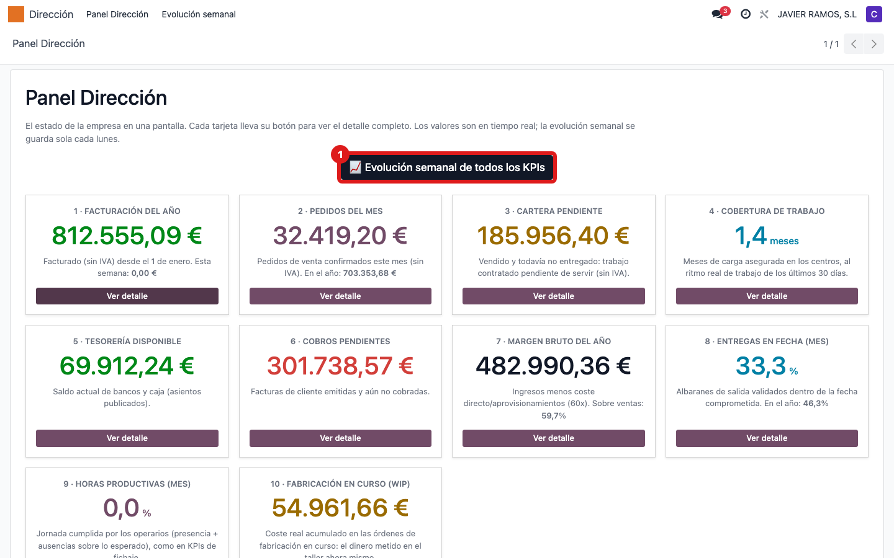
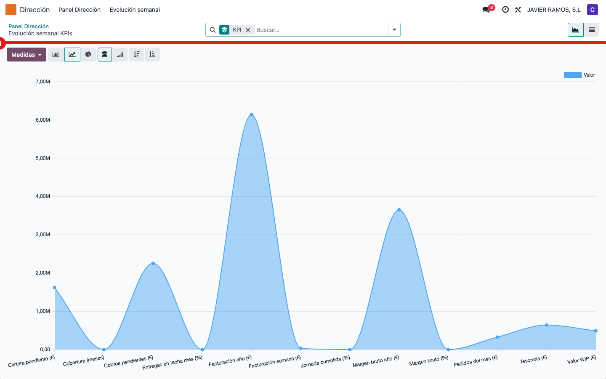
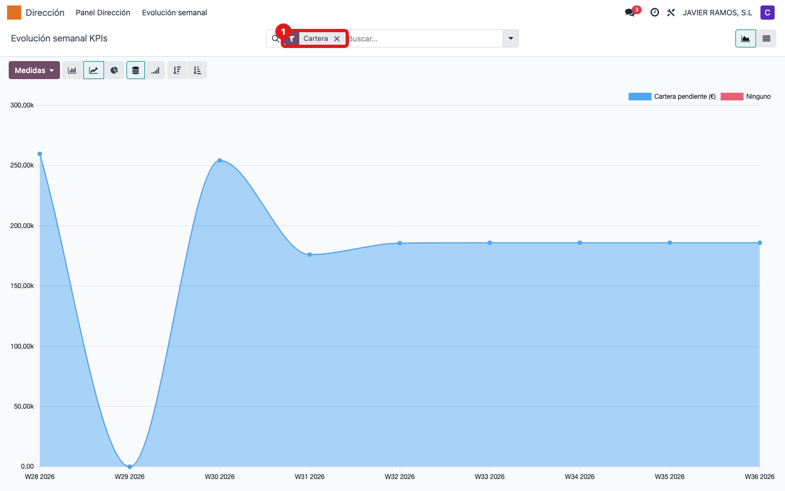
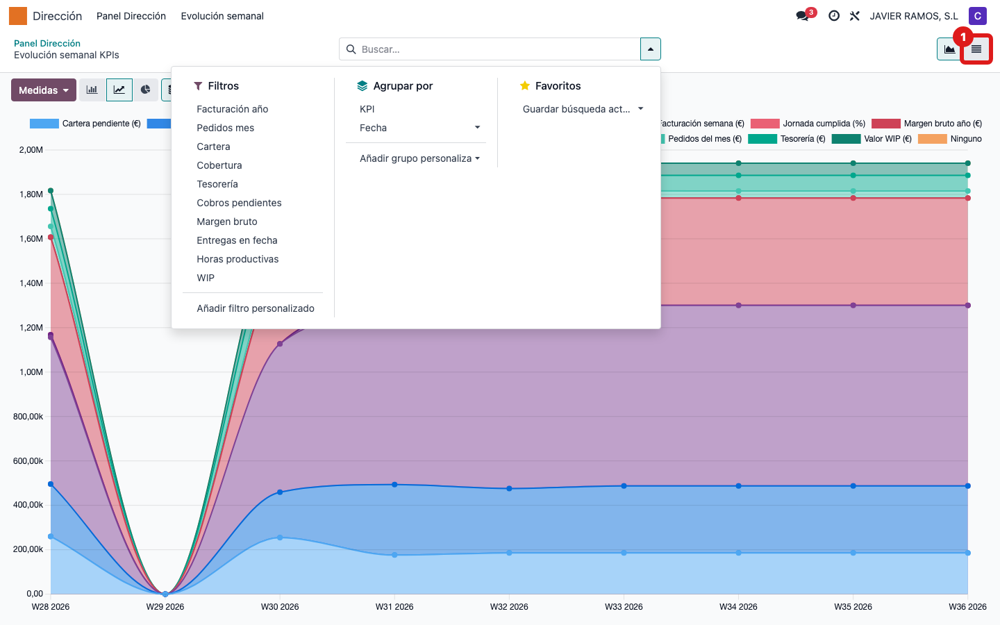

## Cuándo se usa
Cuando no te basta con el número de hoy y quieres ver la tendencia: cómo ha evolucionado
semana a semana un indicador (facturación, cartera, cobertura, WIP...) para saber si mejora
o empeora.

## Antes de empezar
- Necesitas el permiso de contabilidad de **solo lectura** (el mismo del Panel Dirección).
- La historia empieza el día que se instaló el módulo: cada lunes a las 05:00 se guarda sola
  una foto de todos los indicadores. Al principio habrá pocos puntos; se van sumando semana a semana.

## Pasos
1. Desde el **Panel Dirección**, pulsa el botón oscuro **📈 Evolución semanal de todos los KPIs**.
   (También puedes entrar por **Dirección → Evolución semanal**.)
   
2. Se abre el gráfico **agrupado por indicador (KPI)**: sale una sola línea que va saltando de
   un KPI a otro y mezcla euros con porcentajes. Así no se entiende — hay que aislar un indicador.
   
3. En la barra de búsqueda **quita el agrupado "KPI"** y en **Filtros** elige el indicador que
   quieras ver (por ejemplo **Cartera**, **Facturación año** o **Cobertura**). El eje pasa a
   semanas y queda una sola línea limpia de ese indicador.
   
4. Para ver los valores exactos de cada semana, cambia a la vista de **lista** (icono arriba
   a la derecha): verás fecha, indicador y valor de cada foto.
   

## Si algo va mal
- El gráfico mezcla valores que no cuadran (euros con porcentajes): sigue **agrupado por KPI**.
  Quita el agrupado "KPI" y aplica el filtro de un solo indicador; quedará una línea limpia.
- Ves muy pocos puntos: es normal si el módulo se instaló hace poco; se añade uno cada lunes.
- Sale "Aún no hay fotos semanales": todavía no ha corrido el primer lunes tras la instalación.

## Escalar
Si el gráfico no se ha actualizado en varias semanas (falta la foto de algún lunes),
avisa a Apunts: puede ser la tarea programada de las 05:00 que no ha corrido.
