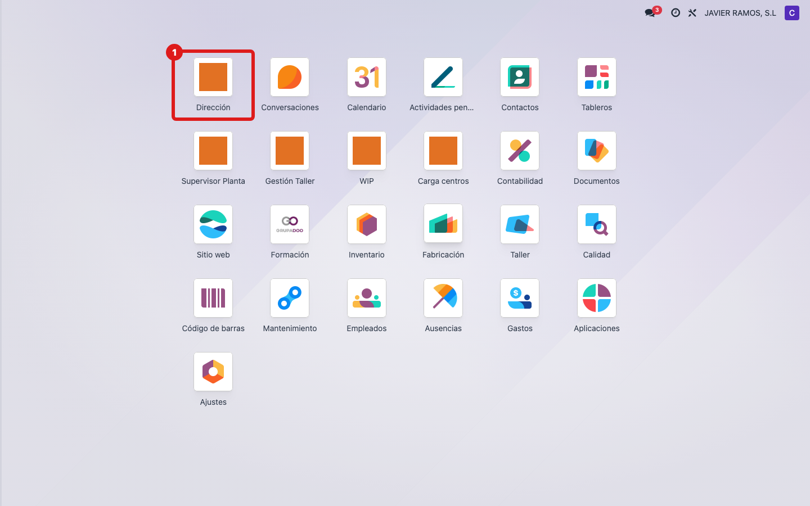
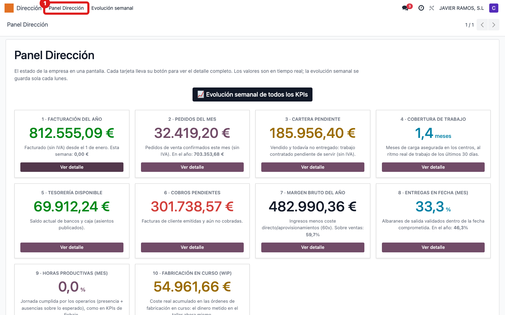
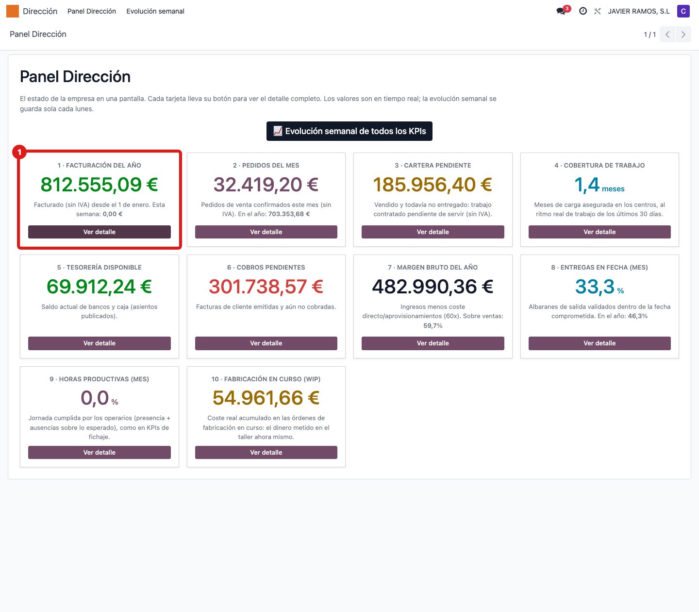
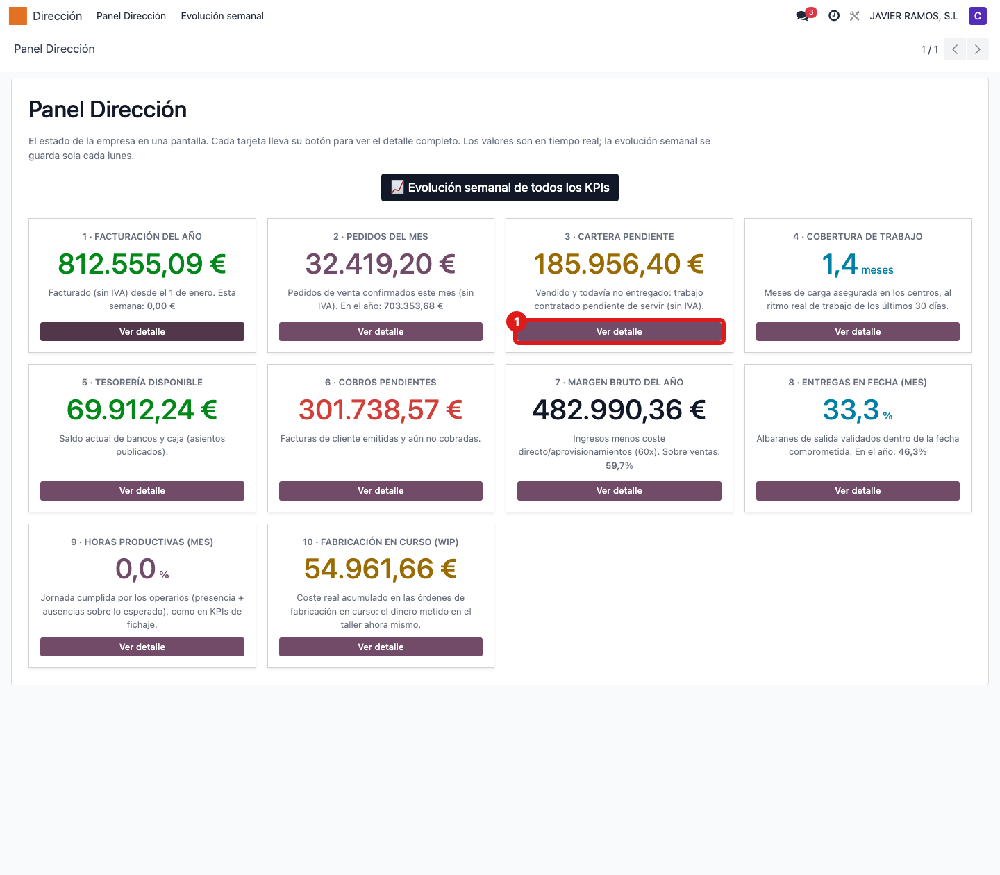

## Cuándo se usa
Cuando quieres ver de un vistazo cómo va la empresa: facturación, cartera pendiente,
cobertura de trabajo, tesorería, margen, entregas y fabricación en curso. Es la pantalla
de cabecera para dirección.

## Antes de empezar
- Necesitas el permiso de contabilidad de **solo lectura**. Si tu usuario no lo tiene, el
  menú **Dirección** no te aparece: pídeselo a administración.
- Los valores son en tiempo real; no hay que actualizar nada.

## Pasos
1. En el menú superior pulsa **Dirección**.
   
2. Pulsa **Panel Dirección**.
   
3. Se abre el panel con las 10 tarjetas numeradas. Léelas en orden: **1 Facturación del año**
   (con el dato de "Esta semana" debajo), **2 Pedidos del mes** ("En el año" debajo),
   **3 Cartera pendiente** (vendido y aún no entregado), **4 Cobertura de trabajo** (en meses),
   **5 Tesorería disponible**, **6 Cobros pendientes**, **7 Margen bruto del año** ("Sobre ventas %"),
   **8 Entregas en fecha (mes)** ("En el año %"), **9 Horas productivas (mes)** (% de jornada
   cumplida) y **10 Fabricación en curso (WIP)**.
   
4. Para profundizar en cualquier indicador, pulsa el botón **Ver detalle** de su tarjeta:
   abre el listado real que hay detrás de ese número.
   

## Si algo va mal
- No ves el menú **Dirección**: te falta el permiso contable de solo lectura. Pídelo a administración.
- Un número te sorprende: pulsa **Ver detalle** para ver de qué documentos sale antes de dar la alarma.
- El panel es de solo lectura: aquí no se edita nada, solo se consulta.

## Escalar
Si un indicador parece mal aun mirando su detalle, avisa a administración/Apunts indicando
qué tarjeta es (número y título), el valor que ves y qué esperabas.
