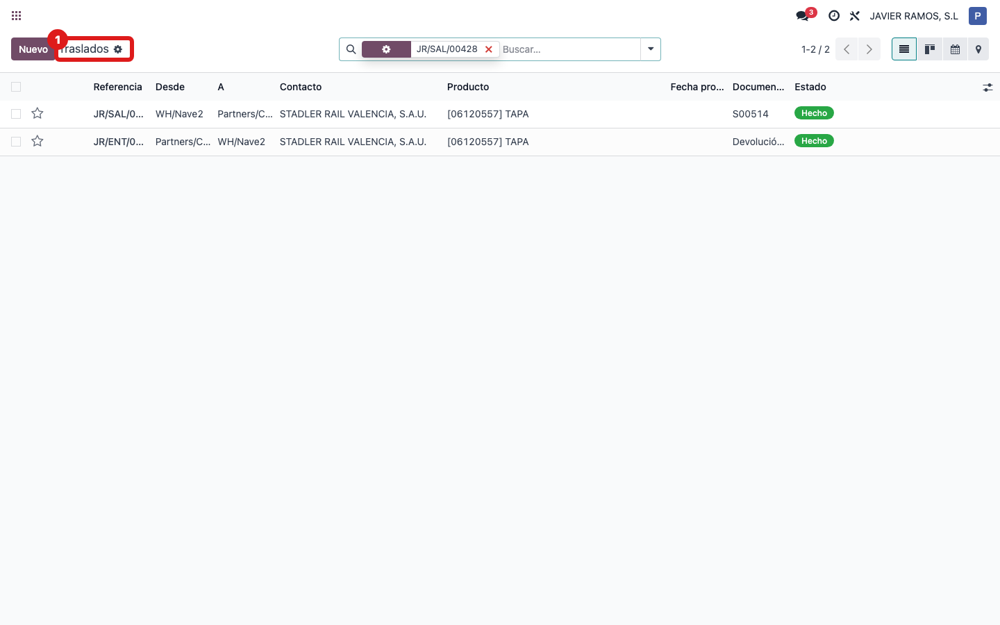
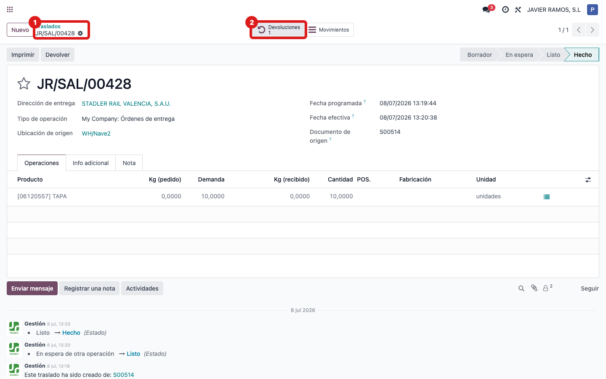
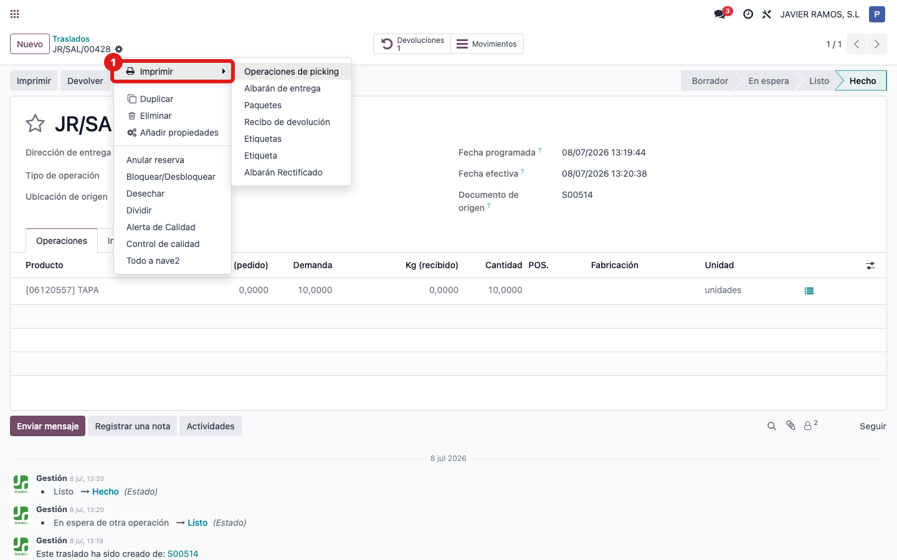
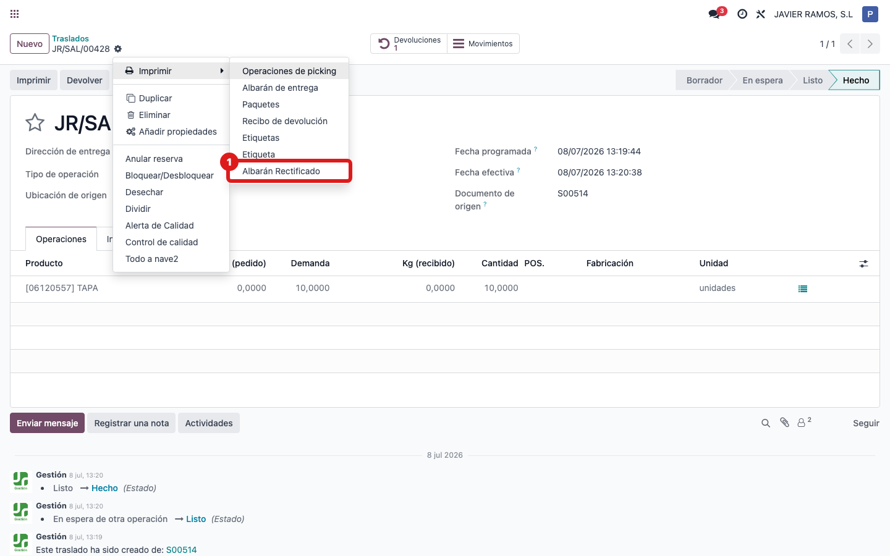
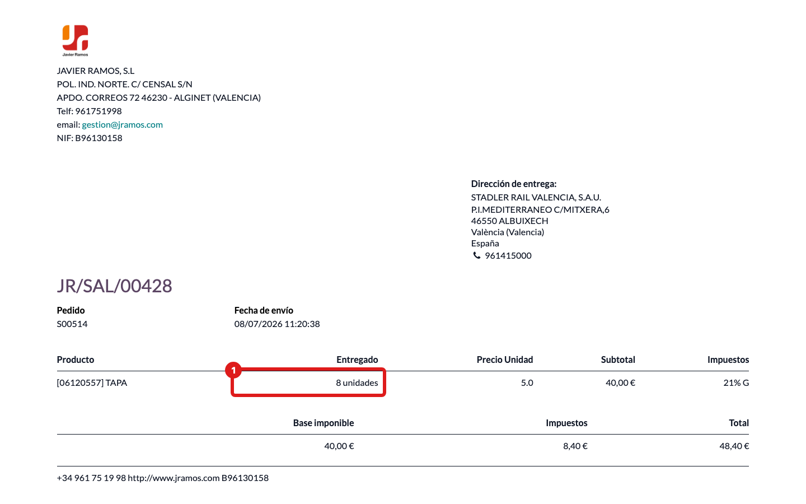

## Cuándo se usa
Cuando una entrega ha tenido una **devolución parcial** y necesitas un albarán que muestre solo lo que realmente se ha quedado el cliente: las líneas devueltas por completo desaparecen y las parciales muestran la cantidad **neta** (entregado menos devuelto).

## Antes de empezar
El albarán tiene que estar **validado** (hecho) y tener al menos una devolución registrada. Si aún no hay devolución, el rectificado saldrá igual que el albarán normal.

## Pasos
1. Entra en **Inventario** y abre **Traslados**. 
2. Abre el albarán de entrega que tuvo la devolución. 
3. Abre el engranaje **⚙ Acciones** (arriba, junto al nombre del albarán) y entra en **Imprimir**. 
4. Elige **Albarán Rectificado**. 
5. Comprueba en el PDF que las líneas devueltas del todo no aparecen y que las parciales muestran la cantidad neta (por ejemplo, entregado 10 y devuelto 2 sale como 8). 

## Si algo va mal
- El rectificado sale igual que el albarán normal: no hay ninguna devolución validada asociada a ese albarán, o las devoluciones aún están en borrador.
- Una línea que esperabas ver ha desaparecido: es lo previsto, esa línea se devolvió por completo (cantidad neta cero) y el rectificado la oculta.
- No encuentras "Albarán Rectificado" en Acciones → Imprimir: asegúrate de estar dentro del albarán abierto; la opción solo aparece con un albarán abierto.

## Escalar
Si las cantidades netas no cuadran con las devoluciones reales, avisa a la oficina técnica (Apunts) con el número del albarán, las devoluciones asociadas y qué cantidad esperabas ver en el PDF.
