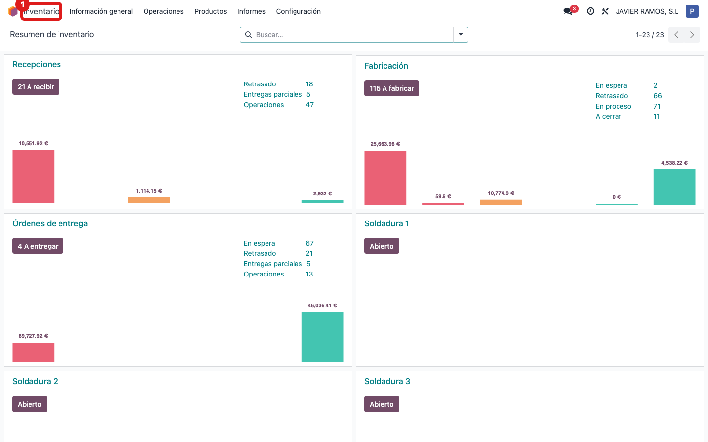
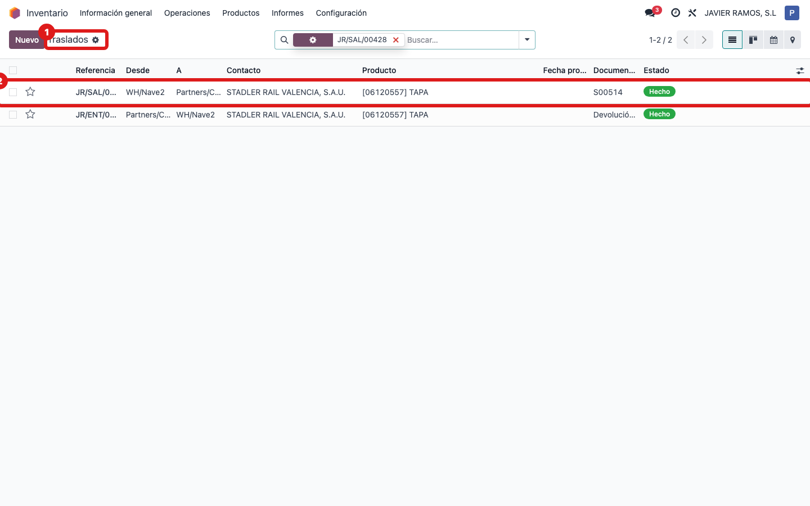
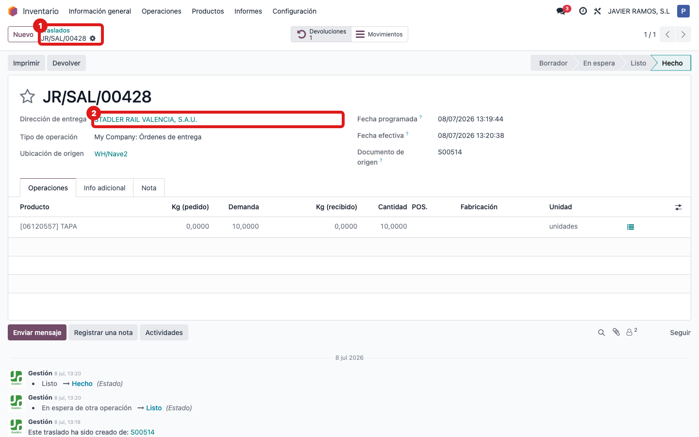
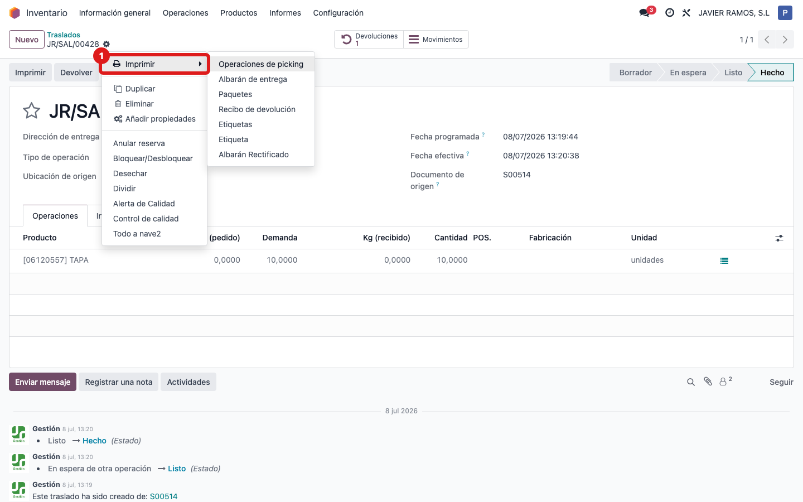
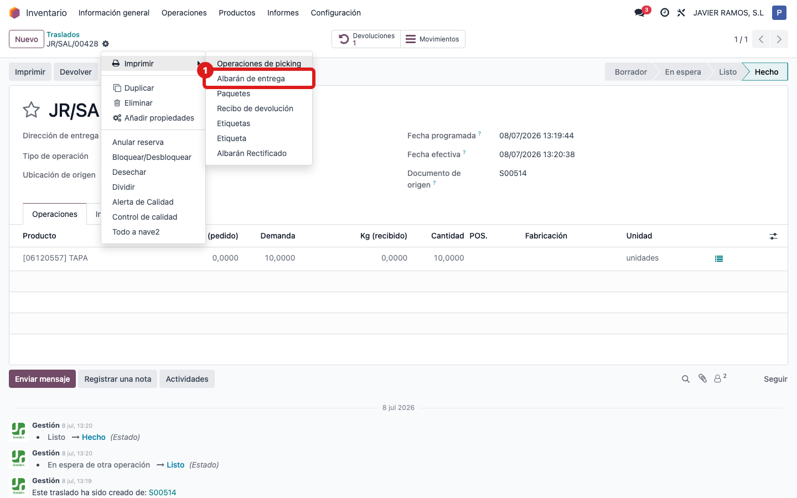
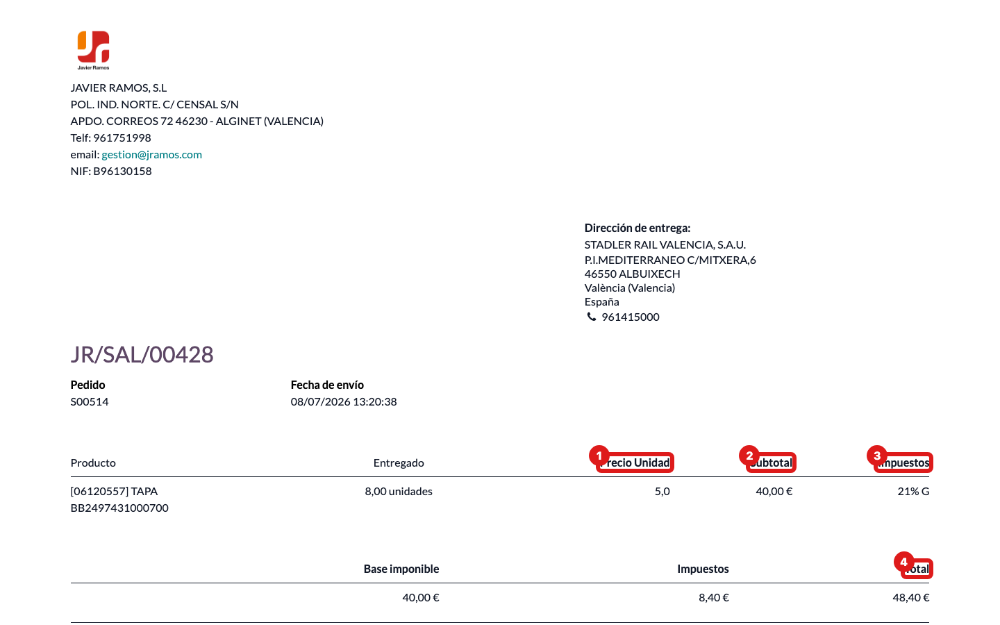

## Cuándo se usa
Cuando un cliente necesita el albarán de entrega con los precios (Precio unidad, Subtotal, Impuestos y los totales al pie), no solo las cantidades.

## Antes de empezar
El albarán tiene que ser de un cliente que salga **valorado**. Eso se controla en la ficha del cliente: **Contactos → abrir el cliente → pestaña Ventas y Compras → casilla "Valued picking"** (viene activada por defecto). Si la casilla está desmarcada, el albarán saldrá sin precios.

## Pasos
1. Entra en **Inventario**. 
2. Abre **Traslados** (o "Operaciones → Traslados") y busca el albarán del cliente. 
3. Abre el albarán haciendo clic en su línea. 
4. Abre el engranaje **⚙ Acciones** (arriba, junto al nombre del albarán) y entra en **Imprimir**. *(Atajo: el albarán también tiene un botón **Imprimir** en la cabecera que saca el valorado directo.)* 
5. Elige **Albarán de entrega**. 
6. Comprueba en el PDF que aparecen las columnas **Precio unidad**, **Subtotal** e **Impuestos**, y la tabla de totales al pie (Base imponible, Impuestos, Total). 

## Si algo va mal
- El PDF sale sin precios: el cliente no tiene marcada la casilla **Valued picking** en su ficha (pestaña Ventas y Compras), o el albarán no tiene pedido de venta asociado. Marca la casilla y vuelve a imprimir.
- Los importes salen más bajos de lo esperado en un albarán con devoluciones: es correcto, el albarán valorado muestra la cantidad **neta** (entregado menos lo devuelto) y valora sobre esa cantidad.
- No ves la opción "Albarán de entrega" en Acciones → Imprimir: confirma que estás dentro del albarán abierto (no en la lista) antes de pulsar Imprimir.

## Escalar
Si el albarán debería salir valorado y no sale, avisa a la oficina técnica (Apunts) indicando el número del albarán, el cliente, si tiene marcada la casilla Valued picking y qué opciones te aparecen exactamente en Acciones → Imprimir.
