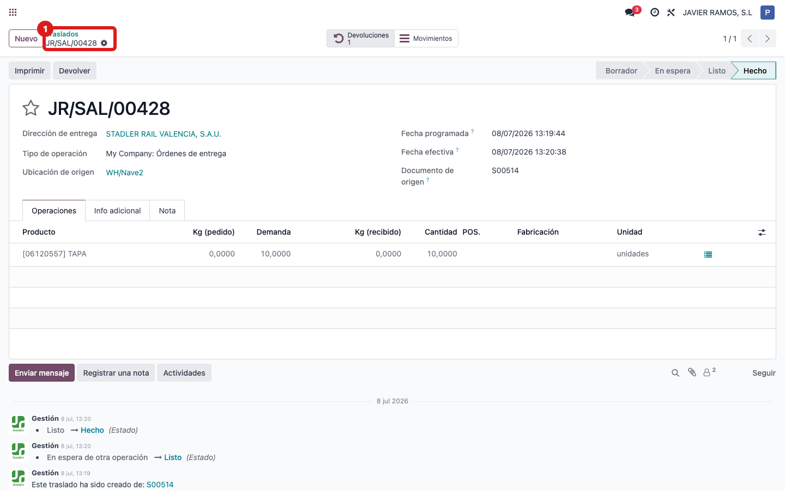
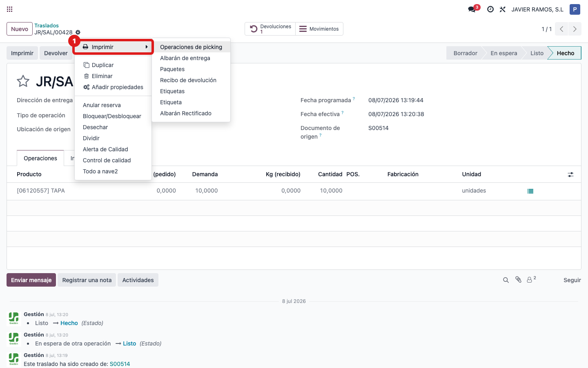
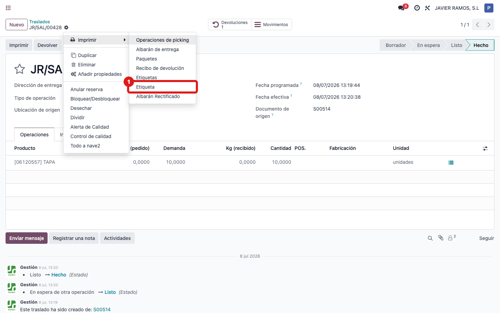
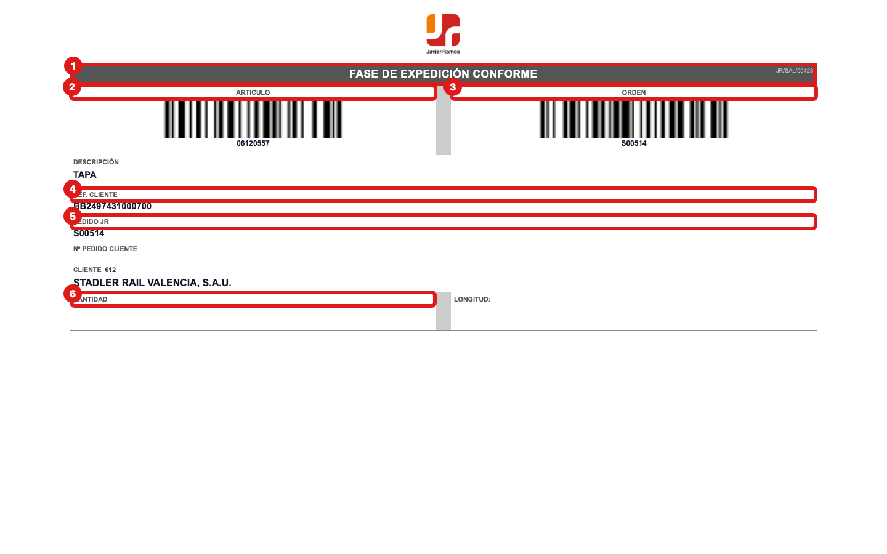

## Cuándo se usa
Cuando necesitas las etiquetas de un albarán para pegar en el material: una etiqueta por línea, en formato 150×105 mm, con los dos códigos de barras (ARTICULO y ORDEN), la REF. CLIENTE, el PEDIDO JR, el cliente y la cantidad/longitud.

## Antes de empezar
No hace falta nada especial. La etiqueta sale automáticamente en versión **expedición** ("FASE DE EXPEDICIÓN CONFORME") si el albarán es de salida, o en versión **recepción** ("FASE DE RECEPCIÓN CONFORME", que además incluye la FECHA VENCIMIENTO) si es de entrada. No hay que elegir el tipo: lo decide el propio albarán.

## Pasos
1. Entra en **Inventario** y abre **Traslados**. 
2. Abre el albarán del que quieres las etiquetas. 
3. Abre el engranaje **⚙ Acciones** (arriba, junto al nombre del albarán) y entra en **Imprimir**. 
4. Elige **Etiqueta**. 
5. Comprueba en el PDF que hay una etiqueta por línea del albarán, con los códigos de barras, REF. CLIENTE, PEDIDO JR, cliente y cantidad. 

## Si algo va mal
- Necesitas imprimir las etiquetas de varios albaranes de golpe: en la lista de **Traslados**, marca la casilla de varios albaranes, abre **⚙ Acciones → Imprimir** y elige **Etiqueta**; saldrán todas las etiquetas juntas.
- La etiqueta sale como recepción cuando esperabas expedición (o al revés): eso depende del tipo de albarán (entrada o salida). Revisa que estás en el albarán correcto.
- Falta la REF. CLIENTE o el PEDIDO JR en la etiqueta: el albarán no tiene enlazado el pedido de venta/compra; revisa que el traslado venga de un pedido.

## Escalar
Si una etiqueta sale con datos en blanco (código de barras, cliente o cantidad vacíos), avisa a la oficina técnica (Apunts) con el número del albarán y una foto de la etiqueta impresa.
