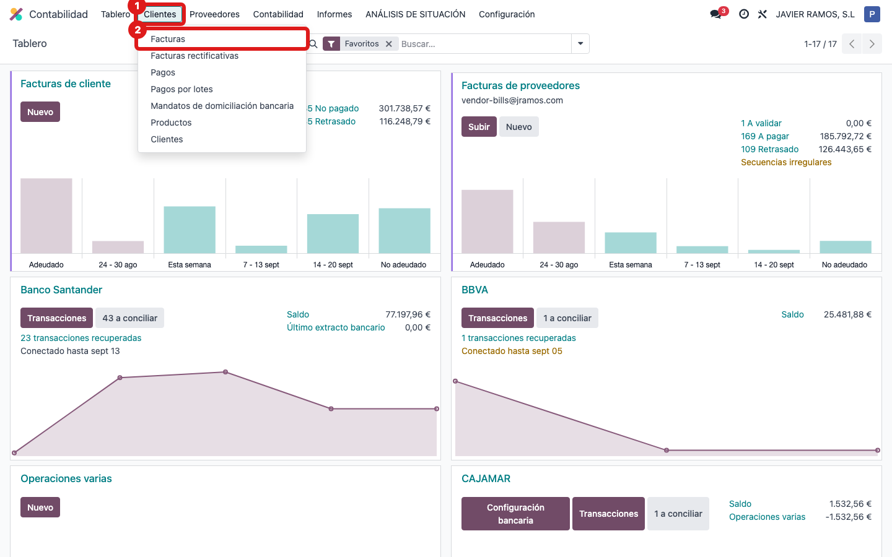
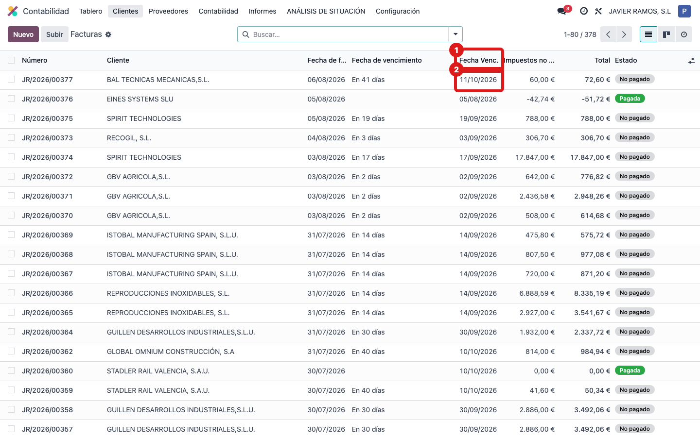
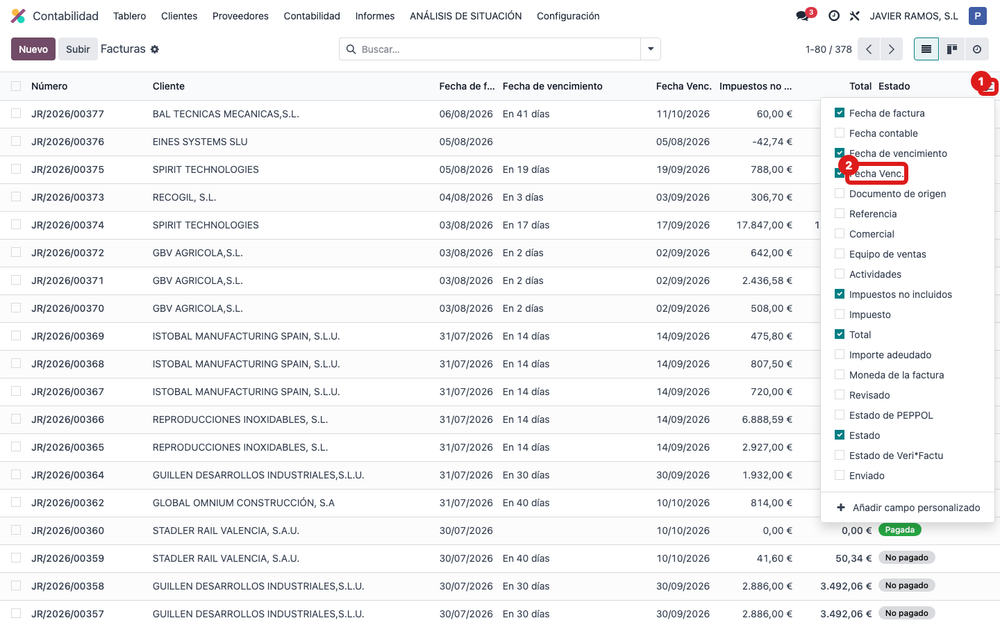

## Cuándo se usa
Cuando quieres ver la fecha de vencimiento de las facturas de cliente directamente en el listado, sin tener que abrir cada factura una a una.

## Antes de empezar
Necesitas acceso a **Contabilidad**. Trabajarás en la vista de lista de facturas de cliente.

## Pasos
1. Entra en **Contabilidad**. 
2. Abre **Clientes → Facturas**. 
3. En la lista, localiza la columna **Fecha Venc.** para ver de un vistazo cuándo vence cada factura. 
4. Si no la ves, pulsa el icono de **opciones de columnas** (arriba a la derecha de la tabla) y marca **Fecha Venc.**. 

## Si algo va mal
- No aparece la columna: es una columna opcional; actívala desde el icono de ajustes de columnas (arriba a la derecha de la lista).
- Quieres ordenar por vencimiento: haz clic en la cabecera de la columna **Fecha Venc.** para ordenar las facturas por esa fecha.
- Solo quieres las vencidas: usa los filtros del buscador (por ejemplo "Facturas vencidas" o "Sin pagar").

## Escalar
Si una fecha de vencimiento no coincide con las condiciones de pago del cliente, revísalo en la propia factura (condiciones de pago). Si la columna no aparece de ninguna manera, avisa a la oficina técnica (Apunts).
