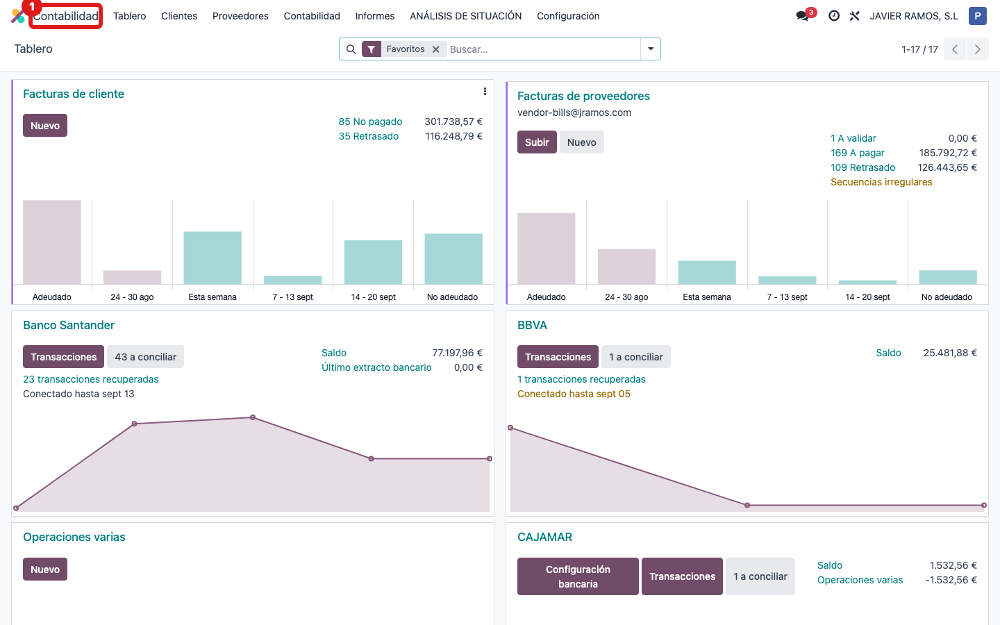
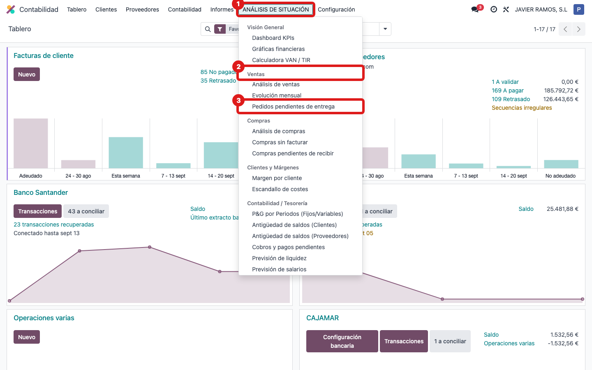
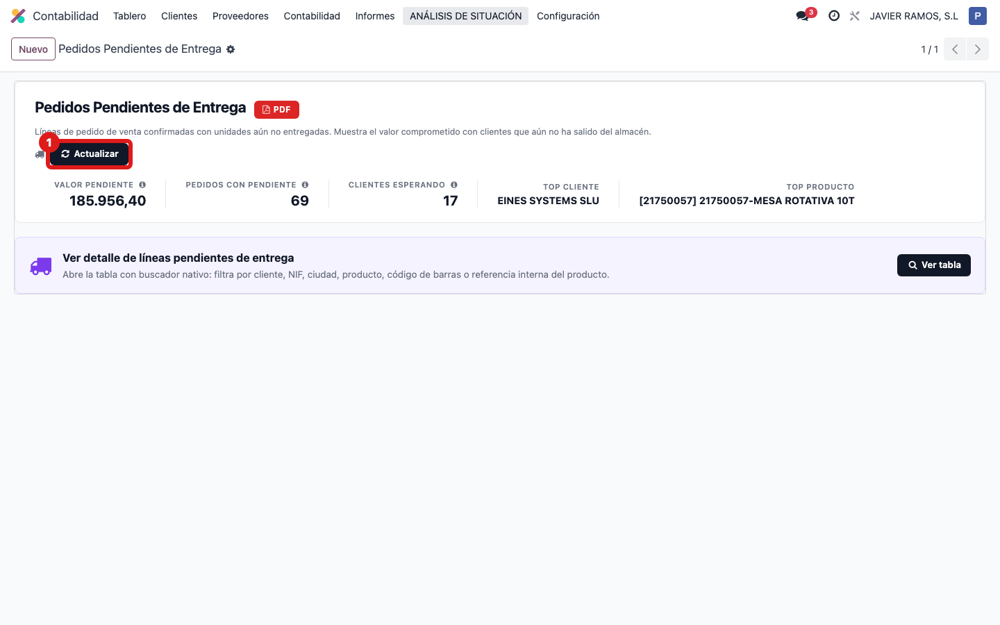
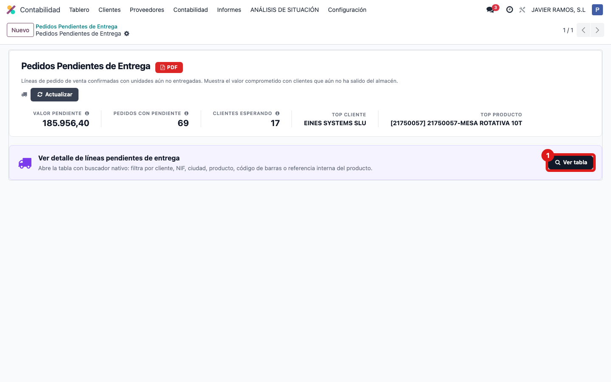
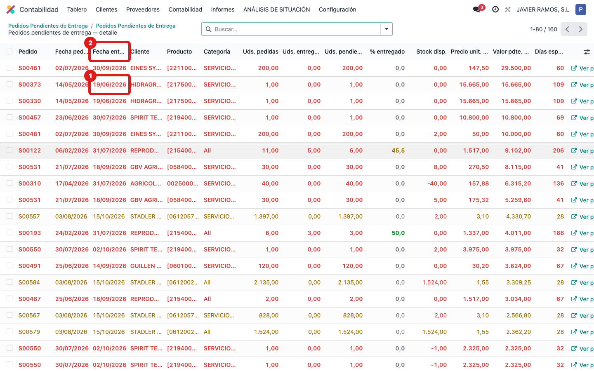
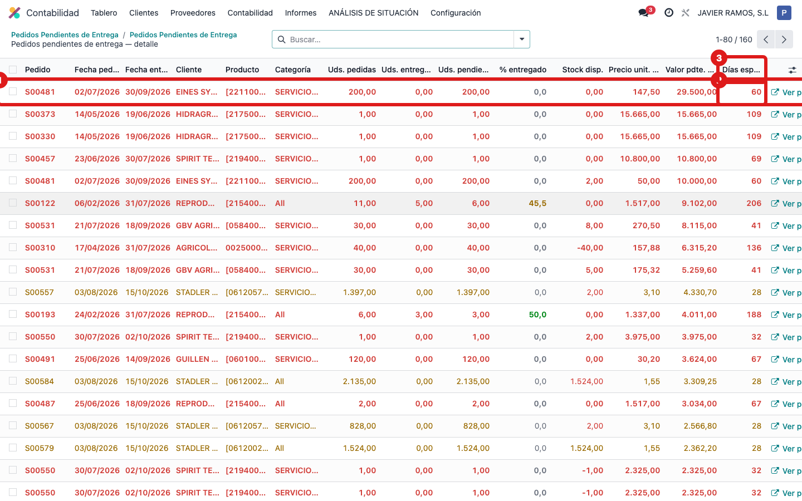

## Cuándo se usa
Cuando quieres ver de un vistazo qué pedidos de venta están pendientes de entregar y cuáles van tarde: la fecha de entrega comprometida se pone en rojo si ya venció, y las filas más antiguas se colorean solas.

## Antes de empezar
Esta pantalla está dentro de **Contabilidad**, en el bloque **ANÁLISIS DE SITUACIÓN**. Necesitas acceso a ese apartado.

## Pasos
1. Entra en **Contabilidad**. 
2. En el menú, abre **ANÁLISIS DE SITUACIÓN → Ventas → Pedidos pendientes de entrega**. 
3. Pulsa **Actualizar** para recalcular los datos con lo último. 
4. Pulsa **Ver tabla** para abrir el listado completo. 
5. Mira la columna **Fecha entrega** (es la fecha comprometida con el cliente): si está **en rojo**, ese pedido ya venció. 
6. Fíjate en el color de la **fila entera**: roja si el pedido lleva más de 30 días esperando, naranja si lleva entre 14 y 30 días. 

## Si algo va mal
- La tabla sale vacía o desactualizada: vuelve a la ficha y pulsa **Actualizar** antes de **Ver tabla**.
- Quieres filtrar solo lo urgente: usa el buscador de arriba; hay filtros como "Espera > 30 días", "Sin entregar (0%)" o "Entrega parcial".
- Necesitas abrir el pedido original: pulsa el icono **Ver pedido en Odoo** al final de la fila.

## Escalar
Si una fecha de entrega no cuadra con lo pactado con el cliente, revísalo en el pedido de venta (campo Fecha de entrega). Si el color o el cálculo de días parece mal, avisa a la oficina técnica (Apunts) con el número de pedido y lo que esperabas ver.
