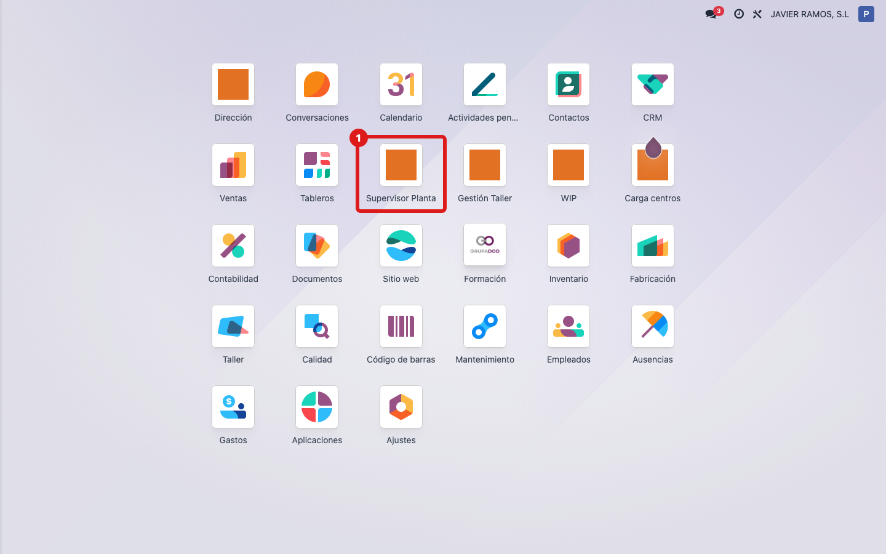
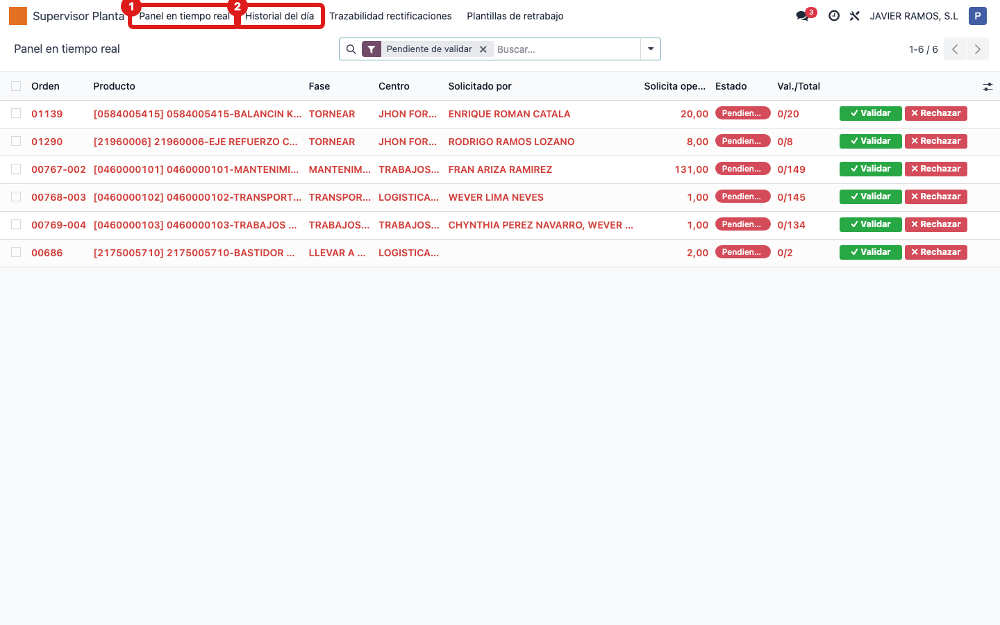
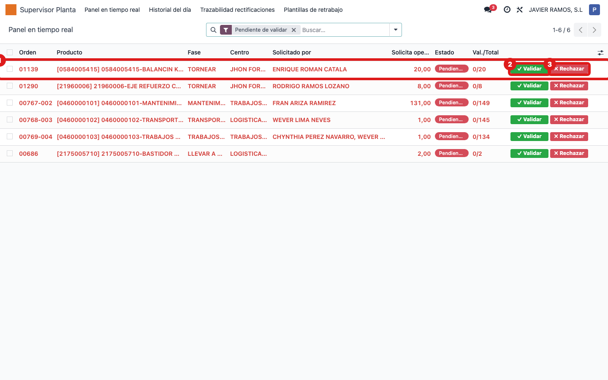
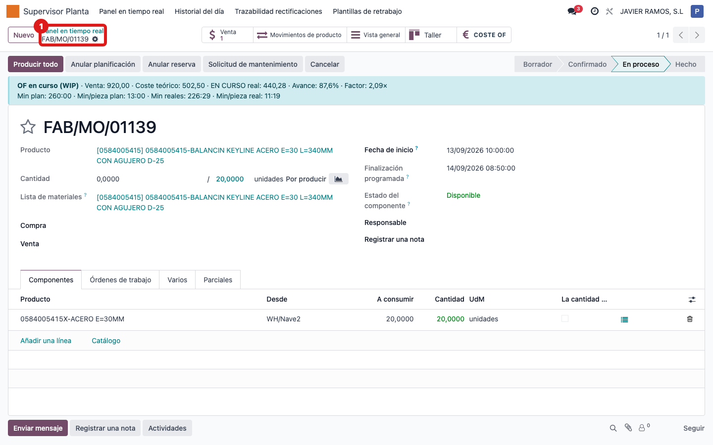

## Cuándo se usa
Cuando estás en el panel del **Supervisor de Planta** y necesitas abrir la orden de fabricación completa de una fila (por ejemplo para revisarla o consultar datos), sin quedarte solo en la fase.

## Antes de empezar
Necesitas acceso a la aplicación **Supervisor Planta**.

## Pasos
1. Abre la aplicación **Supervisor Planta**. 
2. Entra en **Panel en tiempo real** (o en **Historial del día** si buscas algo ya cerrado hoy). 
3. Haz clic en cualquier punto de la **fila** que te interesa. 
4. Se abre directamente la **orden de fabricación** completa (no la fase). 

## Si algo va mal
- Querías validar o rechazar, no abrir la OF: los botones **✓ Validar** y **✗ Rechazar** están al final de la fila y solo aparecen cuando el estado es **Pendiente de validar**. Púlsalos directamente sin abrir la fila.
- No aparece ninguna fila: en el Panel en tiempo real solo se ven las fases activas; usa el buscador o mira en **Historial del día**.
- Al hacer clic no se abre nada: espera un momento a que cargue o refresca la pantalla del navegador.

## Escalar
Si una fila abre una orden equivocada o la orden no se abre, avisa a la oficina técnica (Apunts) indicando el número de orden de la fila, la fase y qué pantalla estabas usando (Panel en tiempo real o Historial del día).
