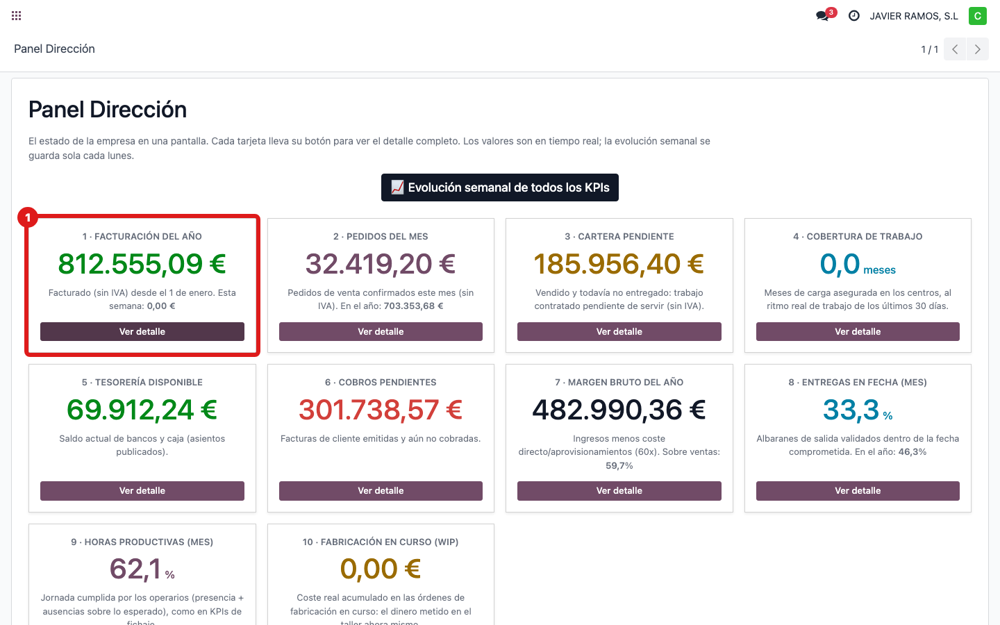
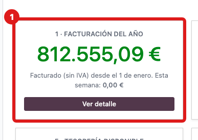
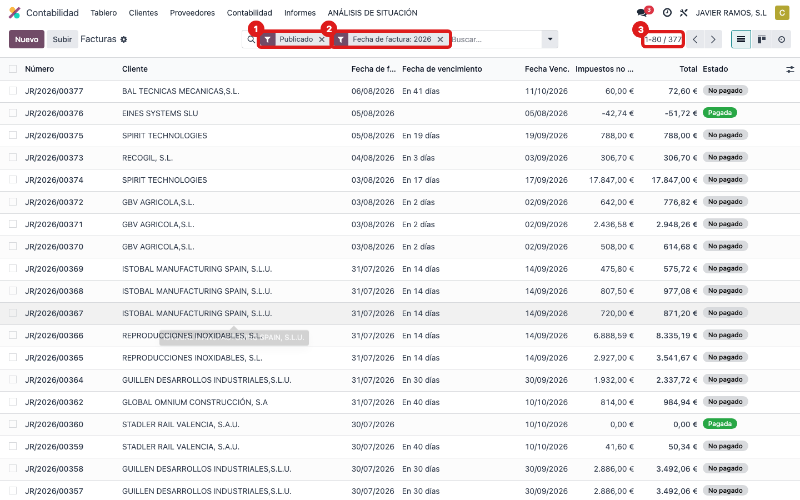
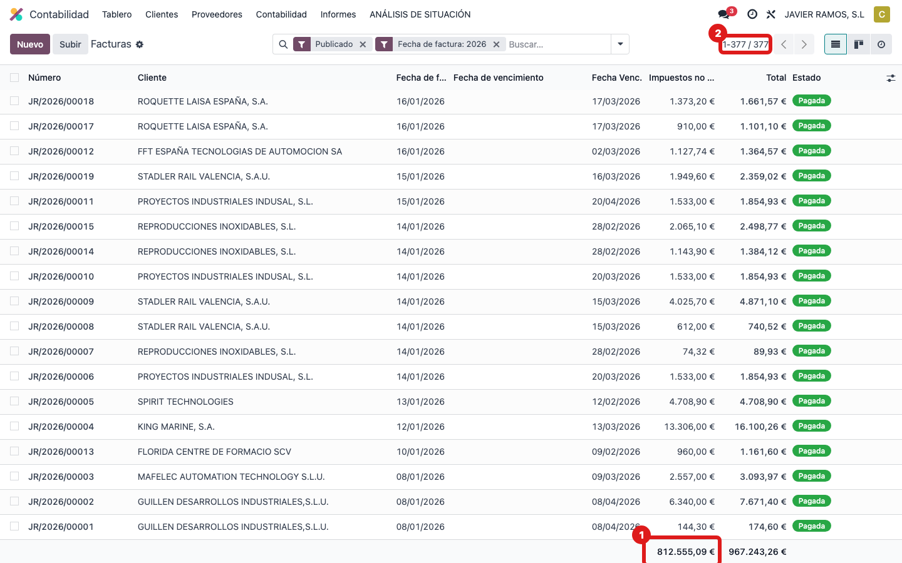

## Cuándo se usa
Para entender y demostrar de dónde sale el número **"Facturación del año"** del Panel Dirección.
Es lo que se ha **facturado a clientes** desde el 1 de enero, **sin IVA** (las facturas menos los
abonos). Ejemplo con los datos de hoy: **812.555,09 €**.

## Antes de empezar
- Necesitas permiso de contabilidad (solo lectura) para ver el menú **Dirección**.

## Pasos
1. Abre **Dirección → Panel Dirección**.
   
2. Mira la tarjeta **1 · Facturación del año** y fíjate en el número (aquí 812.555,09 €).
   
3. Ese número sale de las **facturas de cliente**. Ve a **Contabilidad → Clientes → Facturas**.
   
4. Aplica el filtro **Este año** y deja solo las **Publicadas** (contabilizadas).
   
5. Abajo del todo, en la columna de **base imponible** (sin IVA), mira el **total**: coincide con
   el número de la tarjeta.
   
6. **Cómo se calcula:** se suman las bases imponibles (sin IVA) de todas las facturas de cliente
   publicadas del año, y **se restan los abonos** (facturas rectificativas). Hoy son 377
   documentos que suman 812.555,09 €.

## Si algo va mal
- El número no cuadra con el listado: comprueba que en el listado tienes el filtro **Este año** y
  **solo Publicadas**; los borradores no cuentan.

## Escalar
Si el total del panel y el del listado no coinciden aun con los mismos filtros, avisa a Apunts con
una captura de los dos.
