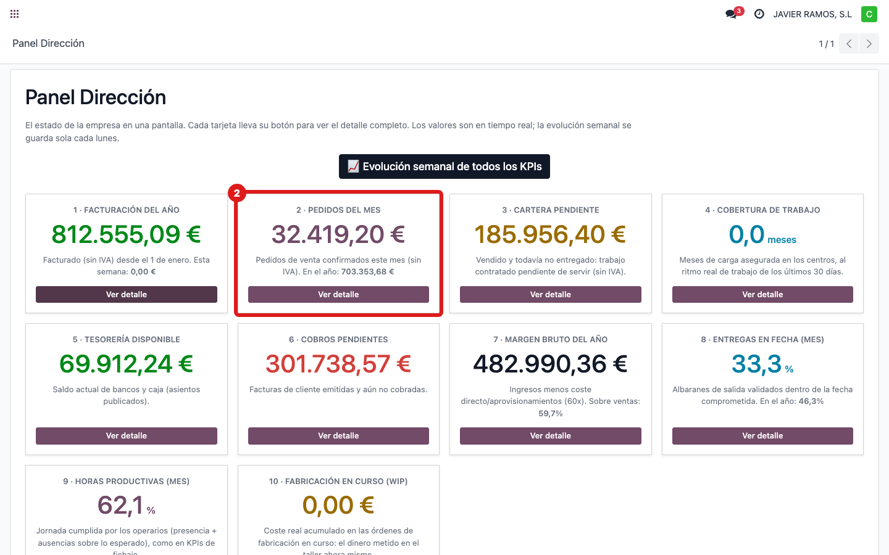
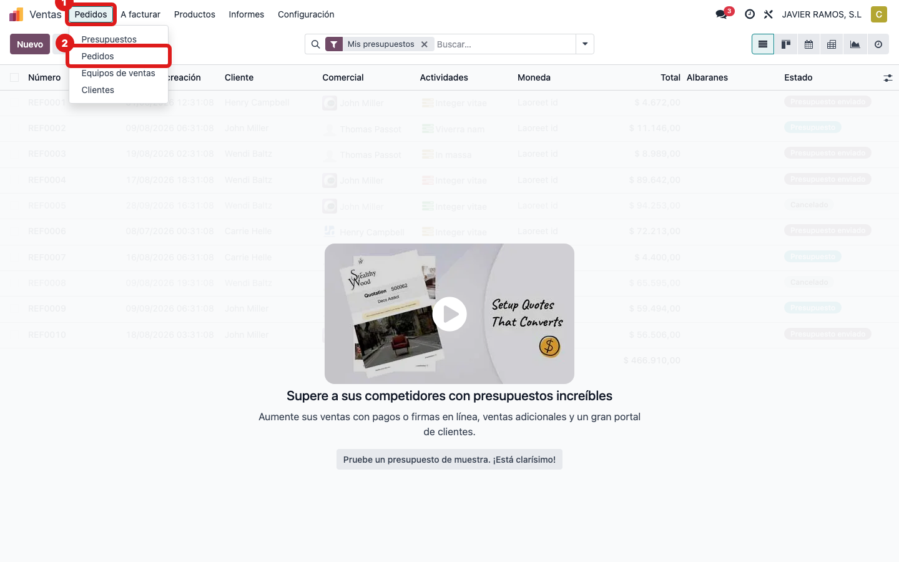
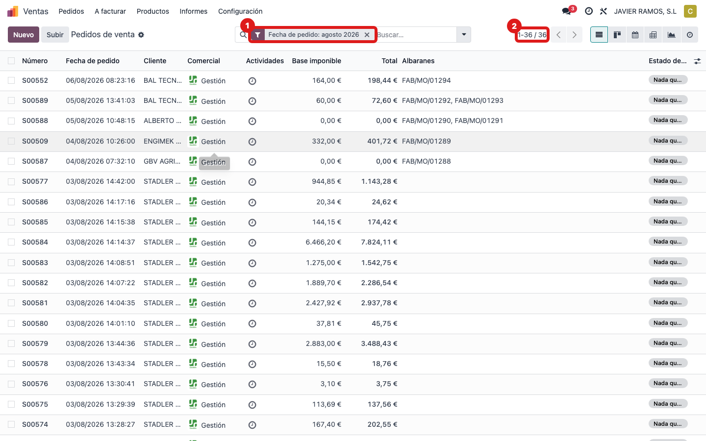
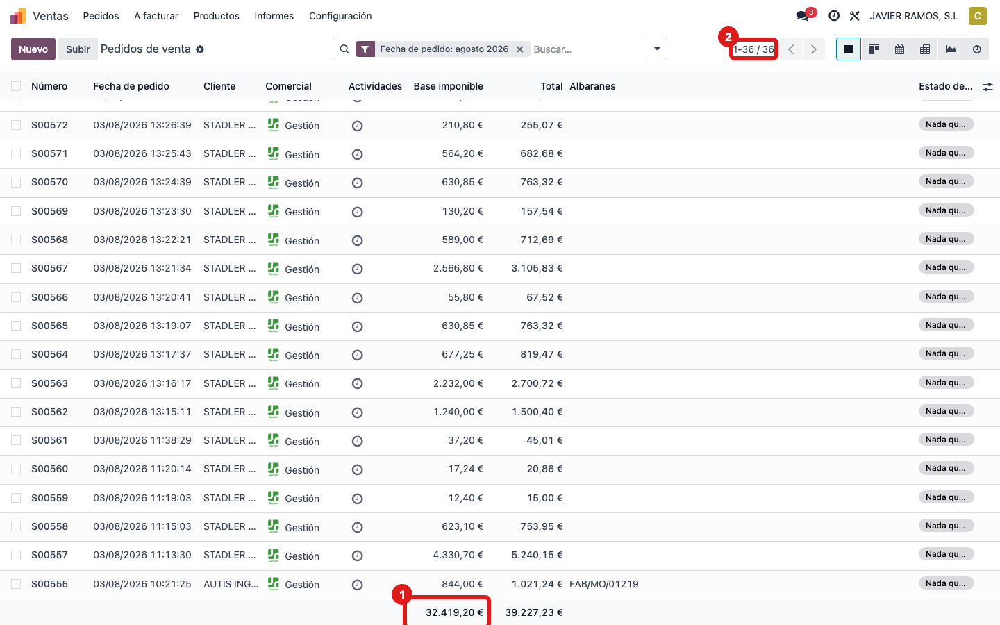

## Cuándo se usa
Para saber de dónde sale **"Pedidos del mes"** del Panel Dirección: lo **vendido** (pedidos de
venta confirmados) este mes, sin IVA. Debajo sale también la cifra del año. Ejemplo de hoy:
**32.419,20 €** este mes · **703.353,68 €** en el año.

## Antes de empezar
- Permiso de ventas o de contabilidad para ver los pedidos.

## Pasos
1. Abre **Dirección → Panel Dirección** y localiza la tarjeta **2 · Pedidos del mes**.
   
2. Ese número sale de los **pedidos de venta confirmados**. Ve a **Ventas → Pedidos**.
   
3. Deja solo los **pedidos confirmados** (no los presupuestos) y filtra por **este mes**.
   
4. Mira el **total sin impuestos**: coincide con el número de la tarjeta.
   
5. **Cómo se calcula:** se suma el importe **sin IVA** de todos los pedidos confirmados con fecha
   de este mes. Hoy son 36 pedidos que suman 32.419,20 €. Para la cifra del año, el mismo filtro
   pero **este año** (268 pedidos, 703.353,68 €).

## Si algo va mal
- Sale más de lo esperado: asegúrate de excluir los **presupuestos** (solo estados confirmados).

## Escalar
Si no cuadra con los mismos filtros, avisa a Apunts con captura del listado.
