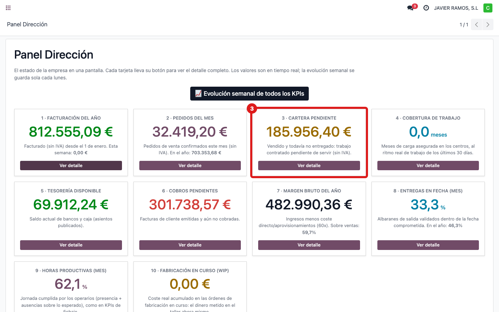
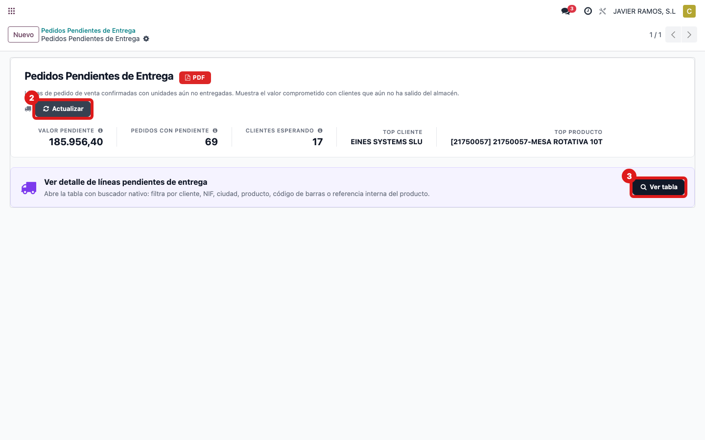
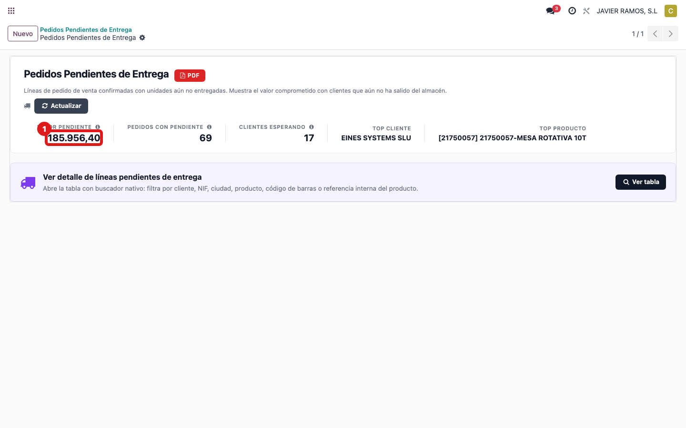
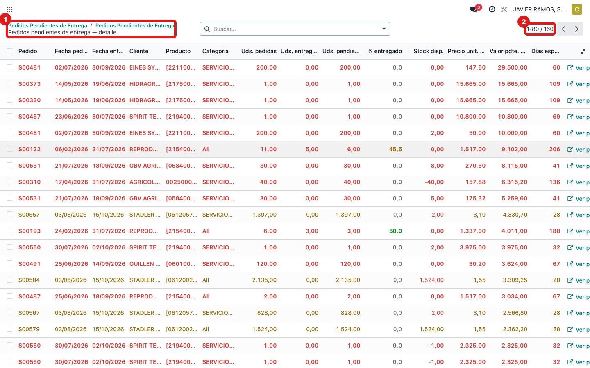

## Cuándo se usa
Para saber de dónde sale **"Cartera pendiente"**: lo ya **vendido pero aún no entregado** (trabajo
comprometido que todavía no ha salido). Ejemplo de hoy: **185.956,40 €**.

## Antes de empezar
- Acceso al tablero **Pedidos pendientes de entrega**.

## Pasos
1. Abre **Dirección → Panel Dirección** y localiza la tarjeta **3 · Cartera pendiente**.
   
2. Ese número es el **valor pendiente** del tablero de entregas. Abre **Pedidos pendientes de
   entrega** y pulsa **Actualizar**.
   
3. Mira el indicador **Valor pendiente**: coincide con la tarjeta.
   
4. Para ver el detalle, pulsa **Ver tabla**: cada línea es un pedido con unidades sin servir.
   
5. **Cómo se calcula:** por cada línea de pedido confirmada se toma **lo que falta por entregar**
   (vendido − entregado) y se multiplica por su **precio**; se suman todas. Es dinero vendido que
   aún está por fabricar/servir.

## Si algo va mal
- Cambia respecto a ayer: es normal, baja según se entregan pedidos y sube con pedidos nuevos.

## Escalar
Si el valor del tablero y el del panel no coinciden tras Actualizar, avisa a Apunts.
