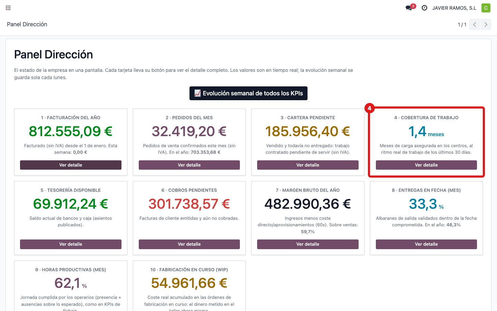
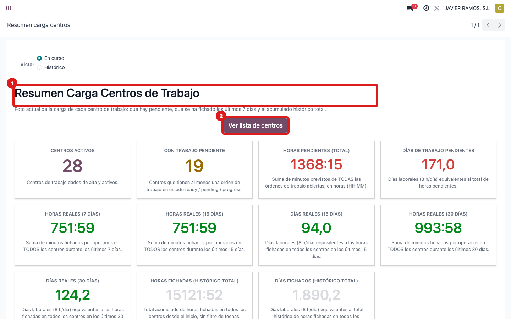
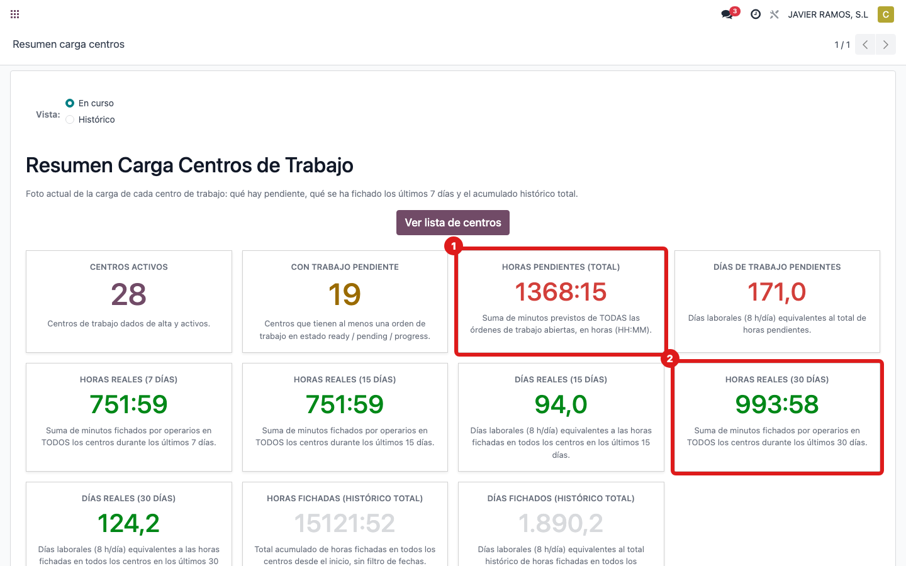

## Cuándo se usa
Para saber de dónde sale **"Cobertura de trabajo"**: cuántos **meses de trabajo** hay asegurados
en el taller al ritmo real de las últimas semanas. Ejemplo de hoy: **1,4 meses**.

## Antes de empezar
- Acceso al menú **Carga centros**.

## Pasos
1. Abre **Dirección → Panel Dirección** y localiza la tarjeta **4 · Cobertura de trabajo**.
   
2. El dato sale de la carga del taller. Abre **Carga centros → Resumen**.
   
3. Fíjate en dos cifras: las **horas pendientes** (trabajo por delante) y las **horas reales de
   los últimos 30 días** (el ritmo al que se produce).
   
4. **Cómo se calcula:** se dividen las **horas pendientes** entre las **horas hechas de media al
   mes** (ritmo de los últimos 30 días). El resultado son los meses de cobertura (aquí ≈ 1,4).
5. **Ojo — es una estimación.** Si en el último mes hubo un parón o vacaciones (poco trabajo
   hecho), el ritmo baja y el número se dispara o queda en 0. Y no descuenta festivos.

## Si algo va mal
- Sale 0 o un número enorme: mira el ritmo de los últimos 30 días; si hubo parón, es normal.

## Escalar
Si dudas del cálculo o el ritmo parece mal, avisa a Apunts con la pantalla del Resumen de carga.
