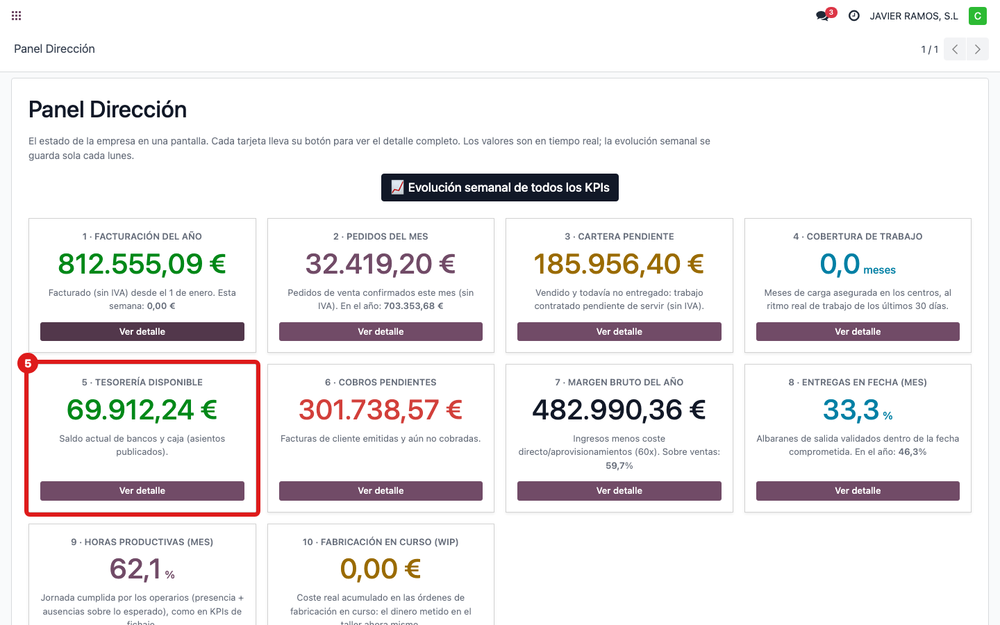
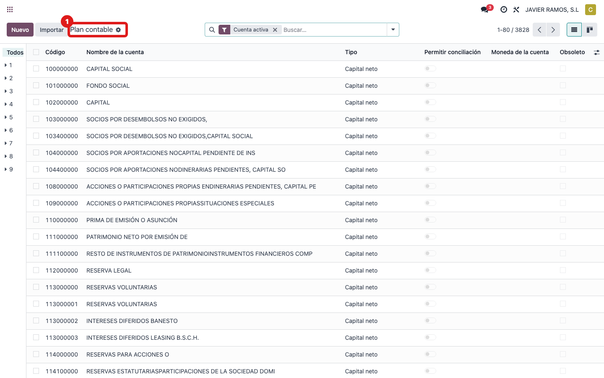
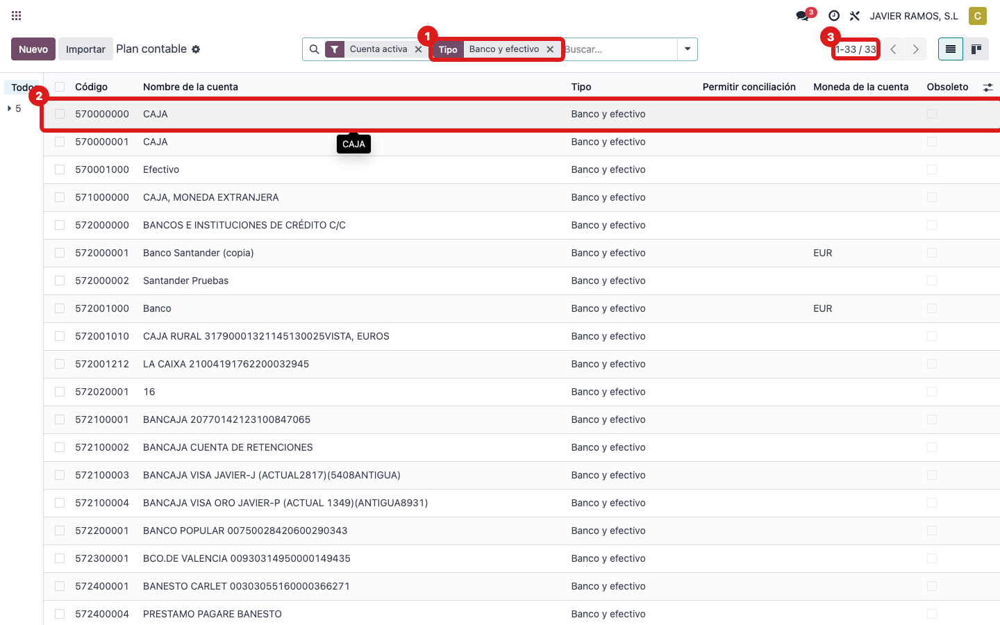
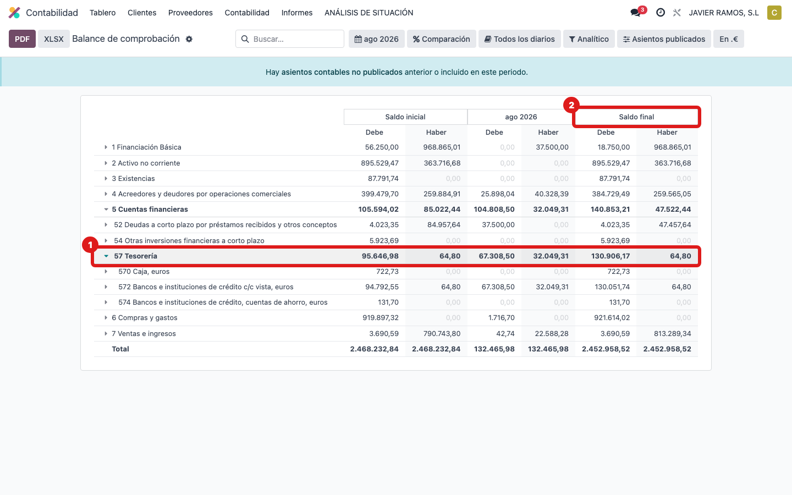

## Cuándo se usa
Para saber de dónde sale **"Tesorería disponible"**: el **saldo de bancos y caja** ahora mismo,
contando solo los asientos ya contabilizados. Ejemplo de hoy: **69.912,24 €**.

## Antes de empezar
- Permiso de contabilidad para ver el plan contable.

## Pasos
1. Abre **Dirección → Panel Dirección** y localiza la tarjeta **5 · Tesorería disponible**.
   
2. El saldo sale de las cuentas de banco y caja. Abre **Contabilidad → Plan contable**.
   
3. Filtra por **Tipo: Banco y efectivo** (son las cuentas de caja **570** y bancos **572** operativas).
   
4. Mira el **saldo** de esas cuentas: sumado, coincide con el número de la tarjeta.
   
5. **Cómo se calcula:** se suma el **saldo** de todas las cuentas de **tipo Banco y efectivo**, contando solo
   los asientos **publicados** (contabilizados). Los apuntes en borrador no cuentan.

## Si algo va mal
- No cuadra: comprueba que no estás incluyendo cuentas que no son de banco/caja, y que miras
  asientos publicados.
- Da MÁS que el grupo **57** del Balance: normal. El grupo 57 completo incluye tarjetas de
  crédito y cuentas transitorias que el panel NO cuenta; el panel solo suma las de **tipo Banco
  y efectivo** (por eso salen ~69.912 y no ~130.841).

## Escalar
Si el saldo del plan contable y el del panel no coinciden, avisa a Apunts.
