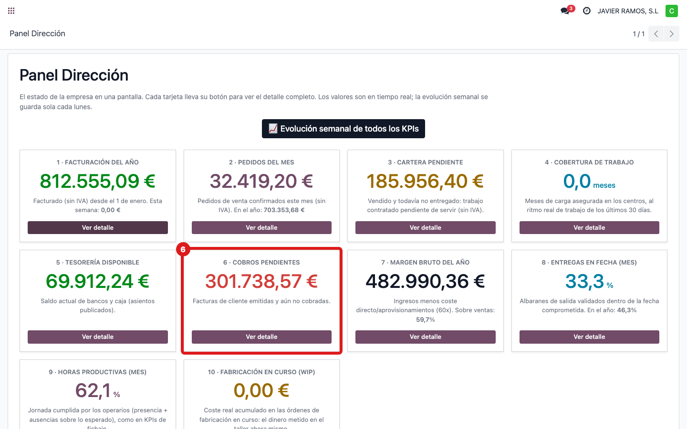
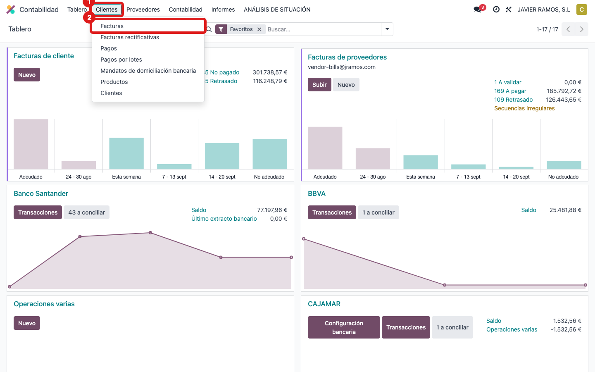
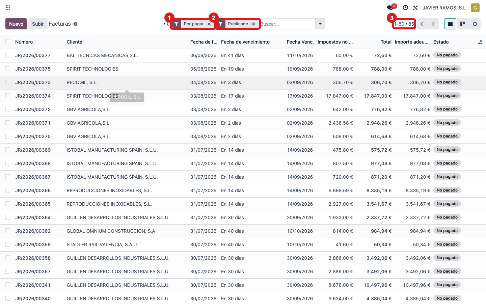
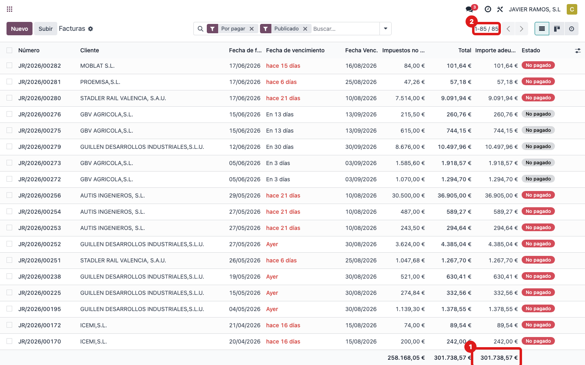

## Cuándo se usa
Para saber de dónde sale **"Cobros pendientes"**: las facturas de cliente **emitidas y todavía sin
cobrar** (lo que nos deben). Ejemplo de hoy: **301.738,57 €**.

## Antes de empezar
- Permiso de contabilidad.

## Pasos
1. Abre **Dirección → Panel Dirección** y localiza la tarjeta **6 · Cobros pendientes**.
   
2. Ve a **Contabilidad → Clientes → Facturas**.
   
3. Aplica los filtros **Por pagar** y **Publicado** (así excluyes borradores): quedan solo las facturas contabilizadas que aún deben cobrarse.
   
4. Mira la columna **Importe adeudado** (lo que queda por cobrar) y su **total**: coincide con la
   tarjeta.
   
5. **Cómo se calcula:** se suma el **importe adeudado** (lo que falta por cobrar, no el total de
   la factura) de todas las facturas de cliente en estado **por pagar** o **pago parcial** y **publicadas**. Hoy
   son 85 facturas que suman 301.738,57 €.

## Si algo va mal
- Sale de más: recuerda que es el **adeudado**, no el total; una factura cobrada a medias solo
  cuenta lo que falta.

## Escalar
Si no cuadra con el listado filtrado, avisa a Apunts con captura.
