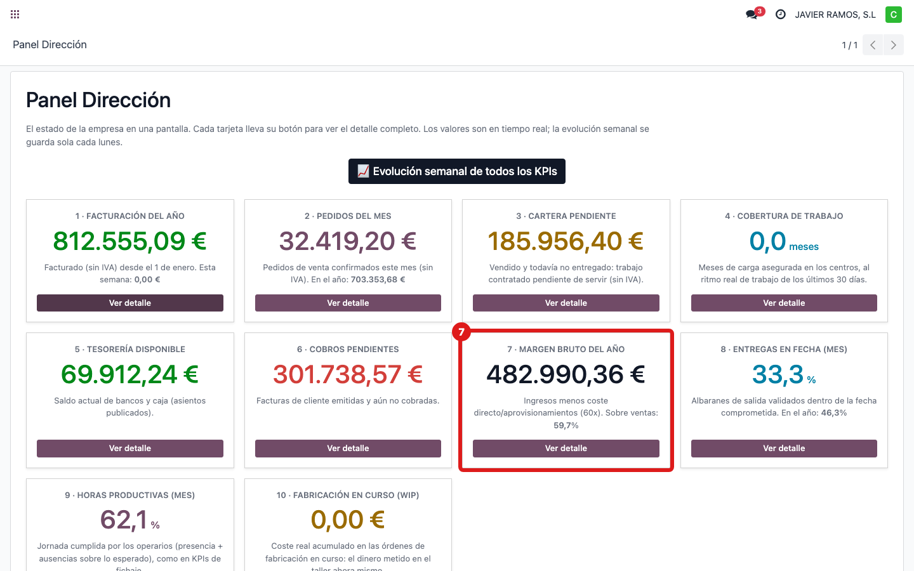
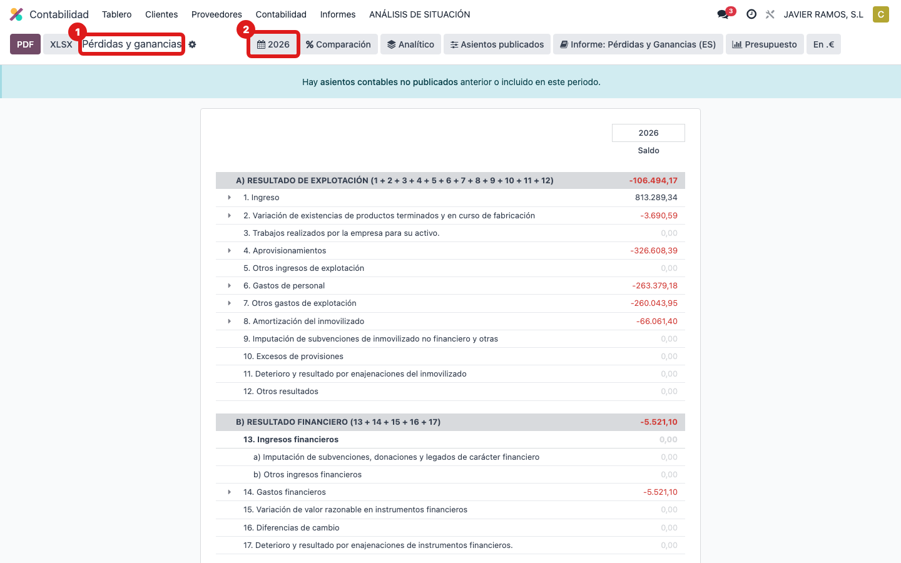
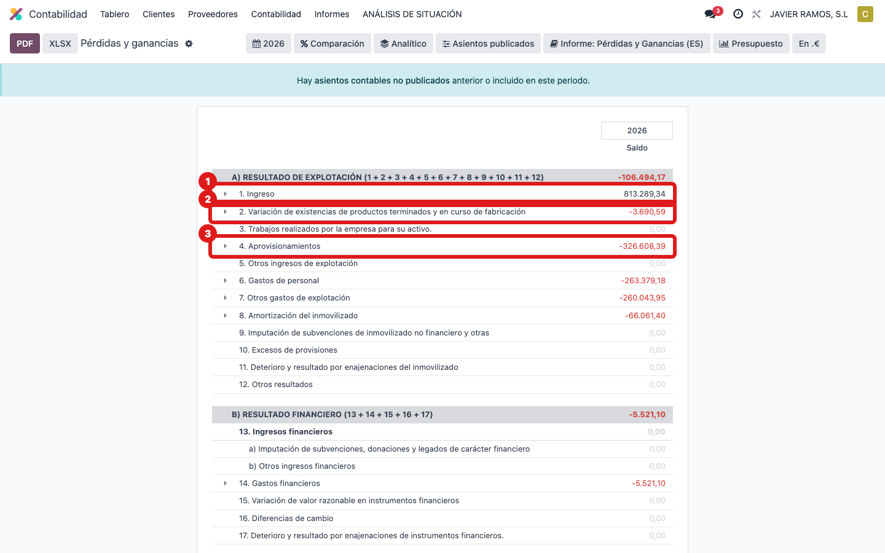

## Cuándo se usa
Para saber de dónde sale **"Margen bruto del año"**: lo que queda tras restar a los **ingresos**
del año el **coste directo** (compras y consumos de material). Ejemplo de hoy: **482.990,36 €**
(**59,7 %** sobre ventas).

## Antes de empezar
- Permiso de contabilidad para ver el informe de Pérdidas y Ganancias.

## Pasos
1. Abre **Dirección → Panel Dirección** y localiza la tarjeta **7 · Margen bruto del año**.
   
2. El dato sale de la cuenta de resultados. Abre **Contabilidad → Informes → Pérdidas y Ganancias**
   y pon el rango **este año**.
   
3. Fíjate en dos bloques: los **Ingresos** y el **coste directo** (cuentas del grupo **60x**:
   compras y consumos de material).
   
4. **Cómo se calcula:** **Margen = Ingresos − Coste directo (60x)**. El porcentaje es
   **Margen ÷ Ingresos × 100** (aquí 482.990,36 € sobre los ingresos = 59,7 %).
5. **Ojo:** el número depende de que las compras estén contabilizadas en las **cuentas de coste
   correctas (60x)**. Si algo de coste está en otra cuenta, el margen sale más alto de lo real.

## Si algo va mal
- El margen parece demasiado alto: revisa con contabilidad que los costes de material estén en las
  cuentas 60x; si están mal clasificados, el margen se distorsiona.

## Escalar
Si el margen del panel y el de Pérdidas y Ganancias no cuadran, avisa a Apunts y a contabilidad.
