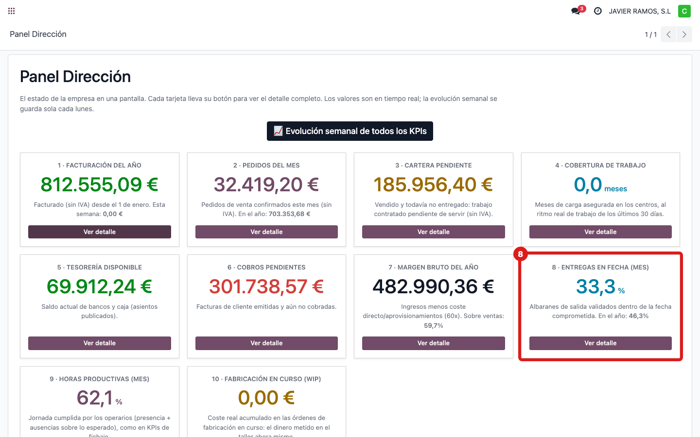
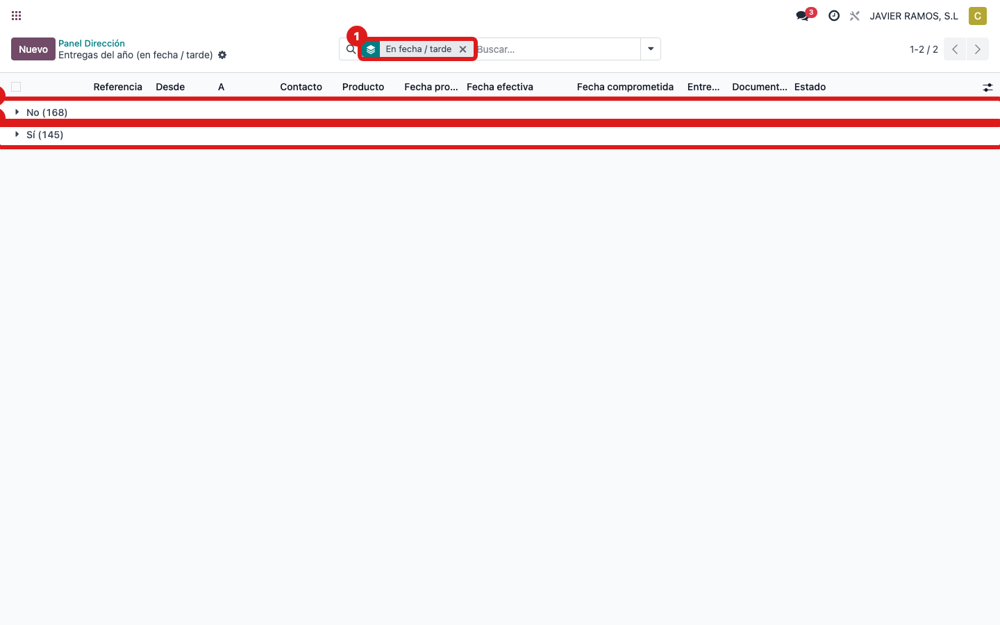
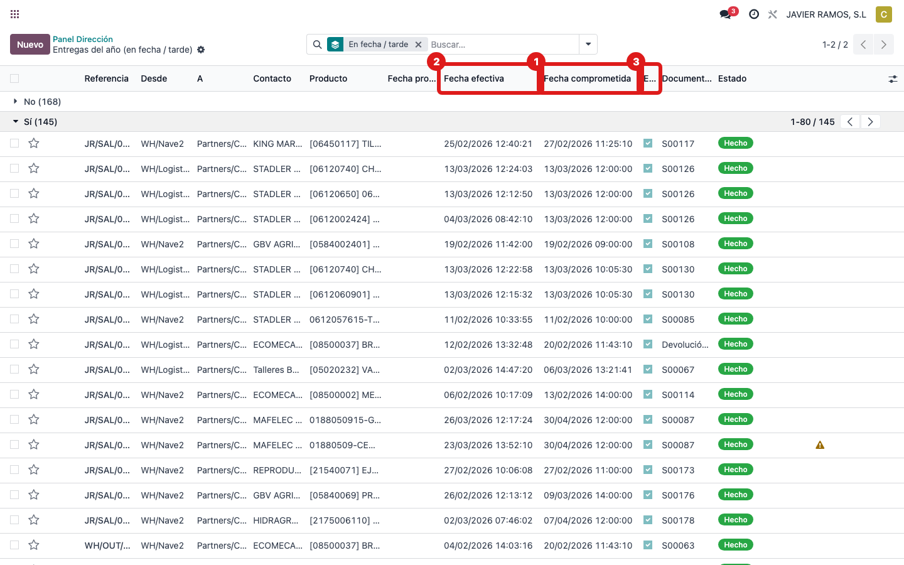

## Cuándo se usa
Para saber de dónde sale **"Entregas en fecha (mes)"**: de los albaranes de **salida** del periodo,
qué porcentaje se entregó **en o antes de la fecha comprometida**. Ejemplo de hoy: **33,3 %** este
mes · **46,3 %** en el año.

## Antes de empezar
- Acceso a **Inventario** (traslados de salida).

## Pasos
1. Abre **Dirección → Panel Dirección** y localiza la tarjeta **8 · Entregas en fecha (mes)**.
   
2. El dato sale de los albaranes de salida. El botón **Ver detalle** de la tarjeta abre la lista
   del **año** (que cuadra con el subtítulo "En el año: 46,3%"). También puedes ir a **Inventario
   → Transferencias** y filtrar las de **salida** ya **validadas**.
   
3. Compara, en cada albarán, la **fecha de validación** con la **fecha comprometida**: está "en
   fecha" si se validó en o antes de la comprometida.
   
4. **Cómo se calcula:** **% = albaranes entregados en fecha ÷ total de albaranes de salida × 100**.
   Aquí, este mes, 1 de cada 3 salió en fecha (33,3 %).
5. **Ojo:** solo entran los albaranes que tienen **fecha comprometida fijada**. Un albarán sin
   fecha límite no cuenta en el porcentaje (ni a favor ni en contra).

## Si algo va mal
- El porcentaje parece bajo: comprueba cuántos albaranes tienen fecha comprometida; si muchos no la
  tienen, la muestra es pequeña y el % es engañoso.

## Escalar
Si crees que el porcentaje no refleja la realidad, avisa a Apunts indicando el mes.
