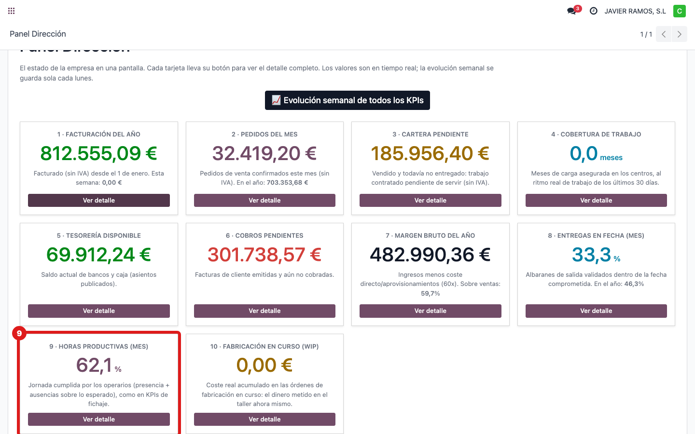
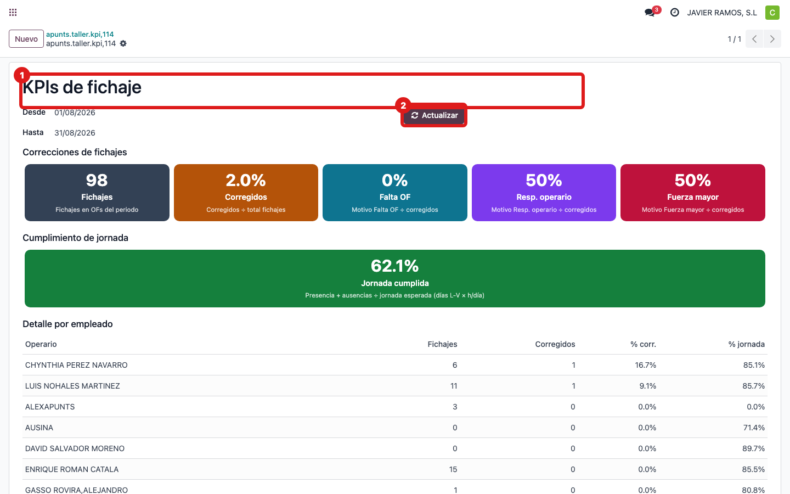
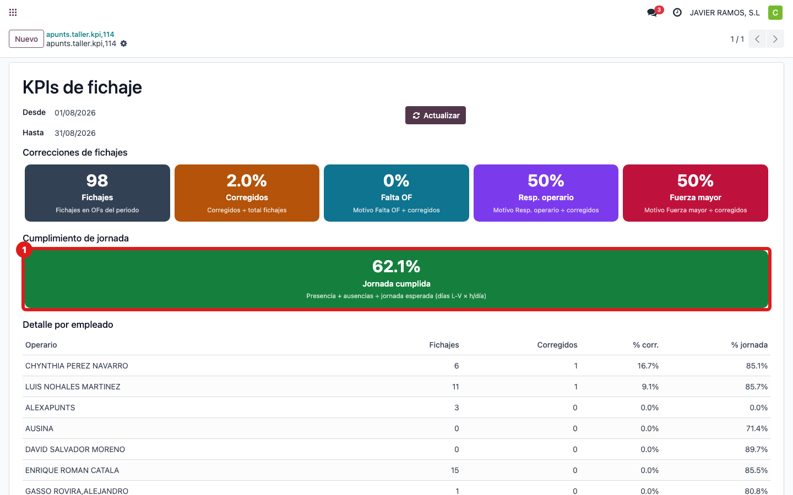

## Cuándo se usa
Para saber de dónde sale **"Horas productivas (mes)"**: cuánto **cumplen la jornada** los operarios
—horas de presencia y ausencias justificadas frente a las horas de calendario—. Ejemplo de hoy:
**62,1 %**.

## Antes de empezar
- Acceso a **Gestión Taller**.

## Pasos
1. Abre **Dirección → Panel Dirección** y localiza la tarjeta **9 · Horas productivas (mes)**.
   
2. El dato sale del taller. Abre **Gestión Taller → KPIs de fichaje** y pon el rango del **mes**;
   pulsa **Actualizar**.
   
3. Fíjate en el indicador **Jornada cumplida**: es el mismo porcentaje que la tarjeta.
   
4. **Cómo se calcula:** **% = (horas de presencia + ausencias aprobadas) ÷ horas de calendario**
   (días laborables L–V × horas por día). Si un operario estuvo o tuvo permiso justificado, cuenta;
   si faltó sin justificar, baja el porcentaje.

## Si algo va mal
- El porcentaje baja de golpe: suele ser por ausencias aún **sin aprobar** o fichajes sin cerrar de
  ese mes; en cuanto se regularizan, sube.

## Escalar
Si el porcentaje del panel y el de KPIs de fichaje no coinciden con el mismo mes, avisa a Apunts.
