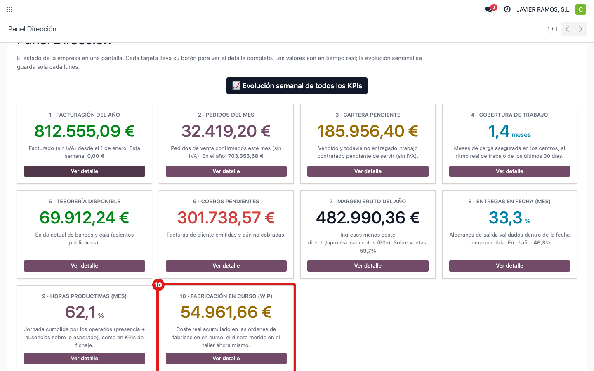
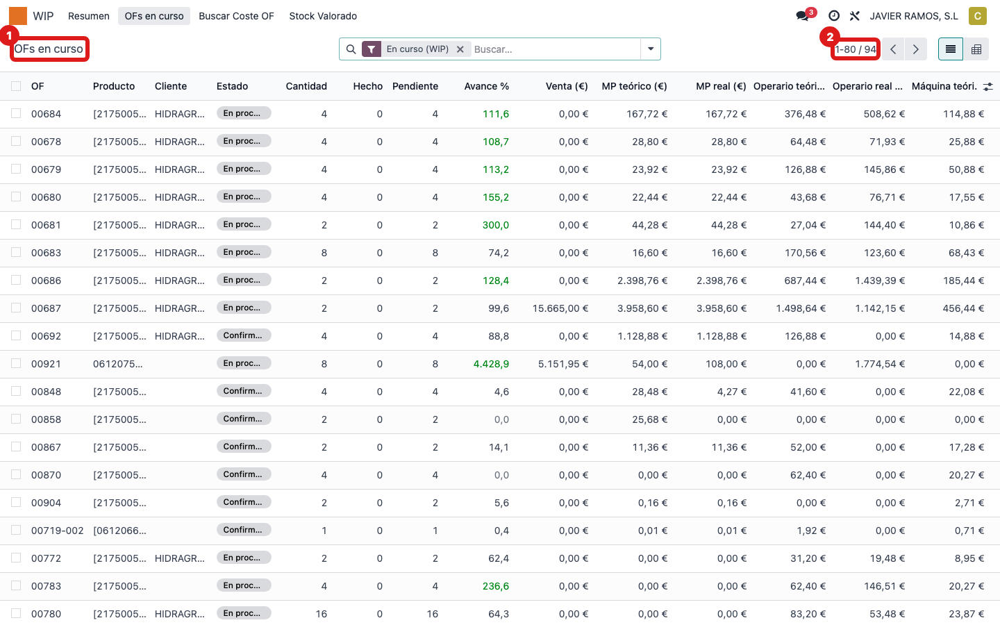
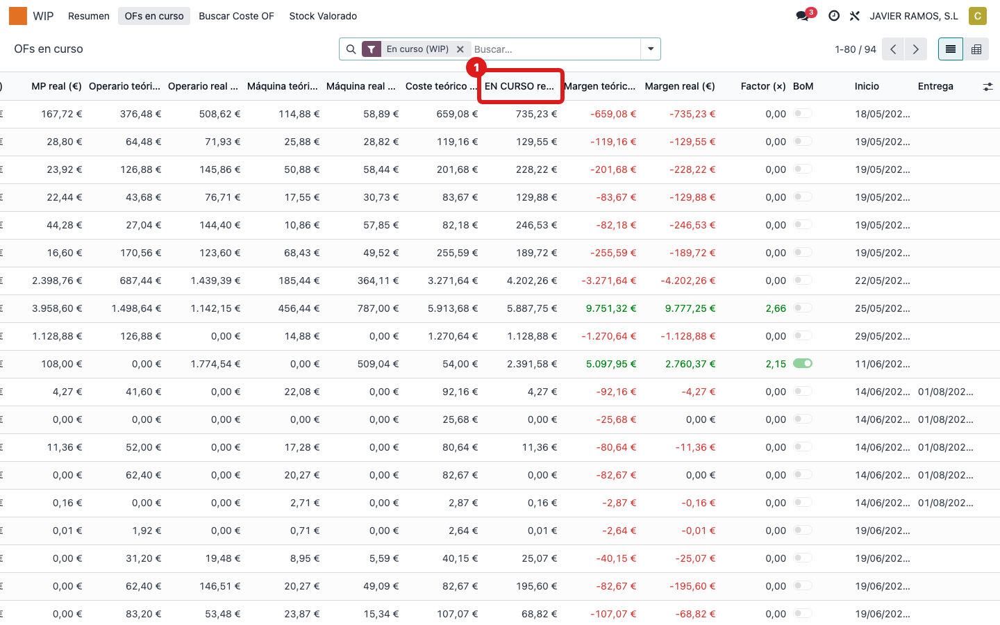
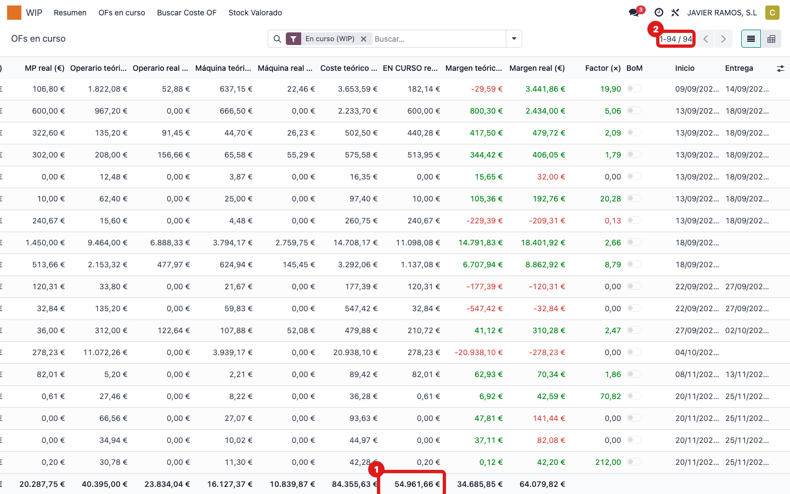

## Cuándo se usa
Para saber de dónde sale **"Fabricación en curso (WIP)"**: el **dinero metido en el taller ahora
mismo** —coste real acumulado (material + mano de obra + máquina) de las órdenes en marcha—.
Ejemplo de hoy: **54.961,66 €**.

## Antes de empezar
- Acceso al menú **WIP**.

## Pasos
1. Abre **Dirección → Panel Dirección** y localiza la tarjeta **10 · Fabricación en curso (WIP)**.
   
2. El dato sale de las órdenes de fabricación en curso. Abre **WIP → OFs en curso**.
   
3. Mira la columna **EN CURSO real**: es el coste real ya invertido en cada orden.
   
4. Suma esa columna (al pie de la lista): el total coincide con el número de la tarjeta.
   
5. **Cómo se calcula:** se **suma la columna "EN CURSO real"** de todas las órdenes en curso. Es lo
   que ya se ha gastado (material recibido + horas fichadas + máquina) en lo que aún no está
   terminado. Hoy son 94 órdenes que suman 54.961,66 €.

## Si algo va mal
- Cambia mucho de un día a otro: es normal; sube al comprar material o fichar horas y baja al
  terminar y entregar órdenes.

## Escalar
Si el total de "OFs en curso" no cuadra con el panel, avisa a Apunts.
