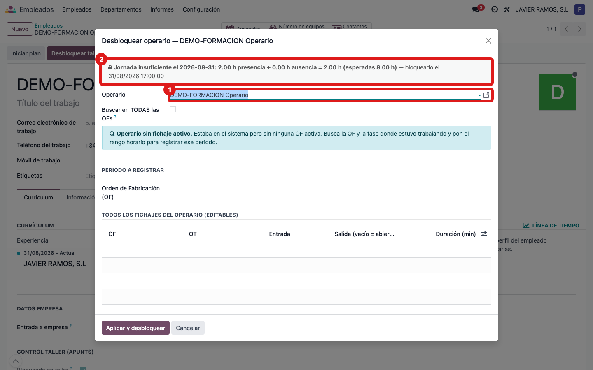
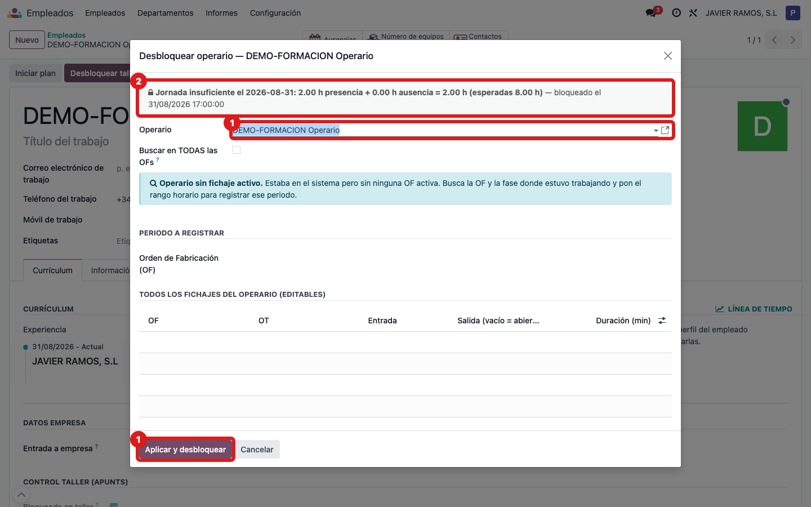
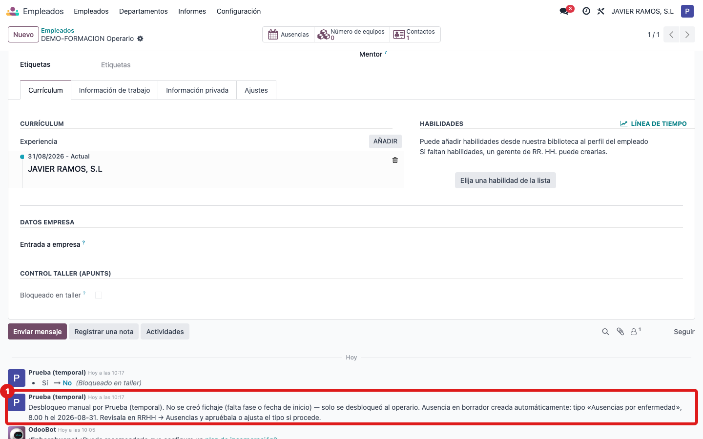
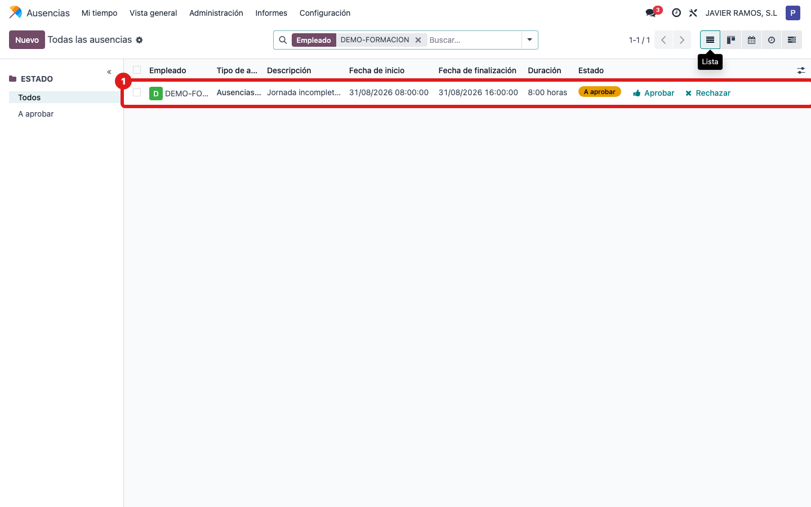
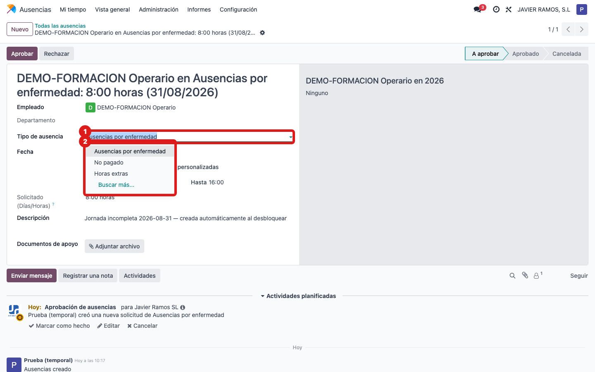
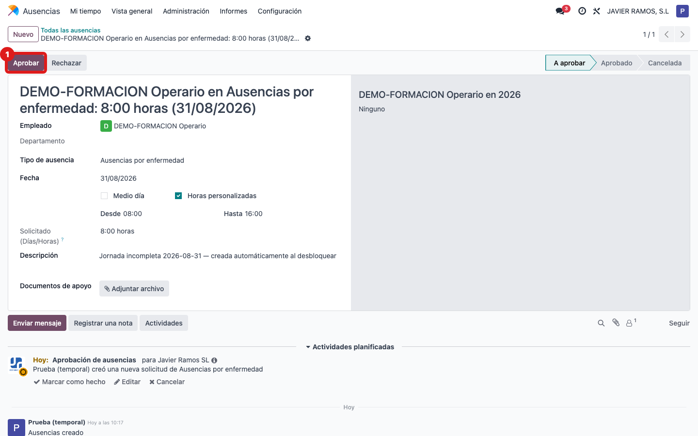

## Cuándo se usa
Cuando un operario se queda **bloqueado en taller por jornada insuficiente** (no cumplió las
horas del día) y lo desbloqueas sin corregirle el fichaje. En ese caso el asistente crea sola
una **ausencia** por las horas que le faltan del día. Luego, desde RRHH, hay que ponerle el
tipo correcto y aprobarla.

## Antes de empezar
- El operario tiene que estar **bloqueado** por el motivo **Jornada insuficiente** (lo ves en
  la ficha del operario o en **Gestión Taller → Estado operarios**).
- **IMPORTANTE:** el asistente hay que abrirlo desde la **ficha del operario** (botón
  **Desbloquear taller**) o desde el botón **Desbloquear** de las listas de Gestión Taller. Si
  lo abres desde el menú *Corregir fichaje / desbloquear* eligiendo el operario a mano, no carga
  el motivo del bloqueo y **no crea la ausencia**.
- Ten claro por qué le faltaron horas (baja médica, permiso, etc.) para elegir bien el tipo.

## Pasos
1. Abre la **ficha del operario bloqueado** (Empleados, o **Gestión Taller → Estado operarios**
   y abre el operario) y pulsa **Desbloquear taller** en la cabecera. Se abre el asistente
   **Desbloquear operario** con el aviso del bloqueo: *"Jornada insuficiente el (fecha)…
   esperadas 8,00 h"*.
   
2. No corrijas ningún fichaje (deja la OF/fase en blanco) y pulsa **Aplicar y desbloquear**.
   
3. Abre (o vuelve a) la ficha del operario y mira el **historial de mensajes** (chatter): verás
   el aviso de que se ha creado una **ausencia** con las horas que faltaban y la indicación de
   revisarla en RRHH → Ausencias.
   
4. Ve a **RRHH → Ausencias** y abre la ausencia de ese operario (estará en estado
   **A aprobar**, con la descripción "Jornada incompleta…").
   
5. Revisa el **Tipo de ausencia** y ponlo en el que corresponda de vuestra lista (por ejemplo
   **Ausencias por enfermedad** o **No pagado**). El asistente pone uno genérico, por eso hay
   que ajustarlo aquí.
   
6. **Aprueba** la ausencia con el botón de aprobar de la cabecera. A partir de ahí queda
   validada y esas horas quedan justificadas.
   

## Si algo va mal
- **No se creó ninguna ausencia:** casi siempre es porque abriste el asistente desde el **menú**
  en vez de desde la ficha del operario (ver "Antes de empezar"). Solo se crea si el bloqueo es
  por **Jornada insuficiente** y desbloqueas **sin** corregir el fichaje.
- **"Aplicar y desbloquear" da un error de correo y no hace nada:** ocurre si la empresa no
  tiene dirección de correo configurada y el operario tiene seguidores. Avisa a Apunts para
  configurar el correo de la empresa.
- **No encuentro la ausencia:** en **RRHH → Ausencias** filtra por el operario y quita los
  filtros de estado; busca la que pone "Jornada incompleta … creada automáticamente".
- **Las horas de la ausencia no cuadran:** las calcula el sistema restando lo que faltó ese día.
  Si hace falta, cámbialas en la propia ausencia antes de aprobar.

## Escalar
Si no aparece la ausencia esperada, o dudas de qué tipo poner, avisa a administración/Apunts con
el nombre del operario, el día del bloqueo y una captura del historial de la ficha del operario
donde sale el aviso.
