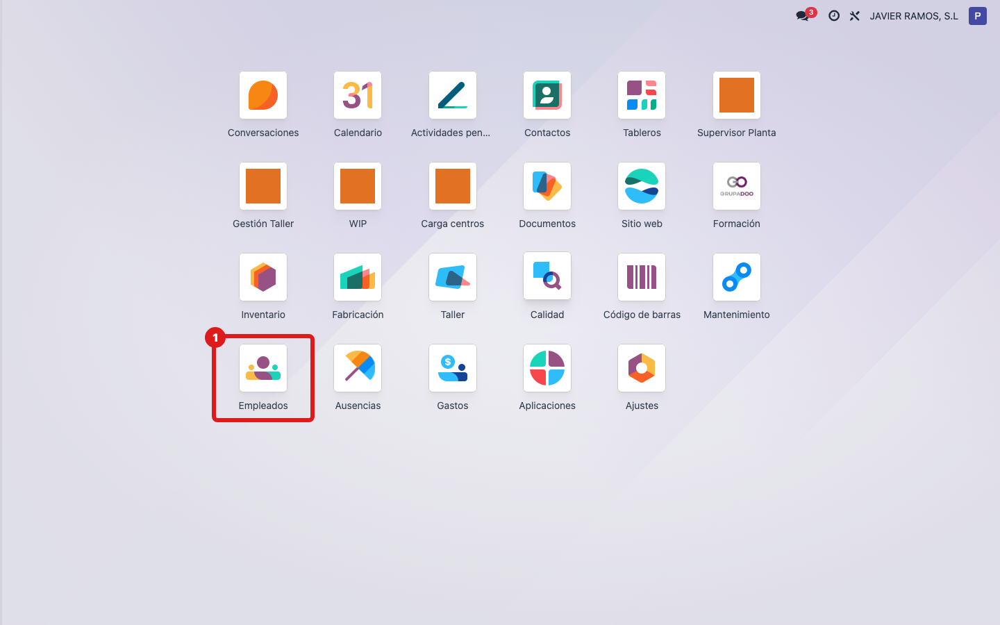
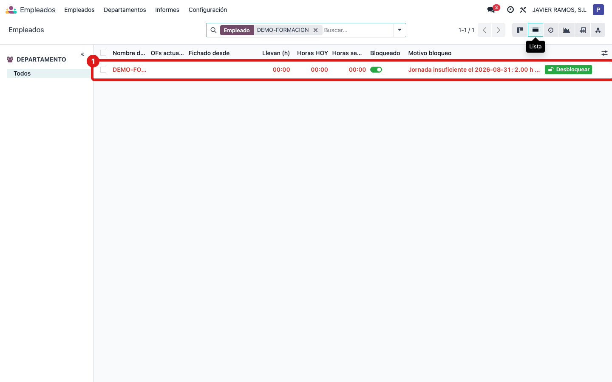
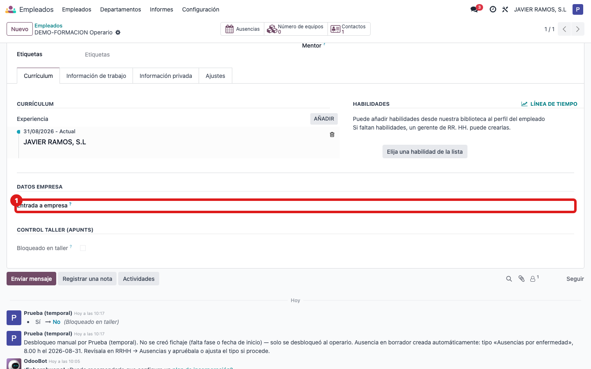
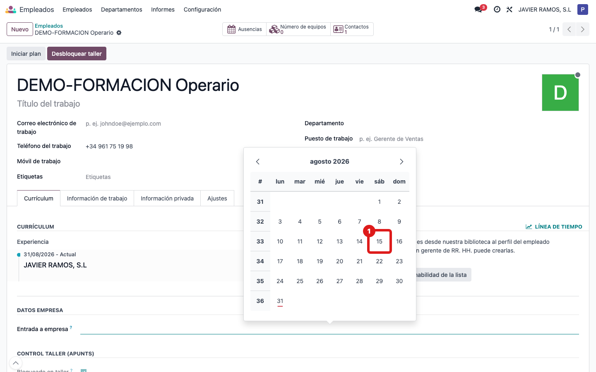
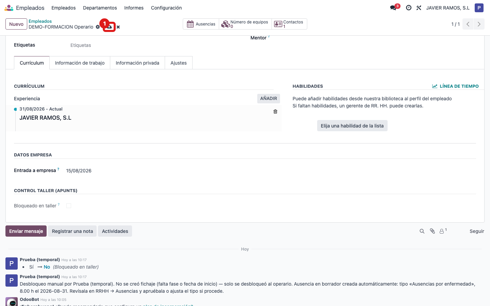

## Cuándo se usa
Cuando das de alta a un operario nuevo (o revisas la ficha de uno que ya está) y quieres
dejar registrada la fecha en la que entró a trabajar en la empresa. Esa fecha queda con
historial: si se cambia, queda constancia de quién y cuándo.

## Antes de empezar
- Ten a mano la fecha real de incorporación del trabajador.
- La ficha del empleado ya tiene que existir en **Empleados**.

## Pasos
1. Entra en **Empleados** desde el menú principal.
   
2. Abre la ficha del operario al que quieres poner la fecha.
   
3. Busca el grupo **Datos empresa** y pulsa en el campo **Entrada a empresa**.
   
4. Elige la fecha en la que el trabajador entró a la empresa.
   
5. Guarda la ficha con el icono de guardar (la nube o el disquete) de la parte superior.
   
6. Listo: la fecha queda registrada. Cualquier cambio posterior de esta fecha se apunta
   en el historial de la ficha.

## Si algo va mal
- No veo el grupo **Datos empresa**: asegúrate de estar en la pestaña principal de la ficha
  del empleado, hacia la parte baja del formulario.
- En la cabecera aparece un botón **Desbloquear taller** y un grupo **Control taller (Apunts)**
  con **Bloqueado / Motivo del bloqueo / Fecha**: eso es el control de fichajes de planta, no
  tiene que ver con la fecha de entrada. Déjalo como está salvo que quieras desbloquear al
  operario.
- Puse mal la fecha: vuelve al campo **Entrada a empresa**, corrígela y guarda otra vez.

## Escalar
Si el campo **Entrada a empresa** no aparece en la ficha o no te deja guardar, avisa a
administración/Apunts indicando el nombre del operario, qué pantalla tienes abierta y el
mensaje exacto que sale.
