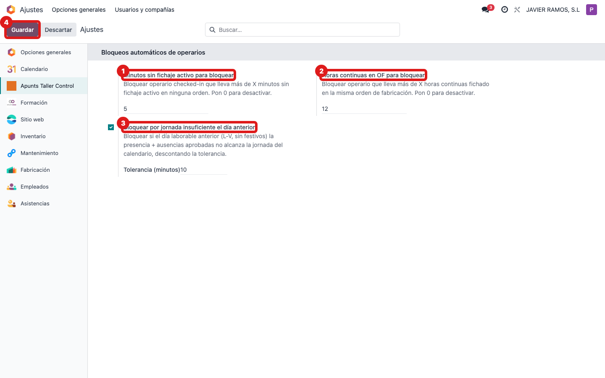

## Cuándo se usa
Cuando hay que afinar cuándo el sistema bloquea automáticamente a un operario: por estar sin
fichaje activo mucho rato, por llevar demasiadas horas seguidas en la misma OF, o por no
cumplir la jornada del día anterior.

## Antes de empezar
Necesitas permisos de administrador (Ajustes). Los cambios afectan a todos los operarios, así
que acuerda los valores con el responsable de taller antes de tocarlos.

## Pasos
1. Abre **Ajustes** y busca la sección **Apunts Taller Control → Bloqueos automáticos de operarios**. 
2. Ajusta **Minutos sin fichaje activo para bloquear** (por defecto 30): bloquea al operario que lleva ese tiempo dentro sin fichaje en ninguna OF.
3. Ajusta **Horas continuas en OF para bloquear** (por defecto 12): bloquea al que lleva esas horas seguidas fichado en la misma orden.
4. Activa o desactiva **Bloquear por jornada insuficiente el día anterior** con su casilla.
5. Si lo activas, pon la **Tolerancia (minutos)** que se descuenta al comparar con la jornada (por defecto 10).
6. Para desactivar cualquiera de los límites por minutos/horas, pon su valor en **0**.
7. Pulsa **Guardar** arriba para aplicar los cambios.

## Si algo va mal
- Se bloquean demasiados operarios: sube los minutos/horas o la tolerancia, o pon a **0** el criterio que sobra.
- No se bloquea nadie cuando debería: comprueba que el valor no está en **0** (que lo desactiva) y que la casilla de jornada está marcada.
- No encuentras la sección: necesitas permisos de administrador; pídelos a quien gestione los usuarios.

## Escalar
Antes de cambiar estos límites, confírmalo con el responsable de taller: afectan a toda la
planta. Si tras guardar el comportamiento no cambia, avisa a soporte indicando qué valor
tocaste y qué esperabas.
