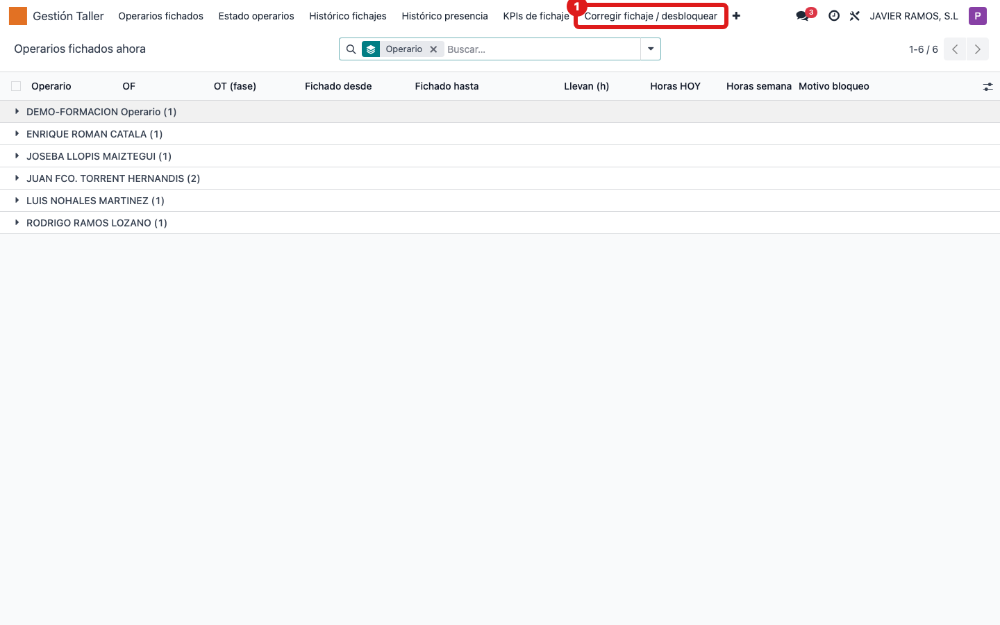
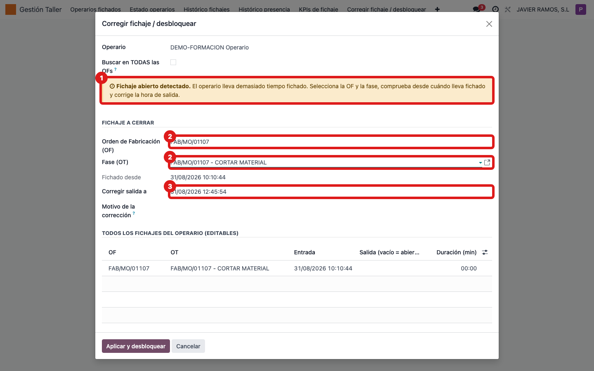
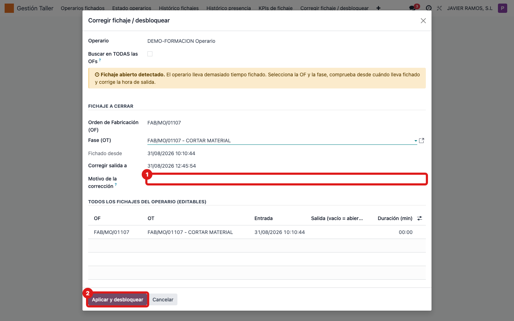

## Cuándo se usa
Cuando un operario está **bloqueado** y hay que arreglar el motivo antes de dejarle seguir:
o bien quedó un fichaje abierto demasiado tiempo, o bien estuvo en el sistema sin ninguna OF
activa, o no completó su jornada. El asistente detecta el caso y te guía.

## Antes de empezar
Ten claro qué pasó: en qué OF y fase estuvo el operario y a qué hora dejó realmente de
trabajar. Necesitarás elegir un **Motivo** de la corrección.

## Pasos
1. Abre **Gestión Taller → Corregir fichaje / desbloquear**. (También puedes llegar con el botón **Desbloquear** de las listas de operarios, o **Desbloquear taller** en la ficha del empleado.) 
2. Elige el **Operario** en el asistente. Arriba verás el motivo del bloqueo.
3. Mira el aviso de color para saber el caso: 
   - Aviso **naranja** "Fichaje abierto detectado": el operario lleva demasiado tiempo fichado (CASO 1).
   - Aviso **azul** "Operario sin fichaje activo": estaba en el sistema sin OF (CASO 2).
4. **CASO 1 (naranja):** **selecciona** la **Orden de Fabricación (OF)** y la **Fase (OT)** (el asistente no las precarga), revisa **Fichado desde** y ajusta **Corregir salida a** con la hora real de salida.
5. **CASO 2 (azul):** busca la **Orden de Fabricación (OF)** y la **Fase (OT)** donde estuvo, y pon **Inicio del periodo** y **Fin del periodo**.
6. Elige el **Motivo** de la corrección (obligatorio): **Falta OF**, **Responsabilidad operario** o **Fuerza mayor**. 
7. Pulsa **Aplicar y desbloquear**. El fichaje se corrige (o se crea) y el operario queda desbloqueado; todo queda anotado en su ficha.

## Si algo va mal
- No te deja aplicar y pide el motivo: es obligatorio siempre que corrijas o crees un fichaje. Elige uno de los tres.
- No encuentras la OF en el buscador: marca **Buscar en TODAS las OFs** para dejar de filtrar solo las del operario.
- El bloqueo era por **jornada insuficiente** y no corriges ningún fichaje: al desbloquear el sistema crea una **ausencia en borrador** por las horas que faltaban. Revísala en RRHH → Ausencias y apruébala o cambia el tipo si procede.
- Puedes editar directamente cualquier fila en la tabla "Todos los fichajes del operario" si necesitas ajustar entradas/salidas de otros días.

## Escalar
Si no sabes qué salida poner o el asistente no detecta bien el caso, para y consulta al
responsable de taller: dile el operario, el motivo del bloqueo que aparece arriba y qué
intentabas corregir.
