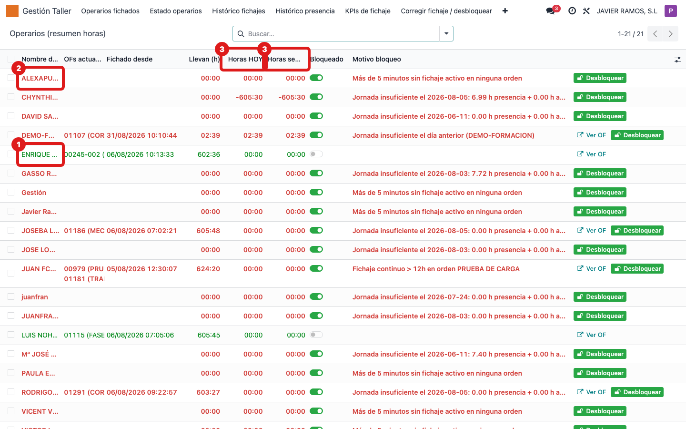
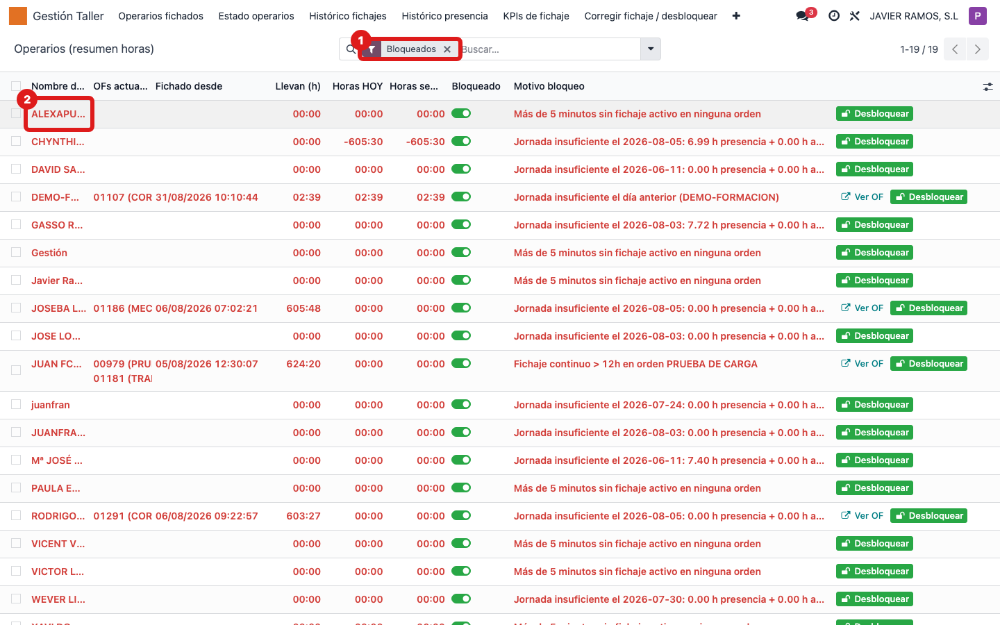
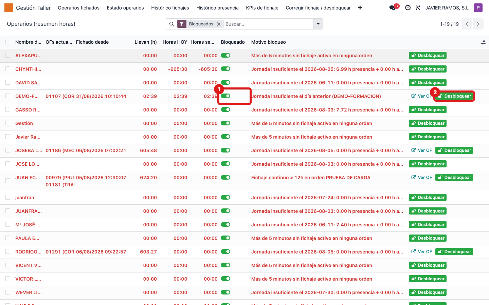

## Cuándo se usa
Cuando quieres una foto de todos los operarios a la vez: quién está fichado (verde), quién
está bloqueado (rojo) y cuántas horas llevan hoy y esta semana. Desde aquí también puedes
bloquear o desbloquear a mano.

## Antes de empezar
Nada especial. Necesitas acceso al menú **Gestión Taller**.

## Pasos
1. Abre **Gestión Taller → Estado operarios**. 
2. Lee el color de cada fila: **verde** = fichado ahora, **rojo** = bloqueado.
3. Repasa las columnas **OFs actuales**, **Fichado desde**, **Llevan (h)**, **Horas HOY** y **Horas semana**.
4. Para ver solo los bloqueados, abre la barra de búsqueda y pulsa el filtro **Bloqueados**. 
5. Para desbloquear a un operario, pulsa **Desbloquear** en su fila (abre el asistente de corrección). 
6. Para forzar el estado a mano, usa el interruptor de la columna **Bloqueado** de su fila.

## Si algo va mal
- Quitas el interruptor **Bloqueado** y el operario vuelve a bloquearse al rato: el bloqueo lo lanza el sistema por una incidencia real (jornada corta, demasiadas horas seguidas, inactividad). Usa el botón **Desbloquear** para corregir la causa, no solo el interruptor.
- No aparece nadie bloqueado: es lo normal si no hay incidencias. Comprueba que el filtro **Bloqueados** está activo si esperabas ver a alguien.
- Las horas no cuadran con lo esperado: recuerda que estas columnas suman los **fichajes en OF**, no la presencia. Para presencia usa "Histórico presencia".

## Escalar
Si un operario aparece bloqueado sin motivo claro o no consigues corregirlo, avisa al
responsable de taller con el nombre del operario y el **Motivo bloqueo** que muestra su fila.
