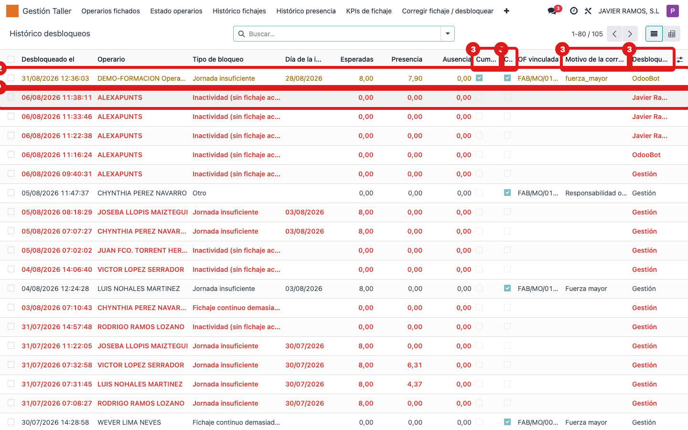
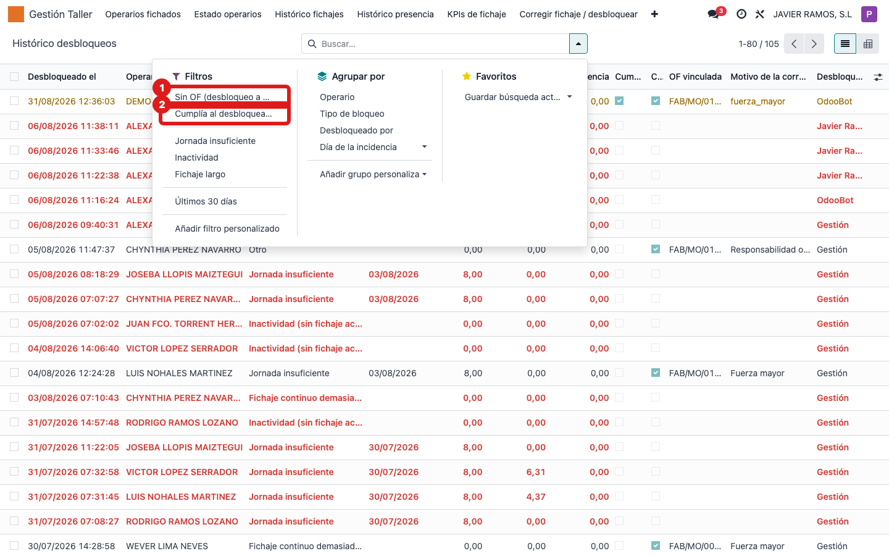

## Cuándo se usa
Cuando quieres auditar los desbloqueos: quién desbloqueó a quién, por qué motivo, si se hizo
con o sin OF, y si el bloqueo tenía sentido o los datos ya cumplían la jornada.

## Antes de empezar
Nada especial. Necesitas acceso al menú **Gestión Taller**.

## Pasos
1. Abre **Gestión Taller → Histórico desbloqueos**. 
2. Fíjate en el color: filas **rojas** = desbloqueo **sin OF** ("a pelo"); filas **amarillas** = el operario **ya cumplía** la jornada al desbloquear (bloqueo dudoso, datos que llegaron tarde).
3. Lee las columnas: **Desbloqueado el**, **Operario**, **Tipo**, **Día incidencia**, **Esperadas**, **Presencia**, **Ausencia**, **Cumple ahora**, **Con OF**, **Motivo** y **Desbloqueado por**.
4. Para revisar los desbloqueos sin justificar, usa el filtro **Sin OF (desbloqueo a pelo)**.
5. Para cazar bloqueos dudosos, usa el filtro **Cumplía al desbloquear (bloqueo dudoso)**. 
6. Abre una fila para ver la ficha completa con la **foto de la jornada** y la **acción realizada**.

## Si algo va mal
- Muchas filas rojas: se están desbloqueando operarios sin corregir el fichaje (sin OF). Conviene recordar el uso del asistente de corrección.
- Muchas filas amarillas: el sistema bloquea con datos que llegan tarde. Puede ser señal de revisar los tiempos del proceso o la tolerancia de jornada.
- No aparece un desbloqueo reciente: quita filtros o comprueba el rango con **Últimos 30 días**.

## Escalar
Si ves un patrón raro (siempre el mismo operario, siempre sin OF), coméntalo al responsable
de taller con el filtro aplicado y el nombre que aparece en **Desbloqueado por**.
