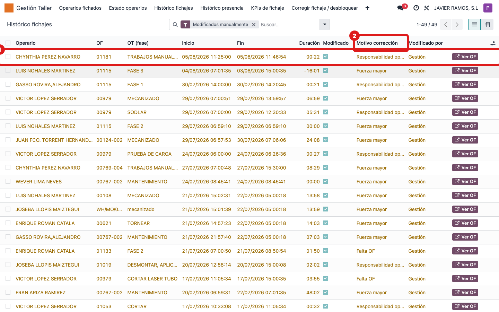
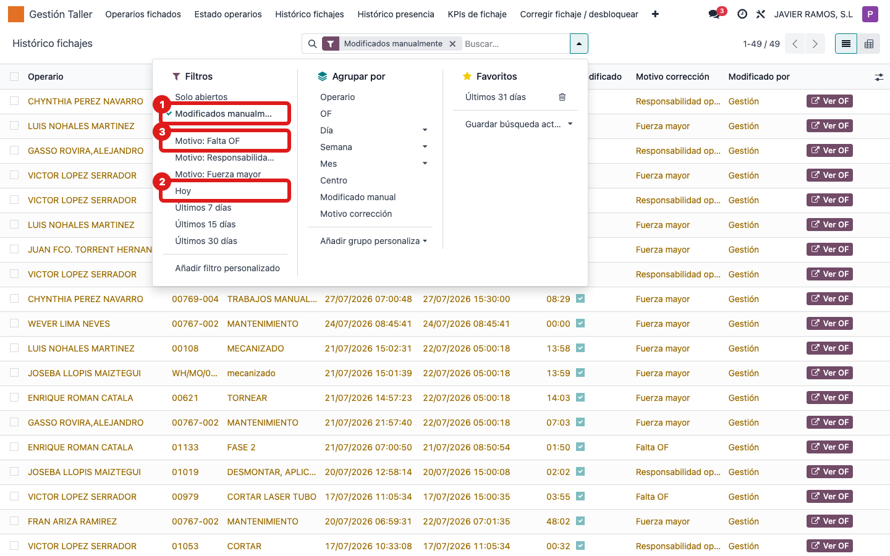
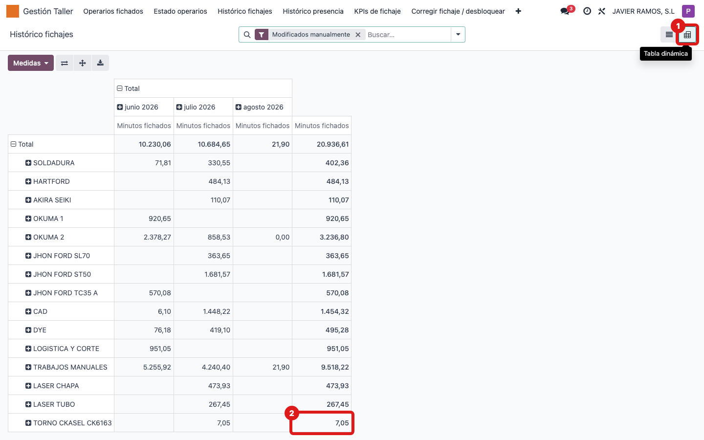

## Cuándo se usa
Cuando necesitas revisar los fichajes en OF de días pasados: cuáles se corrigieron a mano,
por qué motivo, o cuántos minutos dedicó cada operario a cada OF y día.

## Antes de empezar
Nada especial. Necesitas acceso al menú **Gestión Taller**.

## Pasos
1. Abre **Gestión Taller → Histórico fichajes**. Aparece la lista de los últimos 7 días. 
2. Fíjate en las filas **naranjas**: son fichajes **modificados manualmente**. La columna **Motivo corrección** te dice por qué.
3. Para ver solo los corregidos, abre la barra de búsqueda y pulsa el filtro **Modificados manualmente**. 
4. Ajusta el periodo con los filtros **Hoy**, **Últimos 7 días**, **Últimos 15 días** o **Últimos 30 días**.
5. Si buscas por causa, usa los filtros de motivo: **Falta OF**, **Responsabilidad operario** o **Fuerza mayor**.
6. Para ver los minutos fichados en una tabla, cambia a la vista **pivot** (icono arriba a la derecha); por defecto sale por centro de trabajo y mes, pero puedes reagrupar por operario, OF o día. 

## Si algo va mal
- No ves fichajes antiguos: por defecto solo salen los últimos 7 días. Cambia a **Últimos 30 días** o quita el filtro de fecha.
- Hay demasiadas filas: usa **Agrupar por → Operario** (o por OF, por Día) desde la barra de búsqueda.
- El total de minutos del pivot no cuadra: recuerda que mide **minutos fichados en OF**, no la presencia total del día.

## Escalar
Si detectas fichajes corregidos que no deberían estarlo, avisa al responsable indicando el
operario, la OF/fase, la fecha y quién aparece en **Modificado por**.
