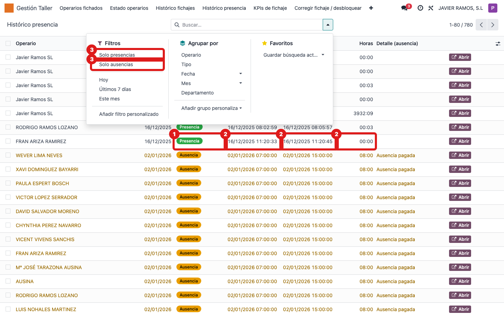

## Cuándo se usa
Cuando necesitas ver la **presencia** real de los operarios (entradas y salidas de fábrica)
junto con sus **ausencias** aprobadas, todo en una misma lista. Es distinto del fichaje en
OF: aquí es el tiempo de presencia en la empresa.

## Antes de empezar
Nada especial. Necesitas acceso al menú **Gestión Taller**.

## Pasos
1. Abre **Gestión Taller → Histórico presencia**. Aparece la lista de los últimos 7 días. 
2. Mira la columna **Tipo**: **Presencia** (verde) para las entradas/salidas y **Ausencia** (naranja) para los permisos aprobados.
3. Lee **Inicio**, **Fin** y **Horas** de cada registro; el **Detalle (ausencia)** explica el permiso.
4. Para separar unos de otros, usa los filtros **Solo presencias** o **Solo ausencias** de la barra de búsqueda.
5. Ajusta el periodo con **Hoy**, **Últimos 7 días** o **Este mes**.
6. Para abrir el registro original, pulsa **Abrir** en su fila.

## Si algo va mal
- No aparece una ausencia: solo salen las **aprobadas**. Si sigue en borrador, apruébala en RRHH → Ausencias.
- Las horas de presencia no coinciden con las de OF: son cosas distintas. La presencia es el tiempo en la empresa; el fichaje en OF es el tiempo imputado a órdenes.
- Faltan días: por defecto solo se ven los últimos 7 días. Cambia a **Este mes** o quita el filtro.

## Escalar
Si una presencia parece incompleta (falta salida) o una ausencia no cuadra, avisa a RRHH con
el operario y la fecha.
