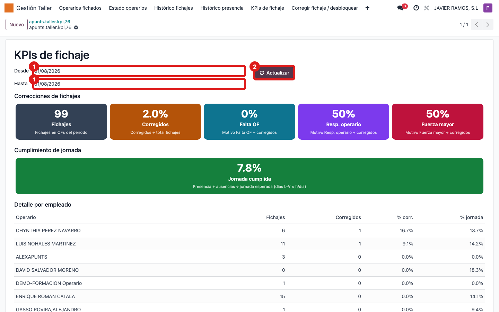
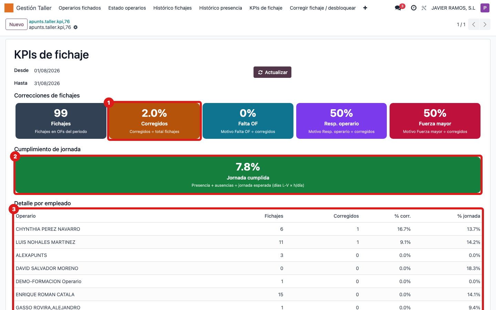

## Cuándo se usa
Cuando quieres el resumen del taller en un periodo: cuántos fichajes hubo, qué porcentaje se
corrigió a mano, por qué motivos y cuánto se cumplió la jornada, con detalle por operario.

## Antes de empezar
Decide el rango de fechas que quieres analizar (por defecto es el mes en curso).

## Pasos
1. Abre **Gestión Taller → KPIs de fichaje**. El panel se calcula solo con el mes en curso. 
2. Ajusta el rango con los campos **Desde** y **Hasta**.
3. Pulsa **Actualizar** para recalcular el panel con esas fechas.
4. Lee las tarjetas de **Correcciones de fichajes**: total de **Fichajes**, **% Corregidos** y el reparto por motivo (**Falta OF**, **Resp. operario**, **Fuerza mayor**).
5. Lee la tarjeta **Jornada cumplida**: presencia más ausencias sobre la jornada esperada. 
6. Baja a la tabla **Detalle por empleado** para ver, operario a operario, fichajes, % corregidos y % de jornada.

## Si algo va mal
- Todo sale a 0: probablemente el rango de fechas no tiene datos. Amplía **Desde/Hasta** y vuelve a pulsar **Actualizar**.
- Cambias las fechas y no cambia nada: recuerda pulsar **Actualizar**; el panel no se recalcula solo.
- El % de jornada parece bajo: incluye solo presencia y ausencias **aprobadas**; ausencias en borrador no cuentan.

## Escalar
Si un indicador se dispara (muchas correcciones o baja jornada) y no sabes la causa,
comparte el periodo y una captura del panel con el responsable de taller.
