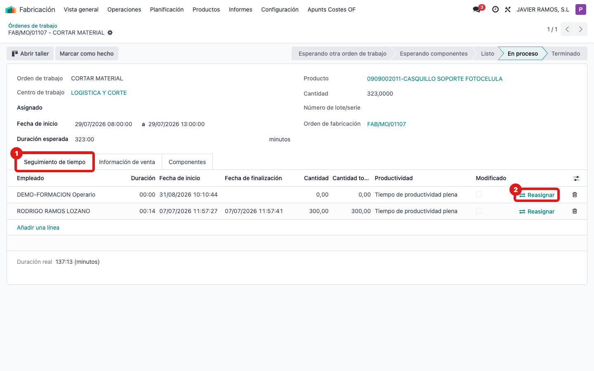
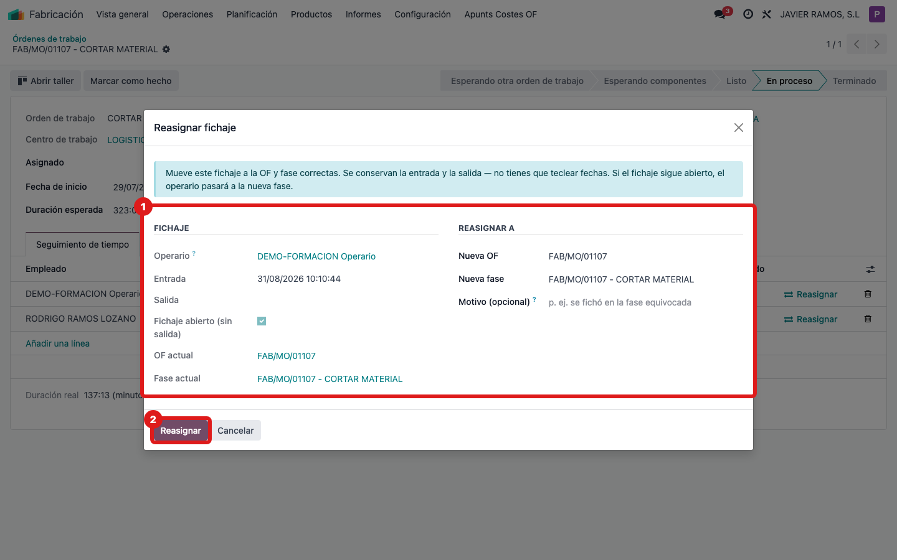

## Cuándo se usa
Cuando un operario fichó horas en la OF o la fase equivocada y hay que moverlas a las
correctas sin volver a teclear las horas. Funciona incluso si el fichaje sigue abierto.

## Antes de empezar
Ten a mano la OF y la fase correctas donde deberían ir esas horas.

## Pasos
1. Ve a **Fabricación → Órdenes de trabajo** y abre la orden de trabajo afectada.
2. Abre la pestaña **Seguimiento de tiempo**. Verás la lista de fichajes de esa fase.
3. En la fila del fichaje mal asignado, pulsa el botón **Reasignar** (icono de dos flechas). 
4. En el asistente, elige la **OF** correcta en el campo de destino. 
5. Elige la **fase (OT)** correcta dentro de esa OF.
6. Si quieres, escribe un **motivo** (por ejemplo: "se fichó en la fase equivocada").
7. Pulsa **Reasignar**. Las horas de entrada y salida se conservan; si el fichaje estaba abierto, el operario pasa a la nueva fase.

## Si algo va mal
- No te deja aplicar: la **fase (OT)** de destino es obligatoria. Selecciónala.
- No encuentras la fila del fichaje: comprueba que estás en la pestaña **Seguimiento de tiempo** de la orden de trabajo correcta.
- Moviste el fichaje que no era: vuelve a reasignarlo a su sitio original de la misma forma; las horas no se pierden.

## Escalar
Si el destino correcto no aparece en las listas o el fichaje no se mueve, avisa al
responsable de taller con la OF/fase de origen, la de destino y el mensaje que veas.
