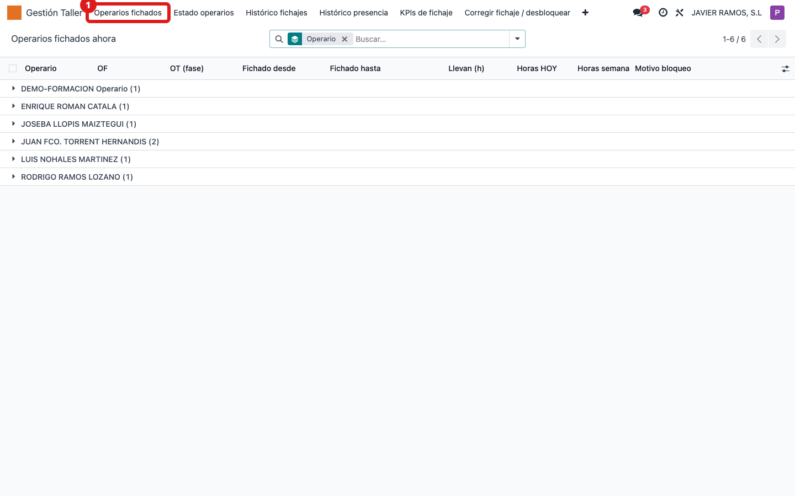
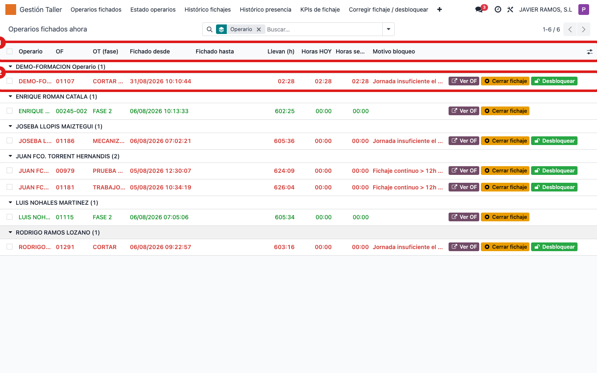
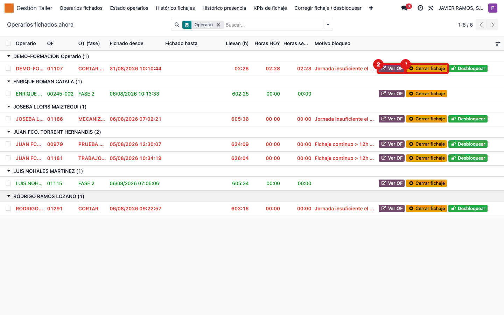

## Cuándo se usa
Cuando quieres saber, ahora mismo, qué operarios tienen un fichaje abierto en una OF y en
qué fase están. También sirve para cerrar el fichaje de alguien que se fue sin desfichar.

## Antes de empezar
Nada especial. Necesitas acceso al menú **Gestión Taller**.

## Pasos
1. Abre **Gestión Taller** en el menú superior. 
2. Pulsa **Operarios fichados**. Verás la lista de fichajes abiertos, agrupada por operario. 
3. Lee las columnas: **Operario**, **OF**, **OT (fase)**, **Fichado desde**, **Llevan (h)**, **Horas HOY** y **Horas semana**. Las filas en **rojo** son operarios bloqueados.
4. Para revisar una orden, pulsa **Ver OF** en su fila.
5. Si un operario se fue sin desfichar, pulsa **Cerrar fichaje** en su fila. 
6. Confirma el aviso "Cerrar este fichaje con la hora actual". El fichaje se cierra con la hora de ahora y queda anotado en la orden.

## Si algo va mal
- La fila está en rojo y no puedes cerrar limpio: el operario está **bloqueado**. Usa el botón **Desbloquear** de la fila (abre el asistente de corrección) — ver la guía "Desbloquear un operario / corregir su fichaje".
- La hora actual no es la buena (el operario dejó de trabajar hace rato): no uses **Cerrar fichaje**; corrige la salida con el asistente de la guía de desbloqueo, que te deja poner la hora exacta.
- No ves a nadie: puede que de verdad no haya fichajes abiertos, o que un filtro esté limitando la lista. Quita filtros de la barra de búsqueda.

## Escalar
Si un fichaje no se cierra o sale un error, avisa al responsable de taller indicando el
operario, la OF/fase y el mensaje exacto que aparece en pantalla.
