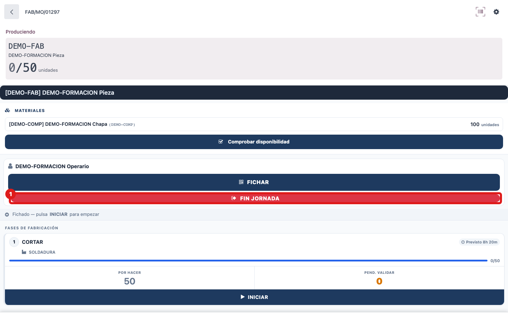
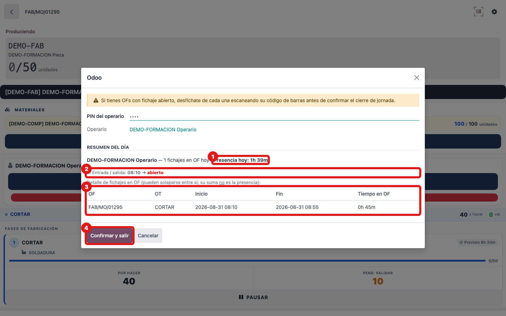

## Cuándo se usa
Al terminar tu día de trabajo. **Aquí se registra tu salida de presencia automáticamente**: no tienes que fichar la salida en ningún otro sitio. Es lo último que haces antes de irte.

## Antes de empezar
Desfíchate primero de todas las fases en las que sigas fichado (con **PAUSAR**, registrando las piezas). Ten a mano tu PIN.

## Pasos
1. Pulsa el botón rojo **FIN JORNADA** (icono de salida) de la barra de acciones.
   
2. Comprueba tu PIN (viene ya puesto si estabas identificado) y pulsa **Ver mi resumen**.
3. Revisa el resumen: **Presencia hoy: Xh YYm**, la línea de **Entrada / salida** y la tabla de tus fichajes en OF del día.
   
4. Pulsa **Confirmar y salir**. Verás el aviso de "Jornada cerrada correctamente".

## Si algo va mal
- Si sale **No puedes cerrar la jornada: tienes OFs con fichaje abierto**, aparece la lista: vuelve a cada OF y desfíchate con **PAUSAR** antes de volver a intentarlo.
- Si sale en rojo **Jornada por debajo del mínimo**, es que hoy llevas menos horas de las de tu jornada: si aún así quieres cerrar, pulsa **Confirmar y salir** otra vez (si no, avisa a oficina antes de irte).
- La **Presencia hoy** es tu tiempo real en fábrica (de tu entrada y salida). No es la suma de las horas de la tabla de OFs: esas pueden solaparse y sumar más.

## Escalar
Si no puedes cerrar la jornada y no consigues desficharte de alguna OF (o el resumen muestra horas que no cuadran), avisa a tu responsable u oficina: dile tu nombre, qué OFs te salen como abiertas y el texto exacto del aviso.
