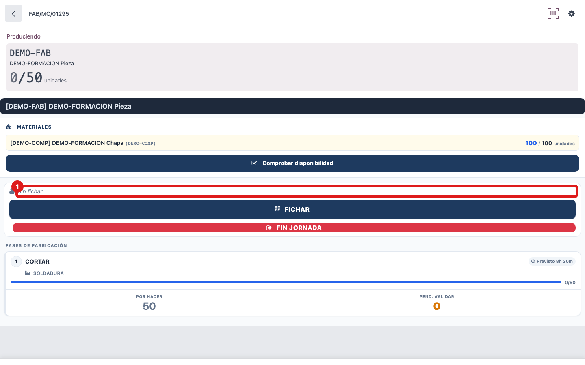
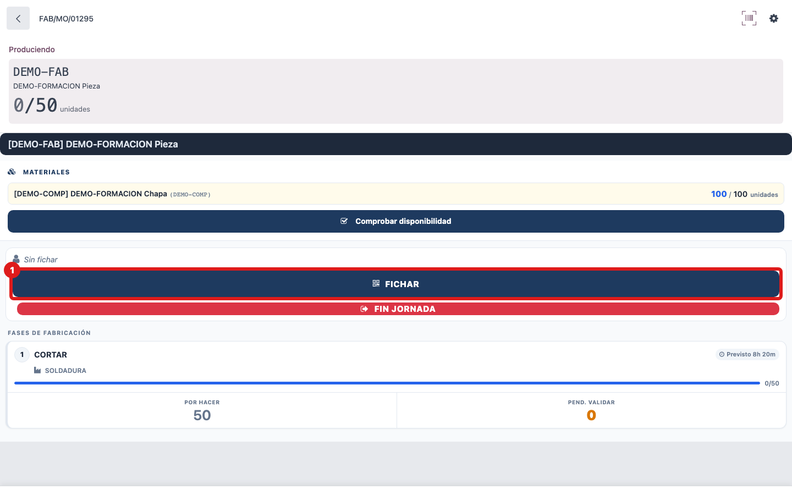
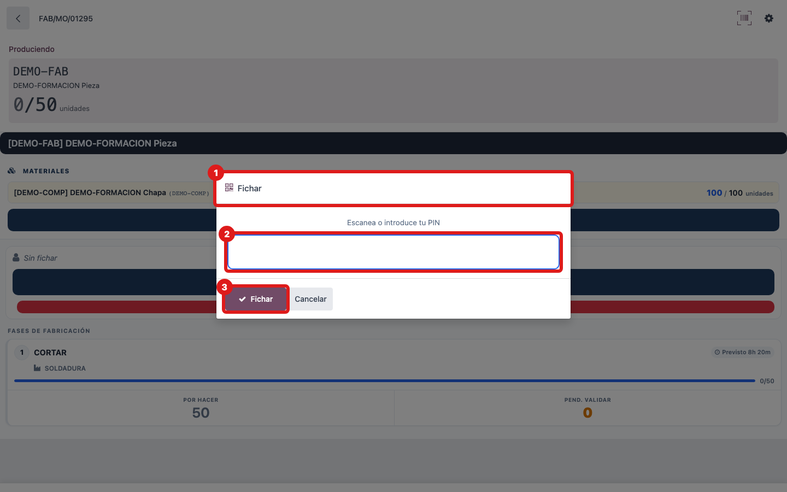
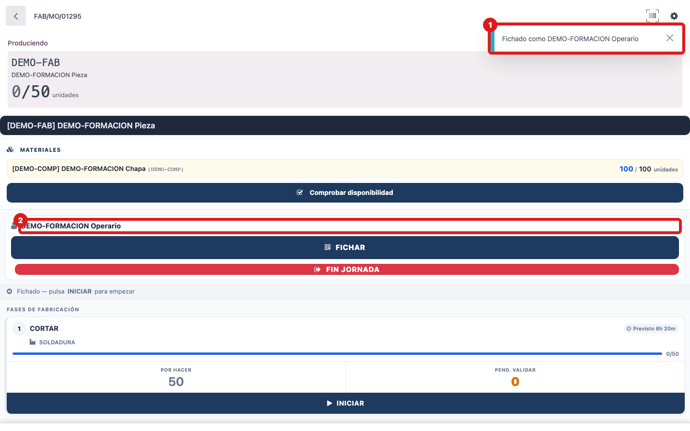

## Cuándo se usa
Cada vez que te pones a trabajar en la tablet de una OF y quieres que la máquina sepa que eres tú. Es lo primero que haces al llegar a la pantalla, antes de arrancar ninguna fase.

## Antes de empezar
Ten a mano tu carné de empleado con el código de barras (o tu PIN). La tablet siempre empieza **sin nadie identificado**: no se acuerda de la persona anterior.

## Pasos
1. Mira la barra de acción: cuando pone **Sin fichar** es que nadie está identificado todavía.
   
2. Escanea tu carné con el lector; si no tienes lector a mano, pulsa el botón **FICHAR** (icono de QR).
   
3. En el cuadro que aparece, escanea el carné o teclea tu PIN y pulsa **Fichar**.
   
4. Comprueba que sale el aviso **Fichado como (tu nombre)** y que tu nombre queda escrito en la barra de acción, en lugar de "Sin fichar".
   

## Si algo va mal
- Si la barra sigue diciendo **Sin fichar**, no se ha leído el código: vuelve a escanear más despacio o teclea el PIN a mano.
- Identificarte **no ficha todavía tu presencia** (tu entrada del día): solo te pone como operario activo en esta tablet. La entrada se registra sola cuando arrancas tu primera fase (INICIAR).
- Si cambias de tablet o se recarga la pantalla, tendrás que volver a identificarte: no se guarda entre sesiones.

## Escalar
Si tu carné o tu PIN no te identifican en ninguna tablet, avisa a tu responsable de taller o a oficina: diles tu nombre y que "la tablet no me reconoce el carné", para que revisen tu ficha de empleado.
