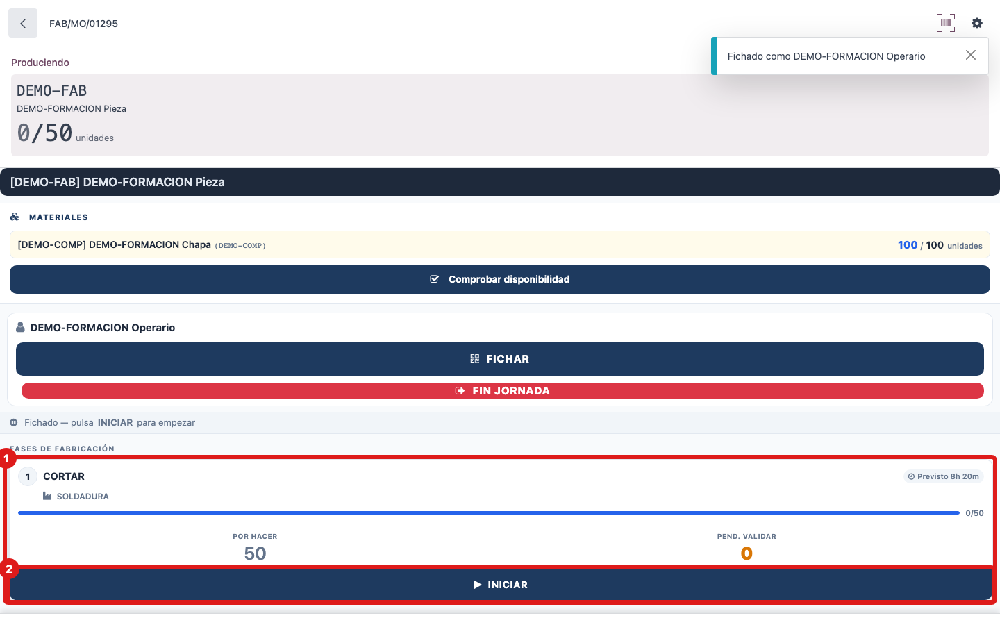
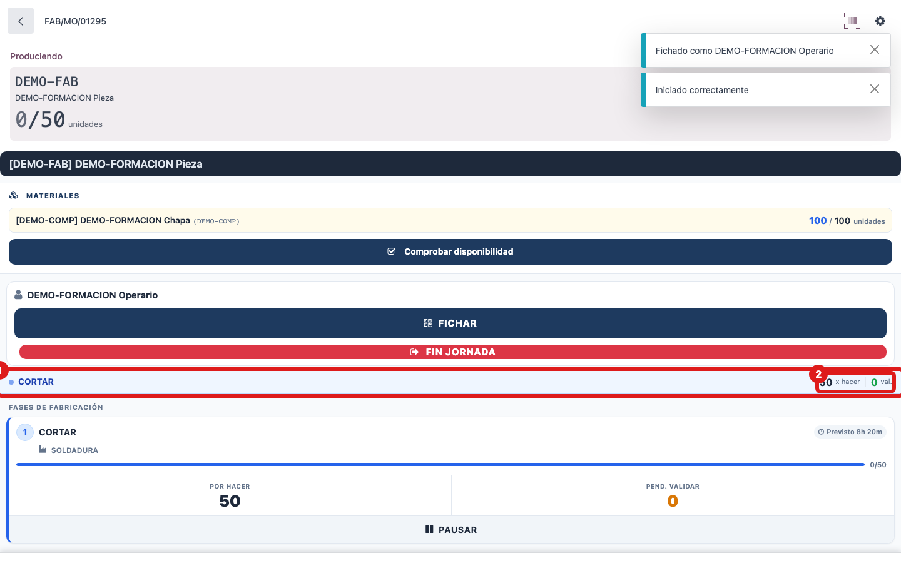

## Cuándo se usa
Cuando vas a empezar a producir en una fase (OT) de la OF que tienes en la tablet. **Al INICIAR la primera OF del día se registra tu entrada de presencia automáticamente**: no tienes que fichar la entrada por separado en ningún sitio.

## Antes de empezar
Tienes que estar identificado en la tablet (tu nombre en la barra de acción, no "Sin fichar"). Si no lo estás, mira la guía "Identificarse en la tablet con el carné".

## Pasos
1. Localiza en la lista **Fases de fabricación** la fase que vas a hacer.
2. Pulsa el botón **INICIAR** (icono de play) de esa fase; también puedes escanear el código de barras de la OF.
   
3. Comprueba que aparece arriba el banner de **fase activa** (punto verde parpadeando), con el nombre de la fase y las piezas **x hacer** y **val.**
   

## Si algo va mal
- Si sale **Primero escanee su código de empleado**, es que no estás identificado: identifícate y vuelve a pulsar INICIAR.
- Si sale **No hay componentes**, faltan materiales para esa OF: usa **Comprobar disponibilidad** y avisa a tu responsable.
- Si sale **La orden no tiene cantidad a producir**, la fase anterior aún no ha validado piezas: hay que terminar la fase de antes primero.
- Si sale que estás **bloqueado en taller** (con un motivo), no podrás arrancar: pasa por oficina para que te desbloqueen.

## Escalar
Si el mensaje no te deja arrancar y no sabes por qué, avisa a tu responsable de taller: dile el número de la OF, la fase que intentabas iniciar y copia el texto exacto del aviso rojo que salió en la tablet.
