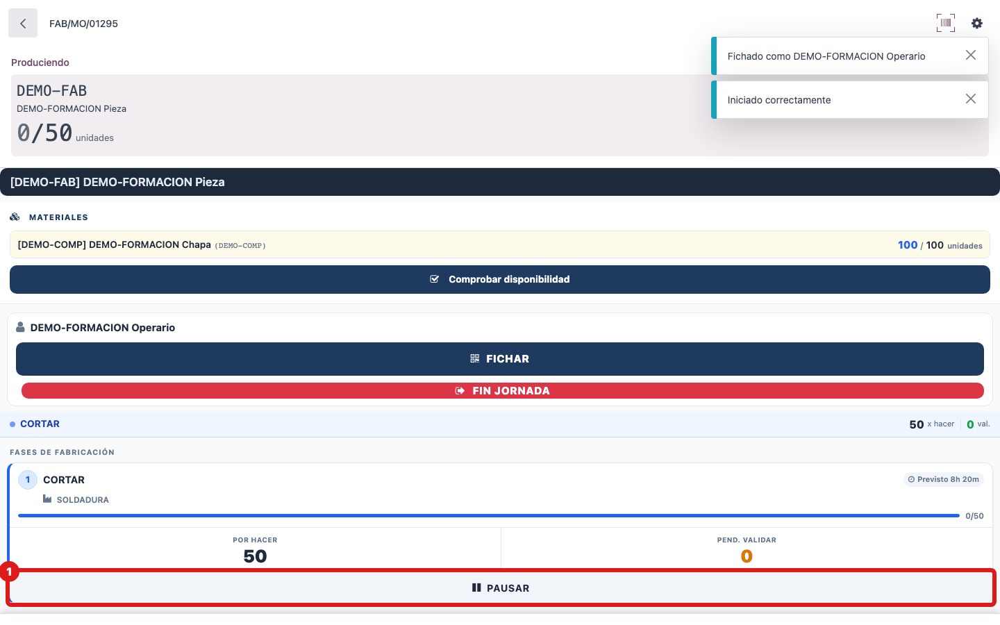
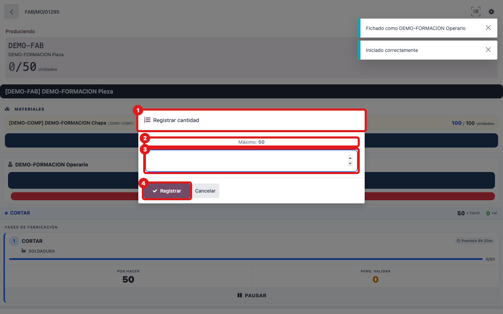

## Cuándo se usa
Cuando terminas o dejas una fase (OT) en la que estás fichado y quieres apuntar cuántas **piezas hechas** llevas. Es la forma correcta de desficharte de esa fase.

## Antes de empezar
Tienes que estar fichado en la fase (verás el banner de fase activa con el punto verde y tu nombre en la barra).

## Pasos
1. En la fase activa, pulsa el botón **PAUSAR** (icono de pausa).
   
2. En el cuadro que aparece, teclea las piezas que has hecho en esta sesión (pon **0** si no produjiste ninguna). No podrás teclear más de las piezas que quedan por hacer.
   
3. Pulsa **Registrar**. La fase deja de estar activa y las piezas quedan apuntadas en la OF.

## Si algo va mal
- Si te equivocas y cierras el cuadro con **Cancelar**, no pasa nada: sigues fichado en la fase y puedes volver a pulsar PAUSAR.
- Si te sale en rojo **Cantidad incorrecta**, es que has tecleado más piezas de las que quedan por hacer (ojo con teclear sin querer el número del carné): corrige la cifra.
- Si no querías producir nada pero sí soltar la fase, pon **0** y pulsa Registrar.

## Escalar
Si registraste una cantidad equivocada y ya no puedes corregirla desde la tablet, avisa a tu responsable u oficina: dile la OF, la fase y la cantidad correcta para que la ajusten.
